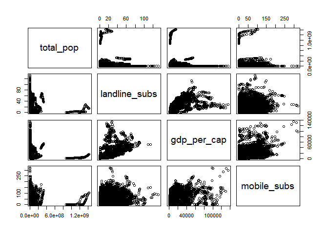
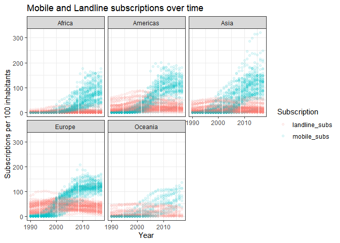
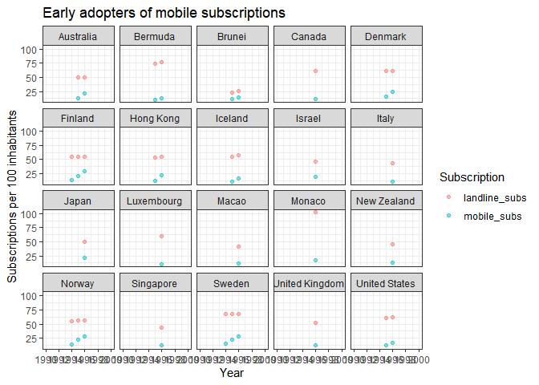
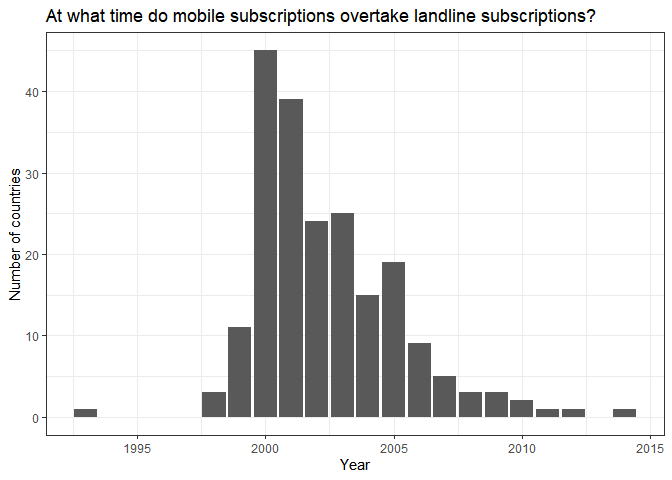
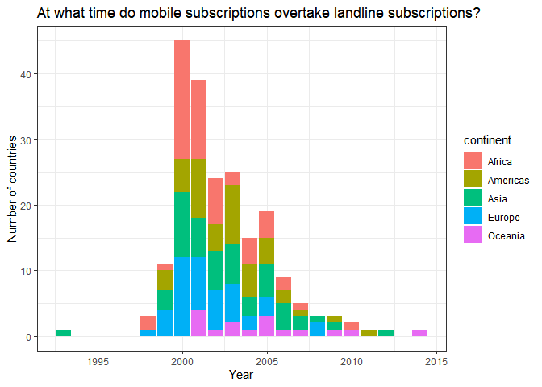

2020-11-10 Historical Phone Usage
================

``` r
library(tidyverse)
```

    ## -- Attaching packages --------------------------------------- tidyverse 1.3.0 --

    ## v ggplot2 3.3.3     v purrr   0.3.4
    ## v tibble  3.0.4     v dplyr   1.0.2
    ## v tidyr   1.1.2     v stringr 1.4.0
    ## v readr   1.4.0     v forcats 0.5.0

    ## -- Conflicts ------------------------------------------ tidyverse_conflicts() --
    ## x dplyr::filter() masks stats::filter()
    ## x dplyr::lag()    masks stats::lag()

``` r
library(skimr)
library(ggplot2); theme_set(theme_bw())
`%nin%` = Negate(`%in%`)
```

``` r
mobile <- readr::read_csv('https://raw.githubusercontent.com/rfordatascience/tidytuesday/master/data/2020/2020-11-10/mobile.csv')
```

    ## 
    ## -- Column specification --------------------------------------------------------
    ## cols(
    ##   entity = col_character(),
    ##   code = col_character(),
    ##   year = col_double(),
    ##   total_pop = col_double(),
    ##   gdp_per_cap = col_double(),
    ##   mobile_subs = col_double(),
    ##   continent = col_character()
    ## )

``` r
landline <- readr::read_csv('https://raw.githubusercontent.com/rfordatascience/tidytuesday/master/data/2020/2020-11-10/landline.csv')
```

    ## 
    ## -- Column specification --------------------------------------------------------
    ## cols(
    ##   entity = col_character(),
    ##   code = col_character(),
    ##   year = col_double(),
    ##   total_pop = col_double(),
    ##   gdp_per_cap = col_double(),
    ##   landline_subs = col_double(),
    ##   continent = col_character()
    ## )

## Explore data

``` r
skim(mobile)
```

|                                                  |        |
| :----------------------------------------------- | :----- |
| Name                                             | mobile |
| Number of rows                                   | 6277   |
| Number of columns                                | 7      |
| \_\_\_\_\_\_\_\_\_\_\_\_\_\_\_\_\_\_\_\_\_\_\_   |        |
| Column type frequency:                           |        |
| character                                        | 3      |
| numeric                                          | 4      |
| \_\_\_\_\_\_\_\_\_\_\_\_\_\_\_\_\_\_\_\_\_\_\_\_ |        |
| Group variables                                  | None   |

Data summary

**Variable type: character**

| skim\_variable | n\_missing | complete\_rate | min | max | empty | n\_unique | whitespace |
| :------------- | ---------: | -------------: | --: | --: | ----: | --------: | ---------: |
| entity         |          0 |              1 |   4 |  32 |     0 |       248 |          0 |
| code           |         28 |              1 |   3 |   8 |     0 |       247 |          0 |
| continent      |          0 |              1 |   4 |   8 |     0 |         5 |          0 |

**Variable type: numeric**

| skim\_variable | n\_missing | complete\_rate |        mean |           sd |      p0 |       p25 |        p50 |         p75 |         p100 | hist  |
| :------------- | ---------: | -------------: | ----------: | -----------: | ------: | --------: | ---------: | ----------: | -----------: | :---- |
| year           |          0 |           1.00 |     2003.38 |         8.01 | 1990.00 |   1996.00 |    2003.00 |     2010.00 |       2017.0 | ▇▆▇▆▇ |
| total\_pop     |        935 |           0.85 | 27891651.10 | 115700661.95 |   50.00 | 427411.75 | 4706194.00 | 16483944.25 | 1359368470.0 | ▇▁▁▁▁ |
| gdp\_per\_cap  |       1202 |           0.81 |    15832.15 |     19016.17 |  247.44 |   2895.37 |    8508.30 |    21866.09 |     135318.8 | ▇▂▁▁▁ |
| mobile\_subs   |        676 |           0.89 |       46.46 |        51.80 |    0.00 |      0.57 |      22.64 |       88.00 |        321.8 | ▇▃▁▁▁ |

``` r
mobile %>% filter(is.na(code))
```

    ## # A tibble: 28 x 7
    ##    entity               code   year total_pop gdp_per_cap mobile_subs continent
    ##    <chr>                <chr> <dbl>     <dbl>       <dbl>       <dbl> <chr>    
    ##  1 Syrian Arab Republic <NA>   1990        NA          NA      0      Asia     
    ##  2 Syrian Arab Republic <NA>   1991        NA          NA      0      Asia     
    ##  3 Syrian Arab Republic <NA>   1992        NA          NA      0      Asia     
    ##  4 Syrian Arab Republic <NA>   1993        NA          NA      0      Asia     
    ##  5 Syrian Arab Republic <NA>   1994        NA          NA      0      Asia     
    ##  6 Syrian Arab Republic <NA>   1995        NA          NA      0      Asia     
    ##  7 Syrian Arab Republic <NA>   1996        NA          NA      0      Asia     
    ##  8 Syrian Arab Republic <NA>   1997        NA          NA      0      Asia     
    ##  9 Syrian Arab Republic <NA>   1998        NA          NA      0      Asia     
    ## 10 Syrian Arab Republic <NA>   1999        NA          NA      0.0250 Asia     
    ## # ... with 18 more rows

``` r
mobile %>% filter(entity == "Syrian Arab Republic")
```

    ## # A tibble: 28 x 7
    ##    entity               code   year total_pop gdp_per_cap mobile_subs continent
    ##    <chr>                <chr> <dbl>     <dbl>       <dbl>       <dbl> <chr>    
    ##  1 Syrian Arab Republic <NA>   1990        NA          NA      0      Asia     
    ##  2 Syrian Arab Republic <NA>   1991        NA          NA      0      Asia     
    ##  3 Syrian Arab Republic <NA>   1992        NA          NA      0      Asia     
    ##  4 Syrian Arab Republic <NA>   1993        NA          NA      0      Asia     
    ##  5 Syrian Arab Republic <NA>   1994        NA          NA      0      Asia     
    ##  6 Syrian Arab Republic <NA>   1995        NA          NA      0      Asia     
    ##  7 Syrian Arab Republic <NA>   1996        NA          NA      0      Asia     
    ##  8 Syrian Arab Republic <NA>   1997        NA          NA      0      Asia     
    ##  9 Syrian Arab Republic <NA>   1998        NA          NA      0      Asia     
    ## 10 Syrian Arab Republic <NA>   1999        NA          NA      0.0250 Asia     
    ## # ... with 18 more rows

``` r
mobile %>% filter(is.na(total_pop))
```

    ## # A tibble: 935 x 7
    ##    entity      code   year total_pop gdp_per_cap mobile_subs continent
    ##    <chr>       <chr> <dbl>     <dbl>       <dbl>       <dbl> <chr>    
    ##  1 Afghanistan AFG    2014        NA       1839.        56.2 Asia     
    ##  2 Afghanistan AFG    2015        NA       1809.        58.4 Asia     
    ##  3 Afghanistan AFG    2016        NA       1803.        62.3 Asia     
    ##  4 Afghanistan AFG    2017        NA       1804.        67.4 Asia     
    ##  5 Albania     ALB    2014        NA      10701.       115.  Europe   
    ##  6 Albania     ALB    2015        NA      10970.       116.  Europe   
    ##  7 Albania     ALB    2016        NA      11356.       115.  Europe   
    ##  8 Albania     ALB    2017        NA      11803.       119.  Europe   
    ##  9 Algeria     DZA    2014        NA      13483.       111.  Africa   
    ## 10 Algeria     DZA    2015        NA      13725.       108.  Africa   
    ## # ... with 925 more rows

``` r
skim(landline)
```

|                                                  |          |
| :----------------------------------------------- | :------- |
| Name                                             | landline |
| Number of rows                                   | 6974     |
| Number of columns                                | 7        |
| \_\_\_\_\_\_\_\_\_\_\_\_\_\_\_\_\_\_\_\_\_\_\_   |          |
| Column type frequency:                           |          |
| character                                        | 3        |
| numeric                                          | 4        |
| \_\_\_\_\_\_\_\_\_\_\_\_\_\_\_\_\_\_\_\_\_\_\_\_ |          |
| Group variables                                  | None     |

Data summary

**Variable type: character**

| skim\_variable | n\_missing | complete\_rate | min | max | empty | n\_unique | whitespace |
| :------------- | ---------: | -------------: | --: | --: | ----: | --------: | ---------: |
| entity         |          0 |              1 |   4 |  32 |     0 |       248 |          0 |
| code           |         28 |              1 |   3 |   8 |     0 |       247 |          0 |
| continent      |          0 |              1 |   4 |   8 |     0 |         5 |          0 |

**Variable type: numeric**

| skim\_variable | n\_missing | complete\_rate |        mean |           sd |      p0 |       p25 |        p50 |         p75 |         p100 | hist  |
| :------------- | ---------: | -------------: | ----------: | -----------: | ------: | --------: | ---------: | ----------: | -----------: | :---- |
| year           |          0 |           1.00 |     2004.52 |         8.66 | 1990.00 |   1997.00 |    2005.00 |     2012.00 | 2.019000e+03 | ▇▇▇▇▇ |
| total\_pop     |         44 |           0.99 | 28193341.24 | 118773574.63 | 1000.00 | 378250.00 | 4621500.00 | 16919500.00 | 1.433784e+09 | ▇▁▁▁▁ |
| gdp\_per\_cap  |       1899 |           0.73 |    15832.15 |     19016.17 |  247.44 |   2895.37 |    8508.30 |    21866.09 | 1.353188e+05 | ▇▂▁▁▁ |
| landline\_subs |       1279 |           0.82 |       19.62 |        20.34 |    0.00 |      2.37 |      12.63 |       31.72 | 1.327200e+02 | ▇▂▁▁▁ |

``` r
landline %>% filter(is.na(total_pop))
```

    ## # A tibble: 44 x 7
    ##    entity             code    year total_pop gdp_per_cap landline_subs continent
    ##    <chr>              <chr>  <dbl>     <dbl>       <dbl>         <dbl> <chr>    
    ##  1 Christmas Island   CXR     2015        NA          NA            NA Oceania  
    ##  2 Guernsey           GGY     2015        NA          NA            NA Europe   
    ##  3 Jersey             JEY     2015        NA          NA            NA Europe   
    ##  4 Netherlands Antil~ ANT     2015        NA          NA            NA Americas 
    ##  5 Norfolk Island     NFK     2015        NA          NA            NA Oceania  
    ##  6 Northern Cyprus    OWID_~  2015        NA          NA            NA Asia     
    ##  7 Pitcairn           PCN     2015        NA          NA            NA Oceania  
    ##  8 Republic of Vietn~ OWID_~  2015        NA          NA            NA Asia     
    ##  9 Saint Barthélemy   BLM     2015        NA          NA            NA Americas 
    ## 10 Serbia excluding ~ OWID_~  2015        NA          NA            NA Europe   
    ## # ... with 34 more rows

## Combine

``` r
dat <- mobile %>% select(entity, year, mobile_subs) %>% left_join(landline) # selecting first because NAs are introduced when joining on total_pop and gdp_per_cap
```

    ## Joining, by = c("entity", "year")

``` r
skim(dat)
```

|                                                  |      |
| :----------------------------------------------- | :--- |
| Name                                             | dat  |
| Number of rows                                   | 6277 |
| Number of columns                                | 8    |
| \_\_\_\_\_\_\_\_\_\_\_\_\_\_\_\_\_\_\_\_\_\_\_   |      |
| Column type frequency:                           |      |
| character                                        | 3    |
| numeric                                          | 5    |
| \_\_\_\_\_\_\_\_\_\_\_\_\_\_\_\_\_\_\_\_\_\_\_\_ |      |
| Group variables                                  | None |

Data summary

**Variable type: character**

| skim\_variable | n\_missing | complete\_rate | min | max | empty | n\_unique | whitespace |
| :------------- | ---------: | -------------: | --: | --: | ----: | --------: | ---------: |
| entity         |          0 |           1.00 |   4 |  32 |     0 |       248 |          0 |
| code           |         90 |           0.99 |   3 |   8 |     0 |       247 |          0 |
| continent      |         62 |           0.99 |   4 |   8 |     0 |         5 |          0 |

**Variable type: numeric**

| skim\_variable | n\_missing | complete\_rate |        mean |           sd |      p0 |       p25 |        p50 |         p75 |         p100 | hist  |
| :------------- | ---------: | -------------: | ----------: | -----------: | ------: | --------: | ---------: | ----------: | -----------: | :---- |
| year           |          0 |           1.00 |     2003.38 |         8.01 | 1990.00 |   1996.00 |    2003.00 |     2010.00 | 2.017000e+03 | ▇▆▇▆▇ |
| mobile\_subs   |        676 |           0.89 |       46.46 |        51.80 |    0.00 |      0.57 |      22.64 |       88.00 | 3.218000e+02 | ▇▃▁▁▁ |
| total\_pop     |        106 |           0.98 | 29139979.37 | 120202524.37 | 1000.00 | 510500.00 | 5137000.00 | 17761000.00 | 1.421022e+09 | ▇▁▁▁▁ |
| gdp\_per\_cap  |       1202 |           0.81 |    15832.15 |     19016.17 |  247.44 |   2895.37 |    8508.30 |    21866.09 | 1.353188e+05 | ▇▂▁▁▁ |
| landline\_subs |        601 |           0.90 |       19.51 |        20.26 |    0.00 |      2.36 |      12.50 |       31.44 | 1.327200e+02 | ▇▂▁▁▁ |

## Potential questions

  - What is the relationship between mobile phone subs and landline
    subs?
  - Which countries were first to adopt mobile phone subs?
  - Where are the highest rates of change? Fast adoption of mobiles?
  - Expectation: Landline down, mobile up - Any examples that contradict
    that?

## Exploratory plots

  - good old pairs()

<!-- end list -->

``` r
dat %>% select(total_pop, landline_subs, gdp_per_cap, mobile_subs) %>% 
  pairs()
```

<!-- -->

  - Mobile and Landline subscriptions over time
  - The relationship looks similar over the continents, I expect there
    to be higher differences between the countries

<!-- end list -->

``` r
dat %>% 
  pivot_longer(cols = c(landline_subs, mobile_subs), names_to = "Subscription", values_to = "SubsPer100") %>% 
  filter(!is.na(continent)) %>% 
  ggplot(aes(x= year, y = SubsPer100, color = Subscription)) +
  geom_point(alpha = 0.1) +
  facet_wrap(~continent) +
  labs(title = "Mobile and Landline subscriptions over time", x = "Year", y = "Subscriptions per 100 inhabitants")
```

    ## Warning: Removed 1153 rows containing missing values (geom_point).

<!-- -->

  - Early adopters?
  - There seems to be missing data for many years

<!-- end list -->

``` r
dat %>%
    filter(mobile_subs > 10) %>% 
  pivot_longer(cols = c(landline_subs, mobile_subs), names_to = "Subscription", values_to = "SubsPer100") %>% 
  filter(!is.na(continent), year > 1990, year < 1997) %>% 
  ggplot(aes(x= year, y = SubsPer100, color = Subscription)) +
  geom_point(alpha = 0.5) +
  facet_wrap(~entity) +
  scale_x_continuous(limits = c(1990, 2000), breaks = c(1990, 1992, 1994, 1996, 1998 , 2000)) +
  labs(title = "Early adopters of mobile subscriptions", x = "Year", y = "Subscriptions per 100 inhabitants")
```

<!-- -->

  - At what time do mobile subscriptions overtake landline
    subscriptions?

<!-- end list -->

``` r
dat %>% 
  filter(mobile_subs > landline_subs) %>% 
  group_by(entity, continent) %>% 
  summarise(infliction_year = min(year)) %>% 
  ungroup() %>% 
  count(infliction_year) %>% 
  ggplot(aes(x = infliction_year, y = n )) +
  geom_col() +
  labs(title = "At what time do mobile subscriptions overtake landline subscriptions?",
       x = "Year", y = "Number of countries")
```

    ## `summarise()` regrouping output by 'entity' (override with `.groups` argument)

<!-- -->

  - Which continents did adopt early or late?

<!-- end list -->

``` r
infliction <- dat %>% 
  filter(mobile_subs > landline_subs) %>% 
  group_by(entity, continent) %>% 
  summarise(infliction_year = min(year))
```

    ## `summarise()` regrouping output by 'entity' (override with `.groups` argument)

``` r
country_count <- infliction %>% 
  ungroup() %>% 
  count(infliction_year) 


dat %>% 
  left_join(infliction) %>% 
  left_join(country_count) %>% 
  select(entity, n, infliction_year, continent) %>% 
  distinct() %>% 
  ggplot(aes(x = infliction_year, fill = continent)) +
  geom_bar(stat= "count") +
  labs(title = "At what time do mobile subscriptions overtake landline subscriptions?",
       x = "Year", y = "Number of countries")
```

    ## Joining, by = c("entity", "continent")

    ## Joining, by = "infliction_year"

    ## Warning: Removed 46 rows containing non-finite values (stat_count).

<!-- -->

``` r
infliction %>%
  filter(infliction_year > 2010 | infliction_year < 2000)
```

    ## # A tibble: 18 x 3
    ## # Groups:   entity [18]
    ##    entity                       continent infliction_year
    ##    <chr>                        <chr>               <dbl>
    ##  1 Austria                      Europe               1999
    ##  2 Cambodia                     Asia                 1993
    ##  3 Cote d'Ivoire                Africa               1999
    ##  4 Cuba                         Americas             2011
    ##  5 Democratic Republic of Congo Africa               1998
    ##  6 El Salvador                  Americas             1999
    ##  7 Finland                      Europe               1998
    ##  8 Guinea                       Africa               1998
    ##  9 Hong Kong                    Asia                 1999
    ## 10 Israel                       Asia                 1999
    ## 11 Italy                        Europe               1999
    ## 12 Lebanon                      Asia                 1999
    ## 13 Marshall Islands             Oceania              2014
    ## 14 North Korea                  Asia                 2012
    ## 15 Norway                       Europe               1999
    ## 16 Paraguay                     Americas             1999
    ## 17 Portugal                     Europe               1999
    ## 18 Venezuela                    Americas             1999

## Further analysis

  - What are the outlying countries?
  - Surely Cambodia is a data entry mistake
  - Relation to GDP?
  - Look at overall adoption rather than infliction point
