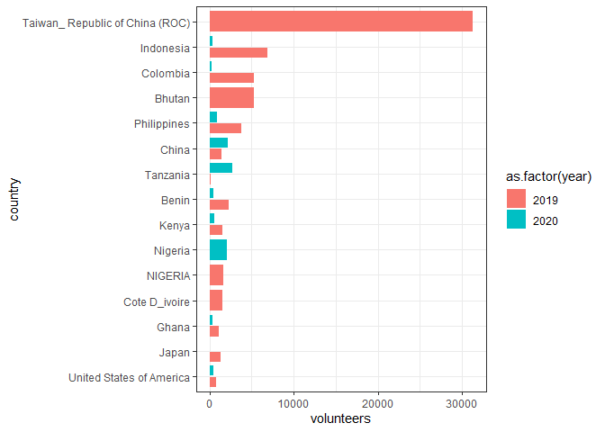
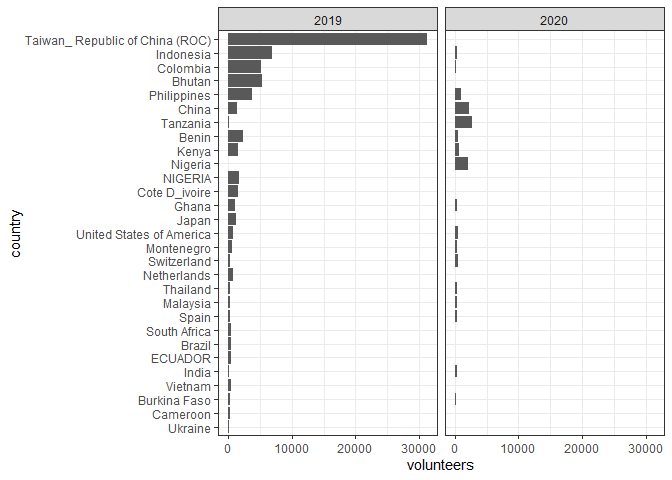
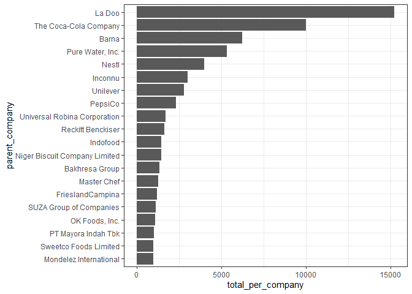

2021-01-26 Plastic Pollution
================

``` r
library(tidyverse)
```

    ## -- Attaching packages --------------------------------------- tidyverse 1.3.0 --

    ## v ggplot2 3.3.3     v purrr   0.3.4
    ## v tibble  3.0.4     v dplyr   1.0.2
    ## v tidyr   1.1.2     v stringr 1.4.0
    ## v readr   1.4.0     v forcats 0.5.0

    ## -- Conflicts ------------------------------------------ tidyverse_conflicts() --
    ## x dplyr::filter() masks stats::filter()
    ## x dplyr::lag()    masks stats::lag()

``` r
library(skimr)
library(ggplot2); theme_set(theme_bw())
`%nin%` = Negate(`%in%`)
```

``` r
plastics <- readr::read_csv('https://raw.githubusercontent.com/rfordatascience/tidytuesday/master/data/2021/2021-01-26/plastics.csv')
```

    ## 
    ## -- Column specification --------------------------------------------------------
    ## cols(
    ##   country = col_character(),
    ##   year = col_double(),
    ##   parent_company = col_character(),
    ##   empty = col_double(),
    ##   hdpe = col_double(),
    ##   ldpe = col_double(),
    ##   o = col_double(),
    ##   pet = col_double(),
    ##   pp = col_double(),
    ##   ps = col_double(),
    ##   pvc = col_double(),
    ##   grand_total = col_double(),
    ##   num_events = col_double(),
    ##   volunteers = col_double()
    ## )

``` r
skim(plastics)
```

|                                                  |          |
| :----------------------------------------------- | :------- |
| Name                                             | plastics |
| Number of rows                                   | 13380    |
| Number of columns                                | 14       |
| \_\_\_\_\_\_\_\_\_\_\_\_\_\_\_\_\_\_\_\_\_\_\_   |          |
| Column type frequency:                           |          |
| character                                        | 2        |
| numeric                                          | 12       |
| \_\_\_\_\_\_\_\_\_\_\_\_\_\_\_\_\_\_\_\_\_\_\_\_ |          |
| Group variables                                  | None     |

Data summary

**Variable type: character**

| skim\_variable  | n\_missing | complete\_rate | min | max | empty | n\_unique | whitespace |
| :-------------- | ---------: | -------------: | --: | --: | ----: | --------: | ---------: |
| country         |          0 |              1 |   4 |  50 |     0 |        69 |          0 |
| parent\_company |          0 |              1 |   1 |  84 |     0 |     10823 |          0 |

**Variable type: numeric**

| skim\_variable | n\_missing | complete\_rate |    mean |      sd |   p0 |  p25 |  p50 |  p75 |   p100 | hist  |
| :------------- | ---------: | -------------: | ------: | ------: | ---: | ---: | ---: | ---: | -----: | :---- |
| year           |          0 |           1.00 | 2019.31 |    0.46 | 2019 | 2019 | 2019 | 2020 |   2020 | ▇▁▁▁▃ |
| empty          |       3243 |           0.76 |    0.41 |   22.59 |    0 |    0 |    0 |    0 |   2208 | ▇▁▁▁▁ |
| hdpe           |       1646 |           0.88 |    3.05 |   66.12 |    0 |    0 |    0 |    0 |   3728 | ▇▁▁▁▁ |
| ldpe           |       2077 |           0.84 |   10.32 |  194.64 |    0 |    0 |    0 |    0 |  11700 | ▇▁▁▁▁ |
| o              |        267 |           0.98 |   49.61 | 1601.99 |    0 |    0 |    0 |    2 | 120646 | ▇▁▁▁▁ |
| pet            |        214 |           0.98 |   20.94 |  428.16 |    0 |    0 |    0 |    0 |  36226 | ▇▁▁▁▁ |
| pp             |       1496 |           0.89 |    8.22 |  141.81 |    0 |    0 |    0 |    0 |   6046 | ▇▁▁▁▁ |
| ps             |       1972 |           0.85 |    1.86 |   39.74 |    0 |    0 |    0 |    0 |   2101 | ▇▁▁▁▁ |
| pvc            |       4328 |           0.68 |    0.35 |    7.89 |    0 |    0 |    0 |    0 |    622 | ▇▁▁▁▁ |
| grand\_total   |         14 |           1.00 |   90.15 | 1873.68 |    0 |    1 |    1 |    6 | 120646 | ▇▁▁▁▁ |
| num\_events    |          0 |           1.00 |   33.37 |   44.71 |    1 |    4 |   15 |   42 |    145 | ▇▃▁▁▂ |
| volunteers     |        107 |           0.99 | 1117.65 | 1812.40 |    1 |  114 |  400 | 1416 |  31318 | ▇▁▁▁▁ |

## Tidying format

Missing data:

  - What sort of plastic is not always recorded, will stick to looking
    at grand\_total
  - Country seems to be missing quite often, will remove “EMPTY”

<!-- end list -->

``` r
plastics_long <- plastics %>%
  filter(country != "EMPTY") %>% 
  pivot_longer(cols = c("hdpe", "ldpe", "o", "pet", "pp", "ps", "pvc", "grand_total"),
               names_to = "type",
               values_to= "amount") %>% 
  select(-empty)

plastics_long %>% 
  count(parent_company) %>% 
  arrange(desc(n))
```

    ## # A tibble: 9,796 x 2
    ##    parent_company             n
    ##    <chr>                  <int>
    ##  1 The Coca-Cola Company    704
    ##  2 Unbranded                672
    ##  3 Unilever                 472
    ##  4 Mondelez International   464
    ##  5 Mars, Incorporated       424
    ##  6 Grand Total              408
    ##  7 null                     400
    ##  8 Pepsico                  344
    ##  9 Colgate-Palmolive        336
    ## 10 Ferrero Group            304
    ## # ... with 9,786 more rows

## Possible questions

  - Activity of BFFP per country?
  - Growth of activity over two years?
  - Which companies pollute most?
  - What sort of plastics?

<!-- end list -->

``` r
plastics_long %>% 
  select(country, year, num_events) %>% 
  distinct() %>% 
  arrange(desc(num_events))
```

    ## # A tibble: 106 x 3
    ##    country                   year num_events
    ##    <chr>                    <dbl>      <dbl>
    ##  1 United States of America  2020        134
    ##  2 India                     2020         56
    ##  3 Indonesia                 2020         50
    ##  4 China                     2019         48
    ##  5 United States of America  2019         42
    ##  6 Japan                     2019         35
    ##  7 Malaysia                  2020         35
    ##  8 Indonesia                 2019         32
    ##  9 Mexico                    2020         32
    ## 10 Korea                     2020         26
    ## # ... with 96 more rows

## Most activity of BFFP in 2020

``` r
plastics_long %>% 
  group_by(country, year) 
```

    ## # A tibble: 96,272 x 7
    ## # Groups:   country, year [106]
    ##    country    year parent_company num_events volunteers type        amount
    ##    <chr>     <dbl> <chr>               <dbl>      <dbl> <chr>        <dbl>
    ##  1 Argentina  2019 Grand Total             4        243 hdpe           215
    ##  2 Argentina  2019 Grand Total             4        243 ldpe            55
    ##  3 Argentina  2019 Grand Total             4        243 o              607
    ##  4 Argentina  2019 Grand Total             4        243 pet           1376
    ##  5 Argentina  2019 Grand Total             4        243 pp             281
    ##  6 Argentina  2019 Grand Total             4        243 ps             116
    ##  7 Argentina  2019 Grand Total             4        243 pvc             18
    ##  8 Argentina  2019 Grand Total             4        243 grand_total   2668
    ##  9 Argentina  2019 Unbranded               4        243 hdpe           155
    ## 10 Argentina  2019 Unbranded               4        243 ldpe            50
    ## # ... with 96,262 more rows

``` r
plastics_long %>% 
  select(year, country, volunteers) %>% 
  filter(country != "EMPTY") %>%
  distinct() %>% 
  group_by(country) %>% 
  mutate(total_volunteers = sum(volunteers)) %>% 
  ungroup %>% 
  mutate(country = fct_reorder(country, total_volunteers)) %>%
  arrange(desc(total_volunteers)) %>% 
  head(25) %>% 
  ggplot(aes(x = volunteers, y= country, fill = as.factor(year))) +
  geom_col(position = position_dodge2())
```

<!-- -->

## Has there been less reporting or less volunteering in 2020? Or has the participation changed that much?

  - Hard to tell
  - The change between the years is nonetheless interesting

<!-- end list -->

``` r
plastics_long %>% 
  select(year, country, volunteers) %>% 
  filter(country != "EMPTY") %>%
  distinct() %>% 
  group_by(country) %>% 
  mutate(total_volunteers = sum(volunteers)) %>% 
  ungroup %>% 
  mutate(country = fct_reorder(country, total_volunteers)) %>%
  arrange(desc(total_volunteers)) %>% 
  head(50) %>% 
  ggplot(aes(x = volunteers, y= country)) +
  geom_col(position = position_dodge2()) +
  facet_wrap(~year, nrow = 1)
```

<!-- -->

## Which company produced the most waste overall?

``` r
plastics_long %>% 
  mutate_at(vars(parent_company), function(x){gsub('[^ -~]', '', x)}) %>%  # removing non UTF-8 character that throw off summarise()
  filter(type == "grand_total", 
         year == "2019",
         parent_company %nin% c("Grand Total",
                                "Unbranded",
                                "Assorted")) %>% # Going through these iteratively to remove irrelevant parent companies
  group_by(parent_company) %>% 
  summarise(total_per_company = sum(amount)) %>% 
  arrange(desc(total_per_company)) %>% 
  head(20) %>% 
  mutate(parent_company = fct_reorder(parent_company, total_per_company)) %>% 
  ggplot(aes(x = total_per_company, y = parent_company)) +
  geom_col()
```

    ## `summarise()` ungrouping output (override with `.groups` argument)

<!-- -->

## Further analysis

  - Normalize for participation per country?
  - Companies x Types of plastics?

<!-- end list -->

``` r
sessionInfo()
```

    ## R version 4.0.3 (2020-10-10)
    ## Platform: x86_64-w64-mingw32/x64 (64-bit)
    ## Running under: Windows 10 x64 (build 18363)
    ## 
    ## Matrix products: default
    ## 
    ## locale:
    ## [1] LC_COLLATE=English_United States.1252 
    ## [2] LC_CTYPE=English_United States.1252   
    ## [3] LC_MONETARY=English_United States.1252
    ## [4] LC_NUMERIC=C                          
    ## [5] LC_TIME=English_United States.1252    
    ## 
    ## attached base packages:
    ## [1] stats     graphics  grDevices utils     datasets  methods   base     
    ## 
    ## other attached packages:
    ##  [1] skimr_2.1.2     forcats_0.5.0   stringr_1.4.0   dplyr_1.0.2    
    ##  [5] purrr_0.3.4     readr_1.4.0     tidyr_1.1.2     tibble_3.0.4   
    ##  [9] ggplot2_3.3.3   tidyverse_1.3.0
    ## 
    ## loaded via a namespace (and not attached):
    ##  [1] tidyselect_1.1.0  xfun_0.20         repr_1.1.3        haven_2.3.1      
    ##  [5] colorspace_2.0-0  vctrs_0.3.6       generics_0.1.0    htmltools_0.5.0  
    ##  [9] yaml_2.2.1        base64enc_0.1-3   utf8_1.1.4        rlang_0.4.10     
    ## [13] pillar_1.4.7      glue_1.4.2        withr_2.3.0       DBI_1.1.0        
    ## [17] dbplyr_2.0.0      modelr_0.1.8      readxl_1.3.1      lifecycle_0.2.0  
    ## [21] munsell_0.5.0     gtable_0.3.0      cellranger_1.1.0  rvest_0.3.6      
    ## [25] evaluate_0.14     labeling_0.4.2    knitr_1.30        curl_4.3         
    ## [29] fansi_0.4.2       highr_0.8         broom_0.7.3       Rcpp_1.0.5       
    ## [33] scales_1.1.1      backports_1.2.0   jsonlite_1.7.2    farver_2.0.3     
    ## [37] fs_1.5.0          hms_1.0.0         digest_0.6.27     stringi_1.5.3    
    ## [41] grid_4.0.3        cli_2.2.0         tools_4.0.3       magrittr_2.0.1   
    ## [45] crayon_1.3.4      pkgconfig_2.0.3   ellipsis_0.3.1    xml2_1.3.2       
    ## [49] reprex_0.3.0      lubridate_1.7.9.2 assertthat_0.2.1  rmarkdown_2.6    
    ## [53] httr_1.4.2        rstudioapi_0.13   R6_2.5.0          compiler_4.0.3
