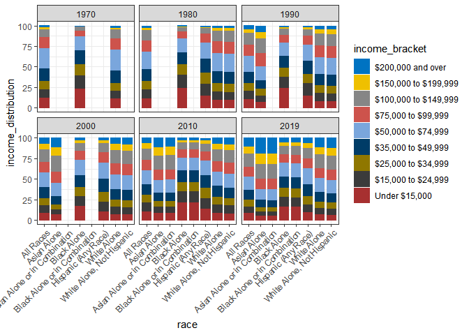
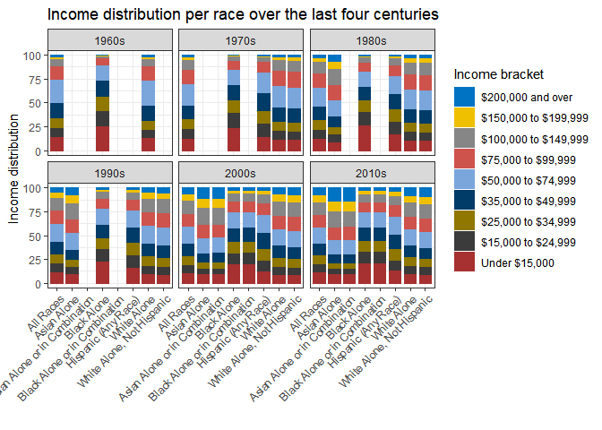

2021-02-09 Wealth and Income
================

``` r
library(tidyverse)
```

    ## -- Attaching packages --------------------------------------- tidyverse 1.3.0 --

    ## v ggplot2 3.3.3     v purrr   0.3.4
    ## v tibble  3.0.4     v dplyr   1.0.2
    ## v tidyr   1.1.2     v stringr 1.4.0
    ## v readr   1.4.0     v forcats 0.5.0

    ## -- Conflicts ------------------------------------------ tidyverse_conflicts() --
    ## x dplyr::filter() masks stats::filter()
    ## x dplyr::lag()    masks stats::lag()

``` r
library(skimr)
library(ggplot2); theme_set(theme_bw())
library(ggsci)
`%nin%` = Negate(`%in%`)
```

``` r
income_distribution <- readr::read_csv('https://raw.githubusercontent.com/rfordatascience/tidytuesday/master/data/2021/2021-02-09/income_distribution.csv')
```

    ## 
    ## -- Column specification --------------------------------------------------------
    ## cols(
    ##   year = col_double(),
    ##   race = col_character(),
    ##   number = col_double(),
    ##   income_median = col_double(),
    ##   income_med_moe = col_double(),
    ##   income_mean = col_double(),
    ##   income_mean_moe = col_double(),
    ##   income_bracket = col_character(),
    ##   income_distribution = col_double()
    ## )

``` r
skim(income_distribution)
```

|                                                  |                      |
| :----------------------------------------------- | :------------------- |
| Name                                             | income\_distribution |
| Number of rows                                   | 2916                 |
| Number of columns                                | 9                    |
| \_\_\_\_\_\_\_\_\_\_\_\_\_\_\_\_\_\_\_\_\_\_\_   |                      |
| Column type frequency:                           |                      |
| character                                        | 2                    |
| numeric                                          | 7                    |
| \_\_\_\_\_\_\_\_\_\_\_\_\_\_\_\_\_\_\_\_\_\_\_\_ |                      |
| Group variables                                  | None                 |

Data summary

**Variable type: character**

| skim\_variable  | n\_missing | complete\_rate | min | max | empty | n\_unique | whitespace |
| :-------------- | ---------: | -------------: | --: | --: | ----: | --------: | ---------: |
| race            |          0 |              1 |   9 |  29 |     0 |         8 |          0 |
| income\_bracket |          0 |              1 |  13 |  20 |     0 |         9 |          0 |

**Variable type: numeric**

| skim\_variable       | n\_missing | complete\_rate |        mean |          sd |        p0 |        p25 |        p50 |         p75 |        p100 | hist  |
| :------------------- | ---------: | -------------: | ----------: | ----------: | --------: | ---------: | ---------: | ----------: | ----------: | :---- |
| year                 |          0 |           1.00 |     1996.70 |       14.71 |    1967.0 |    1985.00 |     1998.5 |     2009.00 |      2019.0 | ▅▅▆▇▇ |
| number               |          9 |           1.00 | 45510458.20 | 40025980.34 | 1913000.0 | 7489000.00 | 17318000.0 | 82368000.00 | 128579000.0 | ▇▁▃▃▁ |
| income\_median       |          0 |           1.00 |    55320.43 |    14368.21 |   29026.0 |   42100.75 |    55674.5 |    64411.75 |     98174.0 | ▇▆▇▃▁ |
| income\_med\_moe     |          0 |           1.00 |     1131.94 |     1002.70 |     268.0 |     470.00 |      794.0 |     1299.00 |      6080.0 | ▇▁▁▁▁ |
| income\_mean         |          9 |           1.00 |    72331.10 |    19960.73 |   34878.0 |   56812.00 |    67724.0 |    86838.00 |    133111.0 | ▃▇▆▂▁ |
| income\_mean\_moe    |         27 |           0.99 |     1379.58 |     1263.47 |     287.0 |     566.00 |      966.0 |     1505.00 |      8076.0 | ▇▁▁▁▁ |
| income\_distribution |          0 |           1.00 |       11.11 |        5.11 |       0.1 |       8.10 |       10.9 |       14.53 |        27.2 | ▃▇▇▃▁ |

## Exploring data

  - What are the categories for race?
  - Checking data completeness -\> only “Black Alone” and “White Alone”
    seem to be complete over the years
  - Testing that income\_distribution adds up to 100 for a single year
    and race?

<!-- end list -->

``` r
income_distribution %>% 
  count(race)
```

    ## # A tibble: 8 x 2
    ##   race                              n
    ##   <chr>                         <int>
    ## 1 All Races                       477
    ## 2 Asian Alone                     297
    ## 3 Asian Alone or in Combination   162
    ## 4 Black Alone                     477
    ## 5 Black Alone or in Combination   162
    ## 6 Hispanic (Any Race)             432
    ## 7 White Alone                     477
    ## 8 White Alone, Not Hispanic       432

``` r
income_distribution %>% 
  filter(race == "Asian Alone", year == 2000) %>% 
  summarise(sum_in_dist = sum(income_distribution))
```

    ## # A tibble: 1 x 1
    ##   sum_in_dist
    ##         <dbl>
    ## 1         100

  - Data seems to be complete after 2001 (maybe the categories for race
    changed?)

<!-- end list -->

``` r
income_distribution %>% 
  filter(year > 2001) %>% 
  count(race)
```

    ## # A tibble: 8 x 2
    ##   race                              n
    ##   <chr>                         <int>
    ## 1 All Races                       162
    ## 2 Asian Alone                     162
    ## 3 Asian Alone or in Combination   162
    ## 4 Black Alone                     162
    ## 5 Black Alone or in Combination   162
    ## 6 Hispanic (Any Race)             162
    ## 7 White Alone                     162
    ## 8 White Alone, Not Hispanic       162

  - Plotting number of households over time per race

<!-- end list -->

``` r
income_distribution %>% 
  ggplot(aes(x = year, y = number / 1000, color = race)) +
  geom_smooth(se = F)
```

    ## `geom_smooth()` using method = 'loess' and formula 'y ~ x'

    ## Warning: Removed 9 rows containing non-finite values (stat_smooth).

<!-- -->

  - Graphing income distribution over the years
  - It seems the distribution is tending up over time for all races
  - Try a barplot

<!-- end list -->

``` r
correct_order_income_bracket <- unique(income_distribution$income_bracket)

income_distribution %>% 
  mutate(income_bracket = fct_relevel(income_bracket, correct_order_income_bracket)) %>% 
  ggplot(aes(x = income_bracket, y = income_distribution, color = year)) +
  geom_point() +
  theme(axis.text.x = element_text(angle=45, hjust = 1)) +
  facet_wrap(~race) +
  scale_color_viridis_c()
```

<!-- -->
\*

``` r
income_distribution %>% 
  filter(year %in% c(1970, 1980, 1990, 2000, 2010, 2019)) %>% 
  mutate(income_bracket = fct_relevel(income_bracket, rev(correct_order_income_bracket))) %>% 
  ggplot(aes(x = race, y = income_distribution, color = income_bracket, fill = income_bracket)) +
  geom_col(width= 0.8) +
  theme(axis.text.x = element_text(angle=45, hjust = 1)) +
  facet_wrap(~year) +
  scale_color_jco() +
  scale_fill_jco() 
```

<!-- -->

  - Summarise over centuries, tidying up graph

<!-- end list -->

``` r
income_distribution$century <- "2010s"
income_distribution$century[income_distribution$year < 2010] <- "2000s"
income_distribution$century[income_distribution$year < 2000] <- "1990s"
income_distribution$century[income_distribution$year < 1990] <- "1980s"
income_distribution$century[income_distribution$year < 1980] <- "1970s"
income_distribution$century[income_distribution$year < 1970] <- "1960s"

income_distribution %>% 
  group_by(race, century, income_bracket) %>% 
  summarise(per_century_inc_dist = mean(income_distribution)) %>% 
  mutate(income_bracket = fct_relevel(income_bracket, rev(correct_order_income_bracket))) %>% 
  ggplot(aes(x = race, y = per_century_inc_dist, color = income_bracket, fill = income_bracket)) +
  geom_col(width= 0.8) +
  theme(axis.text.x = element_text(angle=45, hjust = 1)) +
  facet_wrap(~century) +
  scale_color_jco() +
  scale_fill_jco() + 
  labs(title = "Income distribution per race over the last four centuries",
       x = "",
       y = "Income distribution",
       color= "Income bracket",
       fill = "Income bracket")
```

    ## `summarise()` regrouping output by 'race', 'century' (override with `.groups` argument)

<!-- -->

  - Repeat the same graph, just reverse order of x-axis and facets

<!-- end list -->

``` r
income_distribution %>% 
  group_by(race, century, income_bracket) %>% 
  summarise(per_century_inc_dist = mean(income_distribution)) %>% 
  mutate(income_bracket = fct_relevel(income_bracket, rev(correct_order_income_bracket))) %>% 
  ggplot(aes(x = century, y = per_century_inc_dist, color = income_bracket, fill = income_bracket)) +
  geom_col(width= 0.8) +
  theme(axis.text.x = element_text(angle=45, hjust = 1)) +
  facet_wrap(~race) +
  scale_color_jco() +
  scale_fill_jco() + 
  labs(title = "Income distribution per race over the last four centuries",
       x = "",
       y = "Income distribution",
       color= "Income bracket",
       fill = "Income bracket")
```

    ## `summarise()` regrouping output by 'race', 'century' (override with `.groups` argument)

<!-- -->

## Final summary plot

  - With this type of plot, there is no need to summarise over centuries
  - Limit plot to four race categories to make trends visible

<!-- end list -->

``` r
income_distribution %>% 
  filter(race %in% c("Black Alone", "White Alone, Not Hispanic", "Hispanic (Any Race)", "Asian Alone")) %>%
  mutate(income_bracket = fct_relevel(income_bracket, rev(correct_order_income_bracket))) %>% 
  ggplot(aes(x = year, y = income_distribution, color = income_bracket, fill = income_bracket)) +
  geom_col(width= 0.8) +
  facet_wrap(~race) +
  scale_color_jco() +
  scale_fill_jco() +
  labs(title = "US household income per race ",
       x = "Year",
       y = "Income distribution",
       color= "Income bracket",
       fill = "Income bracket")
```

<!-- -->

``` r
sessionInfo()
```

    ## R version 4.0.3 (2020-10-10)
    ## Platform: x86_64-w64-mingw32/x64 (64-bit)
    ## Running under: Windows 10 x64 (build 18363)
    ## 
    ## Matrix products: default
    ## 
    ## locale:
    ## [1] LC_COLLATE=English_United States.1252 
    ## [2] LC_CTYPE=English_United States.1252   
    ## [3] LC_MONETARY=English_United States.1252
    ## [4] LC_NUMERIC=C                          
    ## [5] LC_TIME=English_United States.1252    
    ## 
    ## attached base packages:
    ## [1] stats     graphics  grDevices utils     datasets  methods   base     
    ## 
    ## other attached packages:
    ##  [1] ggsci_2.9       skimr_2.1.2     forcats_0.5.0   stringr_1.4.0  
    ##  [5] dplyr_1.0.2     purrr_0.3.4     readr_1.4.0     tidyr_1.1.2    
    ##  [9] tibble_3.0.4    ggplot2_3.3.3   tidyverse_1.3.0
    ## 
    ## loaded via a namespace (and not attached):
    ##  [1] Rcpp_1.0.5        lubridate_1.7.9.2 lattice_0.20-41   assertthat_0.2.1 
    ##  [5] digest_0.6.27     utf8_1.1.4        R6_2.5.0          cellranger_1.1.0 
    ##  [9] repr_1.1.3        backports_1.2.0   reprex_0.3.0      evaluate_0.14    
    ## [13] httr_1.4.2        highr_0.8         pillar_1.4.7      rlang_0.4.10     
    ## [17] curl_4.3          readxl_1.3.1      rstudioapi_0.13   Matrix_1.2-18    
    ## [21] rmarkdown_2.6     labeling_0.4.2    splines_4.0.3     munsell_0.5.0    
    ## [25] broom_0.7.3       compiler_4.0.3    modelr_0.1.8      xfun_0.20        
    ## [29] pkgconfig_2.0.3   base64enc_0.1-3   mgcv_1.8-33       htmltools_0.5.0  
    ## [33] tidyselect_1.1.0  viridisLite_0.3.0 fansi_0.4.2       crayon_1.3.4     
    ## [37] dbplyr_2.0.0      withr_2.3.0       grid_4.0.3        nlme_3.1-149     
    ## [41] jsonlite_1.7.2    gtable_0.3.0      lifecycle_0.2.0   DBI_1.1.0        
    ## [45] magrittr_2.0.1    scales_1.1.1      cli_2.2.0         stringi_1.5.3    
    ## [49] farver_2.0.3      fs_1.5.0          xml2_1.3.2        ellipsis_0.3.1   
    ## [53] generics_0.1.0    vctrs_0.3.6       tools_4.0.3       glue_1.4.2       
    ## [57] hms_1.0.0         yaml_2.2.1        colorspace_2.0-0  rvest_0.3.6      
    ## [61] knitr_1.30        haven_2.3.1
