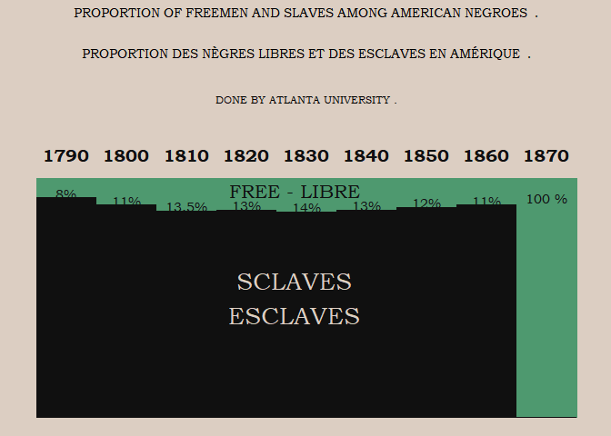

2021-02-16 W.E.B. Du Bois Challenge
================

10 different challenges are available, challenge\_04, challenge\_08 and
challenge\_10 may be possible for me.

``` r
library(tidyverse)
```

    ## -- Attaching packages --------------------------------------- tidyverse 1.3.0 --

    ## v ggplot2 3.3.3     v purrr   0.3.4
    ## v tibble  3.0.4     v dplyr   1.0.2
    ## v tidyr   1.1.2     v stringr 1.4.0
    ## v readr   1.4.0     v forcats 0.5.0

    ## -- Conflicts ------------------------------------------ tidyverse_conflicts() --
    ## x dplyr::filter() masks stats::filter()
    ## x dplyr::lag()    masks stats::lag()

``` r
library(skimr)
library(extrafont)
```

    ## Registering fonts with R

``` r
# font_import()
loadfonts(device = "win")
```

    ## Agency FB already registered with windowsFonts().

    ## Algerian already registered with windowsFonts().

    ## Arial Black already registered with windowsFonts().

    ## Arial already registered with windowsFonts().

    ## Arial Narrow already registered with windowsFonts().

    ## Arial Rounded MT Bold already registered with windowsFonts().

    ## Bahnschrift already registered with windowsFonts().

    ## Baskerville Old Face already registered with windowsFonts().

    ## Bauhaus 93 already registered with windowsFonts().

    ## Bell MT already registered with windowsFonts().

    ## Berlin Sans FB already registered with windowsFonts().

    ## Berlin Sans FB Demi already registered with windowsFonts().

    ## Bernard MT Condensed already registered with windowsFonts().

    ## Blackadder ITC already registered with windowsFonts().

    ## Bodoni MT already registered with windowsFonts().

    ## Bodoni MT Black already registered with windowsFonts().

    ## Bodoni MT Condensed already registered with windowsFonts().

    ## Bodoni MT Poster Compressed already registered with windowsFonts().

    ## Book Antiqua already registered with windowsFonts().

    ## Bookman Old Style already registered with windowsFonts().

    ## Bookshelf Symbol 7 already registered with windowsFonts().

    ## Bradley Hand ITC already registered with windowsFonts().

    ## Britannic Bold already registered with windowsFonts().

    ## Broadway already registered with windowsFonts().

    ## Brush Script MT already registered with windowsFonts().

    ## Calibri already registered with windowsFonts().

    ## Calibri Light already registered with windowsFonts().

    ## Californian FB already registered with windowsFonts().

    ## Calisto MT already registered with windowsFonts().

    ## Cambria already registered with windowsFonts().

    ## Candara already registered with windowsFonts().

    ## Candara Light already registered with windowsFonts().

    ## Castellar already registered with windowsFonts().

    ## Centaur already registered with windowsFonts().

    ## Century already registered with windowsFonts().

    ## Century Gothic already registered with windowsFonts().

    ## Century Schoolbook already registered with windowsFonts().

    ## Chiller already registered with windowsFonts().

    ## Colonna MT already registered with windowsFonts().

    ## Comic Sans MS already registered with windowsFonts().

    ## Consolas already registered with windowsFonts().

    ## Constantia already registered with windowsFonts().

    ## Cooper Black already registered with windowsFonts().

    ## Copperplate Gothic Bold already registered with windowsFonts().

    ## Copperplate Gothic Light already registered with windowsFonts().

    ## Corbel already registered with windowsFonts().

    ## Corbel Light already registered with windowsFonts().

    ## Courier New already registered with windowsFonts().

    ## Curlz MT already registered with windowsFonts().

    ## Droid Sans Mono Slashed already registered with windowsFonts().

    ## Ebrima already registered with windowsFonts().

    ## Edwardian Script ITC already registered with windowsFonts().

    ## Elephant already registered with windowsFonts().

    ## Engravers MT already registered with windowsFonts().

    ## Eras Bold ITC already registered with windowsFonts().

    ## Eras Demi ITC already registered with windowsFonts().

    ## Eras Light ITC already registered with windowsFonts().

    ## Eras Medium ITC already registered with windowsFonts().

    ## Felix Titling already registered with windowsFonts().

    ## Footlight MT Light already registered with windowsFonts().

    ## Forte already registered with windowsFonts().

    ## Franklin Gothic Book already registered with windowsFonts().

    ## Franklin Gothic Demi already registered with windowsFonts().

    ## Franklin Gothic Demi Cond already registered with windowsFonts().

    ## Franklin Gothic Heavy already registered with windowsFonts().

    ## Franklin Gothic Medium already registered with windowsFonts().

    ## Franklin Gothic Medium Cond already registered with windowsFonts().

    ## Freestyle Script already registered with windowsFonts().

    ## French Script MT already registered with windowsFonts().

    ## Gabriola already registered with windowsFonts().

    ## Gadugi already registered with windowsFonts().

    ## Garamond already registered with windowsFonts().

    ## Georgia already registered with windowsFonts().

    ## Gigi already registered with windowsFonts().

    ## Gill Sans Ultra Bold already registered with windowsFonts().

    ## Gill Sans Ultra Bold Condensed already registered with windowsFonts().

    ## Gill Sans MT already registered with windowsFonts().

    ## Gill Sans MT Condensed already registered with windowsFonts().

    ## Gill Sans MT Ext Condensed Bold already registered with windowsFonts().

    ## Gloucester MT Extra Condensed already registered with windowsFonts().

    ## Goudy Old Style already registered with windowsFonts().

    ## Goudy Stout already registered with windowsFonts().

    ## Haettenschweiler already registered with windowsFonts().

    ## Harlow Solid Italic already registered with windowsFonts().

    ## Harrington already registered with windowsFonts().

    ## High Tower Text already registered with windowsFonts().

    ## HoloLens MDL2 Assets already registered with windowsFonts().

    ## Impact already registered with windowsFonts().

    ## Imprint MT Shadow already registered with windowsFonts().

    ## Informal Roman already registered with windowsFonts().

    ## Ink Free already registered with windowsFonts().

    ## Javanese Text already registered with windowsFonts().

    ## Jokerman already registered with windowsFonts().

    ## Juice ITC already registered with windowsFonts().

    ## Kristen ITC already registered with windowsFonts().

    ## Kunstler Script already registered with windowsFonts().

    ## Wide Latin already registered with windowsFonts().

    ## Leelawadee already registered with windowsFonts().

    ## Leelawadee UI already registered with windowsFonts().

    ## Leelawadee UI Semilight already registered with windowsFonts().

    ## Lucida Bright already registered with windowsFonts().

    ## Lucida Calligraphy already registered with windowsFonts().

    ## Lucida Console already registered with windowsFonts().

    ## Lucida Fax already registered with windowsFonts().

    ## Lucida Handwriting already registered with windowsFonts().

    ## Lucida Sans already registered with windowsFonts().

    ## Lucida Sans Typewriter already registered with windowsFonts().

    ## Lucida Sans Unicode already registered with windowsFonts().

    ## Magneto already registered with windowsFonts().

    ## Maiandra GD already registered with windowsFonts().

    ## Malgun Gothic already registered with windowsFonts().

    ## Malgun Gothic Semilight already registered with windowsFonts().

    ## Marlett already registered with windowsFonts().

    ## Matura MT Script Capitals already registered with windowsFonts().

    ## Microsoft Himalaya already registered with windowsFonts().

    ## Microsoft Yi Baiti already registered with windowsFonts().

    ## Microsoft New Tai Lue already registered with windowsFonts().

    ## Microsoft PhagsPa already registered with windowsFonts().

    ## Microsoft Sans Serif already registered with windowsFonts().

    ## Microsoft Tai Le already registered with windowsFonts().

    ## Microsoft Uighur already registered with windowsFonts().

    ## Mistral already registered with windowsFonts().

    ## Modern No. 20 already registered with windowsFonts().

    ## Mongolian Baiti already registered with windowsFonts().

    ## Monotype Corsiva already registered with windowsFonts().

    ## MS Outlook already registered with windowsFonts().

    ## MS Reference Sans Serif already registered with windowsFonts().

    ## MS Reference Specialty already registered with windowsFonts().

    ## MT Extra already registered with windowsFonts().

    ## MV Boli already registered with windowsFonts().

    ## Myanmar Text already registered with windowsFonts().

    ## Niagara Engraved already registered with windowsFonts().

    ## Niagara Solid already registered with windowsFonts().

    ## Nirmala UI already registered with windowsFonts().

    ## Nirmala UI Semilight already registered with windowsFonts().

    ## OCR A Extended already registered with windowsFonts().

    ## Old English Text MT already registered with windowsFonts().

    ## Onyx already registered with windowsFonts().

    ## Open Sans already registered with windowsFonts().

    ## Open Sans ExtraBold already registered with windowsFonts().

    ## Open Sans Light already registered with windowsFonts().

    ## Open Sans SemiBold already registered with windowsFonts().

    ## Oswald already registered with windowsFonts().

    ## Oswald ExtraLight already registered with windowsFonts().

    ## Oswald Light already registered with windowsFonts().

    ## Oswald Medium already registered with windowsFonts().

    ## Oswald SemiBold already registered with windowsFonts().

    ## Palace Script MT already registered with windowsFonts().

    ## Palatino Linotype already registered with windowsFonts().

    ## Papyrus already registered with windowsFonts().

    ## Parchment already registered with windowsFonts().

    ## Perpetua already registered with windowsFonts().

    ## Perpetua Titling MT already registered with windowsFonts().

    ## Playbill already registered with windowsFonts().

    ## Poor Richard already registered with windowsFonts().

    ## Pristina already registered with windowsFonts().

    ## Rage Italic already registered with windowsFonts().

    ## Ravie already registered with windowsFonts().

    ## Rockwell already registered with windowsFonts().

    ## Rockwell Condensed already registered with windowsFonts().

    ## Rockwell Extra Bold already registered with windowsFonts().

    ## Script MT Bold already registered with windowsFonts().

    ## Segoe Condensed already registered with windowsFonts().

    ## Segoe MDL2 Assets already registered with windowsFonts().

    ## Segoe Print already registered with windowsFonts().

    ## Segoe Script already registered with windowsFonts().

    ## Segoe UI already registered with windowsFonts().

    ## Segoe UI Light already registered with windowsFonts().

    ## Segoe UI Semibold already registered with windowsFonts().

    ## Segoe UI Semilight already registered with windowsFonts().

    ## Segoe UI Black already registered with windowsFonts().

    ## Segoe UI Emoji already registered with windowsFonts().

    ## Segoe UI Historic already registered with windowsFonts().

    ## Segoe UI Symbol already registered with windowsFonts().

    ## Showcard Gothic already registered with windowsFonts().

    ## SimSun-ExtB already registered with windowsFonts().

    ## Snap ITC already registered with windowsFonts().

    ## Stencil already registered with windowsFonts().

    ## Sylfaen already registered with windowsFonts().

    ## Symbol already registered with windowsFonts().

    ## Tahoma already registered with windowsFonts().

    ## Tempus Sans ITC already registered with windowsFonts().

    ## Times New Roman already registered with windowsFonts().

    ## Trebuchet MS already registered with windowsFonts().

    ## Tw Cen MT already registered with windowsFonts().

    ## Tw Cen MT Condensed already registered with windowsFonts().

    ## Tw Cen MT Condensed Extra Bold already registered with windowsFonts().

    ## Unispace already registered with windowsFonts().

    ## Verdana already registered with windowsFonts().

    ## Viner Hand ITC already registered with windowsFonts().

    ## Vivaldi already registered with windowsFonts().

    ## Vladimir Script already registered with windowsFonts().

    ## Webdings already registered with windowsFonts().

    ## Wingdings already registered with windowsFonts().

    ## Wingdings 2 already registered with windowsFonts().

    ## Wingdings 3 already registered with windowsFonts().

    ## ZWAdobeF already registered with windowsFonts().

``` r
`%nin%` = Negate(`%in%`)
```

## challenge\_04 Freed Slaves

``` r
freed_slaves <- readr::read_csv('https://raw.githubusercontent.com/rfordatascience/tidytuesday/master/data/2021/2021-02-16/freed_slaves.csv')
```

    ## 
    ## -- Column specification --------------------------------------------------------
    ## cols(
    ##   Year = col_double(),
    ##   Slave = col_double(),
    ##   Free = col_double()
    ## )

``` r
skim(freed_slaves)
```

|                                                  |               |
| :----------------------------------------------- | :------------ |
| Name                                             | freed\_slaves |
| Number of rows                                   | 9             |
| Number of columns                                | 3             |
| \_\_\_\_\_\_\_\_\_\_\_\_\_\_\_\_\_\_\_\_\_\_\_   |               |
| Column type frequency:                           |               |
| numeric                                          | 3             |
| \_\_\_\_\_\_\_\_\_\_\_\_\_\_\_\_\_\_\_\_\_\_\_\_ |               |
| Group variables                                  | None          |

Data summary

**Variable type: numeric**

| skim\_variable | n\_missing | complete\_rate |    mean |    sd |   p0 |    p25 |  p50 |    p75 | p100 | hist  |
| :------------- | ---------: | -------------: | ------: | ----: | ---: | -----: | ---: | -----: | ---: | :---- |
| Year           |          0 |              1 | 1830.00 | 27.39 | 1790 | 1810.0 | 1830 | 1850.0 | 1870 | ▇▇▃▇▇ |
| Slave          |          0 |              1 |   78.17 | 29.37 |    0 |   86.5 |   87 |   88.0 |   92 | ▁▁▁▁▇ |
| Free           |          0 |              1 |   21.72 | 29.41 |    8 |   11.0 |   13 |   13.5 |  100 | ▇▁▁▁▁ |

  - 1800 is missing one percent, will add to category Slave based on
    original image
  - Second thoughts \*\* This graph really is not that interesting - not
    much changes for 70 years, then all slaves are freed \*\* Better
    approach would be using geom\_smooth for either free or slave
    category and fill the background either green or black

<!-- end list -->

``` r
freed_slaves$Slave[freed_slaves$Year == 1800] <- 89
font <- "Bookman Old Style"

freed_slaves_long <- freed_slaves %>% 
  pivot_longer(cols = c("Free", "Slave"), names_to= "Status", values_to = "Percentage")
p <- freed_slaves_long %>% 
  ggplot(aes(x = Year, y = Percentage, color = Status, fill = Status)) +
  geom_col(width = 10) + 
  # geom_col(aes(x = Year, y = 50), width = 0.0001, color = "black") + # Trying to add the light gridlines
  scale_x_continuous(breaks = c(unique(freed_slaves$Year)), position= "top") + 
  labs(title = "PROPORTION OF FREEMEN AND SLAVES AMONG AMERICAN NEGROES  .\n\n\nPROPORTION DES NÈGRES LIBRES ET DES ESCLAVES EN AMÉRIQUE  .\n\n", 
       subtitle = "DONE BY ATLANTA UNIVERSITY .\n\n\n")+
  theme(legend.position = "none",
        axis.title.y=element_blank(),
        axis.text.y=element_blank(),
        axis.ticks.y=element_blank(),
        axis.ticks.x=element_blank(),
        axis.title.x = element_blank(),
        plot.title = element_text(hjust = 0.5, family = font, size = 10.5),
        plot.subtitle = element_text(hjust = 0.5, family = font, size = 8.5),
        panel.border = element_blank(),
        panel.grid.major = element_blank(),
        panel.grid.minor = element_blank(),
        panel.grid = element_line(), 
        panel.background = element_rect(fill = "#dccec2", color = "#dccec2"),
        plot.background = element_rect(fill = "#dccec2", color = "#dccec2"),
        axis.text.x=element_text(face = "bold", family = font, size =14, color = "#101010")) +
  scale_fill_manual(values=c("#4e996f", "#101010")) +
  scale_color_manual(values=c("#4e996f", "#101010")) +
  annotate("text", label = "SCLAVES\nESCLAVES", x = 1828, y = 50, 
           color = "#dccec2", family = font, size = 7) +
  annotate("text", label = "FREE - LIBRE", x = 1828, y = 95, 
           color = "#101010", family = font, size = 5.5) +
  geom_text(data = freed_slaves_long %>%  filter(Year != 1870), 
            aes(label = paste0(Percentage, "%"), y = 102-Percentage), 
            color = "#101010", family = font) +
  annotate("text", label = "100 %", x = 1870, y = 92, 
           color = "#101010", family = font, size = 4)

p
```

<!-- -->

``` r
ggsave(p, filename = "challenge_04.png", units = "cm", width = 12, height = 16, limitsize = F, scale = 1.4)
```

``` r
sessionInfo()
```

    ## R version 4.0.3 (2020-10-10)
    ## Platform: x86_64-w64-mingw32/x64 (64-bit)
    ## Running under: Windows 10 x64 (build 18363)
    ## 
    ## Matrix products: default
    ## 
    ## locale:
    ## [1] LC_COLLATE=English_United States.1252 
    ## [2] LC_CTYPE=English_United States.1252   
    ## [3] LC_MONETARY=English_United States.1252
    ## [4] LC_NUMERIC=C                          
    ## [5] LC_TIME=English_United States.1252    
    ## 
    ## attached base packages:
    ## [1] stats     graphics  grDevices utils     datasets  methods   base     
    ## 
    ## other attached packages:
    ##  [1] extrafont_0.17  skimr_2.1.2     forcats_0.5.0   stringr_1.4.0  
    ##  [5] dplyr_1.0.2     purrr_0.3.4     readr_1.4.0     tidyr_1.1.2    
    ##  [9] tibble_3.0.4    ggplot2_3.3.3   tidyverse_1.3.0
    ## 
    ## loaded via a namespace (and not attached):
    ##  [1] tidyselect_1.1.0  xfun_0.20         repr_1.1.3        haven_2.3.1      
    ##  [5] colorspace_2.0-0  vctrs_0.3.6       generics_0.1.0    htmltools_0.5.0  
    ##  [9] yaml_2.2.1        base64enc_0.1-3   rlang_0.4.10      pillar_1.4.7     
    ## [13] glue_1.4.2        withr_2.3.0       DBI_1.1.0         dbplyr_2.0.0     
    ## [17] modelr_0.1.8      readxl_1.3.1      lifecycle_0.2.0   munsell_0.5.0    
    ## [21] gtable_0.3.0      cellranger_1.1.0  rvest_0.3.6       evaluate_0.14    
    ## [25] labeling_0.4.2    knitr_1.30        curl_4.3          fansi_0.4.2      
    ## [29] highr_0.8         Rttf2pt1_1.3.8    broom_0.7.3       Rcpp_1.0.5       
    ## [33] scales_1.1.1      backports_1.2.0   jsonlite_1.7.2    farver_2.0.3     
    ## [37] fs_1.5.0          hms_1.0.0         digest_0.6.27     stringi_1.5.3    
    ## [41] grid_4.0.3        cli_2.2.0         tools_4.0.3       magrittr_2.0.1   
    ## [45] extrafontdb_1.0   crayon_1.3.4      pkgconfig_2.0.3   ellipsis_0.3.1   
    ## [49] xml2_1.3.2        reprex_0.3.0      lubridate_1.7.9.2 assertthat_0.2.1 
    ## [53] rmarkdown_2.6     httr_1.4.2        rstudioapi_0.13   R6_2.5.0         
    ## [57] compiler_4.0.3
