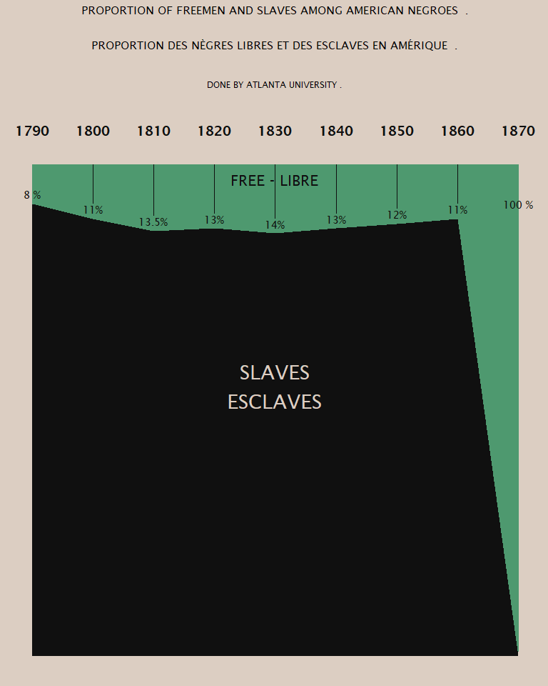

2021-02-16 W.E.B. Du Bois Challenge
================

  - 10 different challenges are available, challenge\_04, challenge\_08
    and challenge\_10 may be possible for me.

<!-- end list -->

``` r
library(tidyverse)
```

    ## -- Attaching packages --------------------------------------- tidyverse 1.3.0 --

    ## v ggplot2 3.3.3     v purrr   0.3.4
    ## v tibble  3.0.4     v dplyr   1.0.2
    ## v tidyr   1.1.2     v stringr 1.4.0
    ## v readr   1.4.0     v forcats 0.5.0

    ## -- Conflicts ------------------------------------------ tidyverse_conflicts() --
    ## x dplyr::filter() masks stats::filter()
    ## x dplyr::lag()    masks stats::lag()

``` r
library(skimr)
library(extrafont)
```

    ## Registering fonts with R

``` r
# font_import()
# loadfonts(device = "win")

`%nin%` = Negate(`%in%`)

font <- "Lucida Sans"
```

## challenge\_04 Freed Slaves

``` r
freed_slaves <- readr::read_csv('https://raw.githubusercontent.com/rfordatascience/tidytuesday/master/data/2021/2021-02-16/freed_slaves.csv')
```

    ## 
    ## -- Column specification --------------------------------------------------------
    ## cols(
    ##   Year = col_double(),
    ##   Slave = col_double(),
    ##   Free = col_double()
    ## )

``` r
skim(freed_slaves)
```

|                                                  |               |
| :----------------------------------------------- | :------------ |
| Name                                             | freed\_slaves |
| Number of rows                                   | 9             |
| Number of columns                                | 3             |
| \_\_\_\_\_\_\_\_\_\_\_\_\_\_\_\_\_\_\_\_\_\_\_   |               |
| Column type frequency:                           |               |
| numeric                                          | 3             |
| \_\_\_\_\_\_\_\_\_\_\_\_\_\_\_\_\_\_\_\_\_\_\_\_ |               |
| Group variables                                  | None          |

Data summary

**Variable type: numeric**

| skim\_variable | n\_missing | complete\_rate |    mean |    sd |   p0 |    p25 |  p50 |    p75 | p100 | hist  |
| :------------- | ---------: | -------------: | ------: | ----: | ---: | -----: | ---: | -----: | ---: | :---- |
| Year           |          0 |              1 | 1830.00 | 27.39 | 1790 | 1810.0 | 1830 | 1850.0 | 1870 | ▇▇▃▇▇ |
| Slave          |          0 |              1 |   78.17 | 29.37 |    0 |   86.5 |   87 |   88.0 |   92 | ▁▁▁▁▇ |
| Free           |          0 |              1 |   21.72 | 29.41 |    8 |   11.0 |   13 |   13.5 |  100 | ▇▁▁▁▁ |

  - 1800 is missing one percent, I am adding one percent to category
    Slave based on original image

<!-- end list -->

``` r
freed_slaves$Slave[freed_slaves$Year == 1800] <- 89

freed_slaves_long <- freed_slaves %>% 
  pivot_longer(cols = c("Free", "Slave"), names_to= "Status", values_to = "Percentage")
```

### Building theme

``` r
theme_challenge_04 <- theme(legend.position = "none",
      axis.title.y=element_blank(),
      axis.text.y=element_blank(),
      axis.ticks.y=element_blank(),
      axis.ticks.x=element_blank(),
      axis.title.x = element_blank(),
      plot.title = element_text(hjust = 0.5, family = font, size = 11.5),
      plot.subtitle = element_text(hjust = 0.5, family = font, size = 9),
      panel.border = element_blank(),
      panel.grid.major = element_blank(),
      panel.grid.minor = element_blank(),
      panel.grid = element_line(), 
      panel.background = element_rect(fill = "#dccec2", color = "#dccec2"),
      plot.background = element_rect(fill = "#dccec2", color = "#dccec2"),
      axis.text.x=element_text(face = "bold", family = font, size =14, color = "#101010")) 
```

``` r
p <- freed_slaves_long %>% 
  ggplot(aes(x = Year, y = Percentage, color = Status, fill = Status)) +
  geom_col(width = 10) + 
  scale_x_continuous(breaks = c(unique(freed_slaves$Year)), position= "top") + 
  labs(title = "PROPORTION OF FREEMEN AND SLAVES AMONG AMERICAN NEGROES  .\n\n\nPROPORTION DES NÈGRES LIBRES ET DES ESCLAVES EN AMÉRIQUE  .\n\n", 
       subtitle = "DONE BY ATLANTA UNIVERSITY .\n\n\n")+
  theme_challenge_04 +
  scale_fill_manual(values=c("#4e996f", "#101010")) +
  scale_color_manual(values=c("#4e996f", "#101010")) +
  annotate("text", label = "SLAVES\nESCLAVES", x = 1828, y = 50, 
           color = "#dccec2", family = font, size = 7) +
  annotate("text", label = "FREE - LIBRE", x = 1828, y = 95, 
           color = "#101010", family = font, size = 5.5) +
  geom_text(data = freed_slaves_long %>%  filter(Year != 1870), 
            aes(label = paste0(Percentage, "%"), y = 102-Percentage), 
            color = "#101010", family = font) +
  annotate("text", label = "100 %", x = 1870, y = 92, 
           color = "#101010", family = font, size = 4)

p
```


### Second thoughts

  - Better approach would be using geom\_smooth for either free or slave
    category and fill the background either green or black

<!-- end list -->

``` r
p2 <- ggplot(data = freed_slaves, aes(x = Year, y = Slave)) +
  geom_rect(aes(xmin = 1790, xmax = 1870, ymin = 1, ymax = 100), color = "#4e996f", fill = "#4e996f") +
  geom_ribbon( aes(ymin = 0,ymax = predict(loess(Slave ~ Year, span = 0.4))),
               alpha = 1,fill = "#101010") +
  geom_linerange(data = freed_slaves %>%  filter(Year %nin% c(1790, 1870)),aes(x = Year, ymin = predict(loess(Slave ~ Year, span = 0.4)) +3, ymax = 100), color ="#101010", fill = "#101010", width = 0.1) +
  scale_x_continuous(breaks = c(unique(freed_slaves$Year)), limits = c(1790, 1870), position= "top") + 
  labs(title = "PROPORTION OF FREEMEN AND SLAVES AMONG AMERICAN NEGROES  .\n\n\nPROPORTION DES NÈGRES LIBRES ET DES ESCLAVES EN AMÉRIQUE  .\n\n", 
       subtitle = "DONE BY ATLANTA UNIVERSITY .\n\n\n")+
  theme_challenge_04 +
  annotate("text", label = "SLAVES\nESCLAVES", x = 1830, y = 55, 
           color = "#dccec2", family = font, size = 7.5) +
  annotate("text", label = "FREE - LIBRE", x = 1830, y = 97, 
           color = "#101010", family = font, size = 5.5) +
  geom_text(data = freed_slaves_long %>%  filter(Year %nin% c(1790, 1870)),
            aes(label = paste0(Percentage, "%"), y = 102-Percentage),
            color = "#101010", family = font) +
  annotate("text", label = "100 %", x = 1870, y = 92,
           color = "#101010", family = font, size = 4) +
  annotate("text", label = "8 %", x = 1790, y = 94,
           color = "#101010", family = font, size = 4) 
```

    ## Warning: Ignoring unknown parameters: fill, width

``` r
p2
```

    ## Warning in simpleLoess(y, x, w, span, degree = degree, parametric =
    ## parametric, : span too small. fewer data values than degrees of freedom.

    ## Warning in simpleLoess(y, x, w, span, degree = degree, parametric =
    ## parametric, : pseudoinverse used at 1789.6

    ## Warning in simpleLoess(y, x, w, span, degree = degree, parametric =
    ## parametric, : neighborhood radius 20.4

    ## Warning in simpleLoess(y, x, w, span, degree = degree, parametric =
    ## parametric, : reciprocal condition number 0

    ## Warning in simpleLoess(y, x, w, span, degree = degree, parametric =
    ## parametric, : There are other near singularities as well. 416.16

    ## Warning in simpleLoess(y, x, w, span, degree = degree, parametric =
    ## parametric, : span too small. fewer data values than degrees of freedom.

    ## Warning in simpleLoess(y, x, w, span, degree = degree, parametric =
    ## parametric, : pseudoinverse used at 1799.7

    ## Warning in simpleLoess(y, x, w, span, degree = degree, parametric =
    ## parametric, : neighborhood radius 10.3

    ## Warning in simpleLoess(y, x, w, span, degree = degree, parametric =
    ## parametric, : reciprocal condition number 0

    ## Warning in simpleLoess(y, x, w, span, degree = degree, parametric =
    ## parametric, : There are other near singularities as well. 106.09



### Notes

  - Needs better font
  - x-axis label should be moved down

<!-- end list -->

``` r
ggsave(p2, filename = "challenge_04.png", units = "cm", width = 12, height = 16, limitsize = F, scale = 1.4)
```

    ## Warning in simpleLoess(y, x, w, span, degree = degree, parametric =
    ## parametric, : span too small. fewer data values than degrees of freedom.

    ## Warning in simpleLoess(y, x, w, span, degree = degree, parametric =
    ## parametric, : pseudoinverse used at 1789.6

    ## Warning in simpleLoess(y, x, w, span, degree = degree, parametric =
    ## parametric, : neighborhood radius 20.4

    ## Warning in simpleLoess(y, x, w, span, degree = degree, parametric =
    ## parametric, : reciprocal condition number 0

    ## Warning in simpleLoess(y, x, w, span, degree = degree, parametric =
    ## parametric, : There are other near singularities as well. 416.16

    ## Warning in simpleLoess(y, x, w, span, degree = degree, parametric =
    ## parametric, : span too small. fewer data values than degrees of freedom.

    ## Warning in simpleLoess(y, x, w, span, degree = degree, parametric =
    ## parametric, : pseudoinverse used at 1799.7

    ## Warning in simpleLoess(y, x, w, span, degree = degree, parametric =
    ## parametric, : neighborhood radius 10.3

    ## Warning in simpleLoess(y, x, w, span, degree = degree, parametric =
    ## parametric, : reciprocal condition number 0

    ## Warning in simpleLoess(y, x, w, span, degree = degree, parametric =
    ## parametric, : There are other near singularities as well. 106.09

``` r
sessionInfo()
```

    ## R version 4.0.3 (2020-10-10)
    ## Platform: x86_64-w64-mingw32/x64 (64-bit)
    ## Running under: Windows 10 x64 (build 18363)
    ## 
    ## Matrix products: default
    ## 
    ## locale:
    ## [1] LC_COLLATE=English_United States.1252 
    ## [2] LC_CTYPE=English_United States.1252   
    ## [3] LC_MONETARY=English_United States.1252
    ## [4] LC_NUMERIC=C                          
    ## [5] LC_TIME=English_United States.1252    
    ## 
    ## attached base packages:
    ## [1] stats     graphics  grDevices utils     datasets  methods   base     
    ## 
    ## other attached packages:
    ##  [1] extrafont_0.17  skimr_2.1.2     forcats_0.5.0   stringr_1.4.0  
    ##  [5] dplyr_1.0.2     purrr_0.3.4     readr_1.4.0     tidyr_1.1.2    
    ##  [9] tibble_3.0.4    ggplot2_3.3.3   tidyverse_1.3.0
    ## 
    ## loaded via a namespace (and not attached):
    ##  [1] tidyselect_1.1.0  xfun_0.20         repr_1.1.3        haven_2.3.1      
    ##  [5] colorspace_2.0-0  vctrs_0.3.6       generics_0.1.0    htmltools_0.5.0  
    ##  [9] yaml_2.2.1        base64enc_0.1-3   rlang_0.4.10      pillar_1.4.7     
    ## [13] glue_1.4.2        withr_2.3.0       DBI_1.1.0         dbplyr_2.0.0     
    ## [17] modelr_0.1.8      readxl_1.3.1      lifecycle_0.2.0   munsell_0.5.0    
    ## [21] gtable_0.3.0      cellranger_1.1.0  rvest_0.3.6       evaluate_0.14    
    ## [25] labeling_0.4.2    knitr_1.30        curl_4.3          fansi_0.4.2      
    ## [29] highr_0.8         Rttf2pt1_1.3.8    broom_0.7.3       Rcpp_1.0.5       
    ## [33] scales_1.1.1      backports_1.2.0   jsonlite_1.7.2    farver_2.0.3     
    ## [37] fs_1.5.0          hms_1.0.0         digest_0.6.27     stringi_1.5.3    
    ## [41] grid_4.0.3        cli_2.2.0         tools_4.0.3       magrittr_2.0.1   
    ## [45] extrafontdb_1.0   crayon_1.3.4      pkgconfig_2.0.3   ellipsis_0.3.1   
    ## [49] xml2_1.3.2        reprex_0.3.0      lubridate_1.7.9.2 assertthat_0.2.1 
    ## [53] rmarkdown_2.6     httr_1.4.2        rstudioapi_0.13   R6_2.5.0         
    ## [57] compiler_4.0.3
