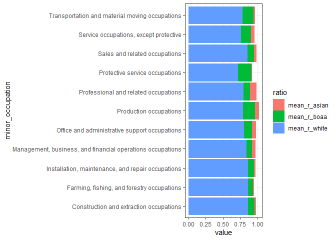
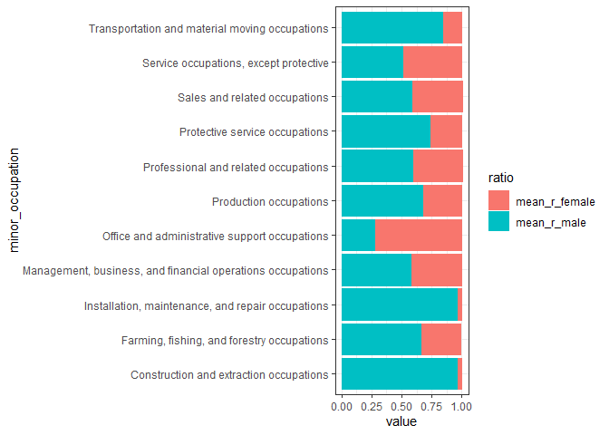
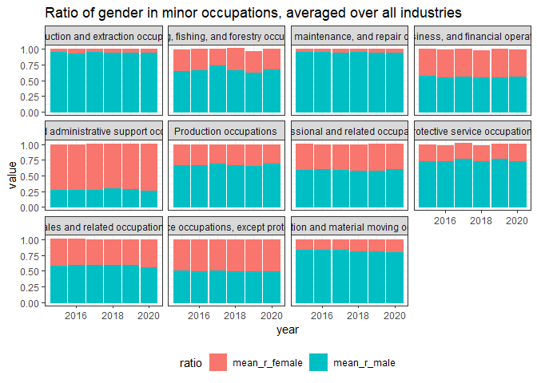
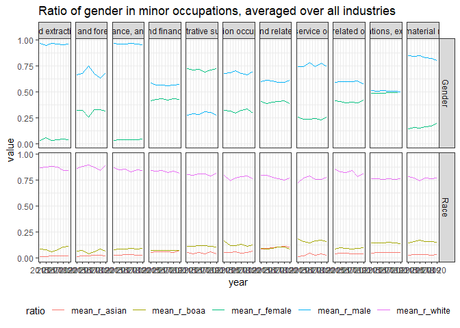
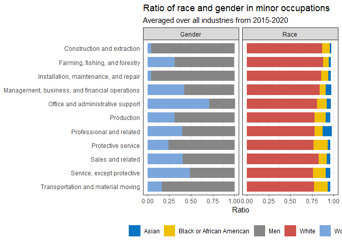

2021-02-23 Employment and Earnings
================

``` r
library(tidyverse)
```

    ## -- Attaching packages --------------------------------------- tidyverse 1.3.0 --

    ## v ggplot2 3.3.3     v purrr   0.3.4
    ## v tibble  3.0.4     v dplyr   1.0.2
    ## v tidyr   1.1.2     v stringr 1.4.0
    ## v readr   1.4.0     v forcats 0.5.0

    ## -- Conflicts ------------------------------------------ tidyverse_conflicts() --
    ## x dplyr::filter() masks stats::filter()
    ## x dplyr::lag()    masks stats::lag()

``` r
library(skimr)
library(ggsci)
theme_set(theme_bw())
`%nin%` = Negate(`%in%`)
```

``` r
employed <- readr::read_csv('https://raw.githubusercontent.com/rfordatascience/tidytuesday/master/data/2021/2021-02-23/employed.csv')
```

    ## 
    ## -- Column specification --------------------------------------------------------
    ## cols(
    ##   industry = col_character(),
    ##   major_occupation = col_character(),
    ##   minor_occupation = col_character(),
    ##   race_gender = col_character(),
    ##   industry_total = col_double(),
    ##   employ_n = col_double(),
    ##   year = col_double()
    ## )

``` r
earn <- readr::read_csv('https://raw.githubusercontent.com/rfordatascience/tidytuesday/master/data/2021/2021-02-23/earn.csv')
```

    ## 
    ## -- Column specification --------------------------------------------------------
    ## cols(
    ##   sex = col_character(),
    ##   race = col_character(),
    ##   ethnic_origin = col_character(),
    ##   age = col_character(),
    ##   year = col_double(),
    ##   quarter = col_double(),
    ##   n_persons = col_double(),
    ##   median_weekly_earn = col_double()
    ## )

## First look

  - Will focus on ‘employed’ dataset
  - Possible questions:
      - What are womens main industries per year (per race)?
      - What are mens main industries per year (per race)?

<!-- end list -->

``` r
skim(earn)
```

|                                                  |      |
| :----------------------------------------------- | :--- |
| Name                                             | earn |
| Number of rows                                   | 4224 |
| Number of columns                                | 8    |
| \_\_\_\_\_\_\_\_\_\_\_\_\_\_\_\_\_\_\_\_\_\_\_   |      |
| Column type frequency:                           |      |
| character                                        | 4    |
| numeric                                          | 4    |
| \_\_\_\_\_\_\_\_\_\_\_\_\_\_\_\_\_\_\_\_\_\_\_\_ |      |
| Group variables                                  | None |

Data summary

**Variable type: character**

| skim\_variable | n\_missing | complete\_rate | min | max | empty | n\_unique | whitespace |
| :------------- | ---------: | -------------: | --: | --: | ----: | --------: | ---------: |
| sex            |          0 |              1 |   3 |  10 |     0 |         3 |          0 |
| race           |          0 |              1 |   5 |  25 |     0 |         4 |          0 |
| ethnic\_origin |          0 |              1 |  11 |  18 |     0 |         2 |          0 |
| age            |          0 |              1 |  14 |  17 |     0 |        12 |          0 |

**Variable type: numeric**

| skim\_variable       | n\_missing | complete\_rate |        mean |          sd |     p0 |       p25 |       p50 |         p75 |      p100 | hist  |
| :------------------- | ---------: | -------------: | ----------: | ----------: | -----: | --------: | --------: | ----------: | --------: | :---- |
| year                 |          0 |              1 |     2015.00 |        3.16 |   2010 | 2.012e+03 |    2015.0 |     2018.00 |      2020 | ▇▅▅▅▅ |
| quarter              |          0 |              1 |        2.50 |        1.12 |      1 | 1.750e+00 |       2.5 |        3.25 |         4 | ▇▇▁▇▇ |
| n\_persons           |          0 |              1 | 16268337.59 | 22421840.69 | 103000 | 2.614e+06 | 7441000.0 | 17555250.00 | 118358000 | ▇▁▁▁▁ |
| median\_weekly\_earn |          0 |              1 |      762.18 |      217.21 |    318 | 6.050e+02 |     755.0 |      911.00 |      1709 | ▅▇▅▁▁ |

``` r
skim(employed)
```

|                                                  |          |
| :----------------------------------------------- | :------- |
| Name                                             | employed |
| Number of rows                                   | 8184     |
| Number of columns                                | 7        |
| \_\_\_\_\_\_\_\_\_\_\_\_\_\_\_\_\_\_\_\_\_\_\_   |          |
| Column type frequency:                           |          |
| character                                        | 4        |
| numeric                                          | 3        |
| \_\_\_\_\_\_\_\_\_\_\_\_\_\_\_\_\_\_\_\_\_\_\_\_ |          |
| Group variables                                  | None     |

Data summary

**Variable type: character**

| skim\_variable    | n\_missing | complete\_rate | min | max | empty | n\_unique | whitespace |
| :---------------- | ---------: | -------------: | --: | --: | ----: | --------: | ---------: |
| industry          |        330 |           0.96 |   3 |  46 |     0 |        25 |          0 |
| major\_occupation |          0 |           1.00 |  19 |  60 |     0 |         5 |          0 |
| minor\_occupation |          0 |           1.00 |  22 |  59 |     0 |        12 |          0 |
| race\_gender      |          0 |           1.00 |   3 |  25 |     0 |         6 |          0 |

**Variable type: numeric**

| skim\_variable  | n\_missing | complete\_rate |      mean |         sd |    p0 |    p25 |       p50 |     p75 |     p100 | hist  |
| :-------------- | ---------: | -------------: | --------: | ---------: | ----: | -----: | --------: | ------: | -------: | :---- |
| industry\_total |        660 |           0.92 | 5077105.3 | 6056215.81 | 18000 | 767250 | 2484000.0 | 7643000 | 35894000 | ▇▂▁▁▁ |
| employ\_n       |        660 |           0.92 |  461551.6 | 1267564.10 |     0 |   9000 |   65000.0 |  373000 | 20263000 | ▇▁▁▁▁ |
| year            |          0 |           1.00 |    2017.5 |       1.71 |  2015 |   2016 |    2017.5 |    2019 |     2020 | ▇▃▃▃▃ |

## ‘Employed’ exploratory

  - If ‘industry’ is used, a couple of things probably need to be fixed:
      - remove NA, fix parsing error for ‘mining, quarrying…’
      - Combine or remove categories that count numbers twice

<!-- end list -->

``` r
employed %>% 
  count(industry) %>% 
  arrange(n)
```

    ## # A tibble: 26 x 2
    ##    industry                                               n
    ##    <chr>                                              <int>
    ##  1 "Asian"                                               66
    ##  2 "Black or African American"                           66
    ##  3 "Men"                                                 66
    ##  4 "White"                                               66
    ##  5 "Women"                                               66
    ##  6 "Mining, quarrying, and\r\noil and gas extraction"   132
    ##  7 "Mining, quarrying, and oil and gas extraction"      264
    ##  8  <NA>                                                330
    ##  9 "Agriculture and related"                            396
    ## 10 "Construction"                                       396
    ## # ... with 16 more rows

``` r
employed %>% 
  count(minor_occupation) %>% 
  arrange(n)
```

    ## # A tibble: 12 x 2
    ##    minor_occupation                                                n
    ##    <chr>                                                       <int>
    ##  1 Manage-ment, business, and financial operations occupations   124
    ##  2 Management, business, and financial operations occupations    620
    ##  3 Construction and extraction occupations                       744
    ##  4 Farming, fishing, and forestry occupations                    744
    ##  5 Installation, maintenance, and repair occupations             744
    ##  6 Office and administrative support occupations                 744
    ##  7 Production occupations                                        744
    ##  8 Professional and related occupations                          744
    ##  9 Protective service occupations                                744
    ## 10 Sales and related occupations                                 744
    ## 11 Service occupations, except protective                        744
    ## 12 Transportation and material moving occupations                744

  - that might mean that it is not possible to answer questions per race
    per gender
  - maybe just analyze per race instead?

<!-- end list -->

``` r
employed %>% 
  count(race_gender) %>% 
  arrange(n)
```

    ## # A tibble: 6 x 2
    ##   race_gender                   n
    ##   <chr>                     <int>
    ## 1 Asian                      1254
    ## 2 Black or African American  1386
    ## 3 Men                        1386
    ## 4 TOTAL                      1386
    ## 5 White                      1386
    ## 6 Women                      1386

### Data prep

  - Fixing parsing errors
  - pivot\_wider for easy ratio calculations

<!-- end list -->

``` r
employed_clean <- employed
employed_clean$minor_occupation[employed_clean$minor_occupation == "Manage-ment, business, and financial operations occupations"] <- 
  "Management, business, and financial operations occupations"

employed_clean$industry[employed_clean$industry == "Mining, quarrying, and\r\noil and gas extraction"] <- 
  "Mining, quarrying, and oil and gas extraction"

employed_wide <- employed_clean  %>% 
  pivot_wider(id_cols = c(year, minor_occupation, major_occupation, industry),  names_from = race_gender, values_from = employ_n) %>% 
  mutate(r_asian = Asian/TOTAL, 
         r_black_or_afram = `Black or African American`/TOTAL, 
         r_white = White/TOTAL,
         r_male = Men/TOTAL, 
         r_female = Women/TOTAL)
```

  - Is it possible to find out about minor occupation over all
    industries?
      - Ideally, this should be normalized for the total size of the
        industries

<!-- end list -->

``` r
per_minor_occ <- employed_wide %>% 
  group_by(year, minor_occupation) %>% 
  summarize(mean_r_white = mean(r_white, na.rm = T), 
            mean_r_asian = mean(r_asian, na.rm = T),
            mean_r_boaa = mean(r_black_or_afram, na.rm = T),
            mean_r_male = mean(r_male, na.rm =T),
            mean_r_female = mean(r_female, na.rm = T)) %>% 
  pivot_longer(cols = c(-year, -minor_occupation), names_to = "ratio")
```

    ## `summarise()` regrouping output by 'year' (override with `.groups` argument)

### ‘employed’ graphs

  - Graph of ratio of race per minor\_occupation in 2015
  - there is missing data (other category for race?) + no striking
    differences
      - the only other categories for race\_gender in this dataset are
        “Men”, “Women”, “Total”

<!-- end list -->

``` r
per_minor_occ %>% 
  filter(year == 2015, ratio %in% c("mean_r_asian", "mean_r_white", "mean_r_boaa")) %>% 
  ggplot(aes(x = value, y = minor_occupation, color = ratio, fill = ratio)) +
  geom_col()
```

<!-- -->

  - Graph of ratio of gender per minor\_occupation in 2015
      - Some more striking differences\!

<!-- end list -->

``` r
per_minor_occ %>% 
  filter(year == 2015, ratio %in% c("mean_r_female", "mean_r_male")) %>% 
  ggplot(aes(x = value, y = minor_occupation, color = ratio, fill = ratio)) +
  geom_col()
```

<!-- -->

  - Now to expand this graph over the years
      - the ratios of men and women do not add up to 1 but there are no
        other gender categories

<!-- end list -->

``` r
per_minor_occ %>% 
  filter(ratio %in% c("mean_r_female", "mean_r_male")) %>%
  ggplot(aes(x = year, y = value, color = ratio, fill = ratio)) +
  geom_col() +
  facet_wrap(~minor_occupation)+ 
  labs(title = "Ratio of gender in minor occupations, averaged over all industries") +
  theme(legend.position = "bottom")
```

<!-- -->

### Big summary plot

  - It does not really need the resolution over time, nothing drastic
    happens
      - take average over last 5 years

<!-- end list -->

``` r
per_minor_occ$category <- "Race"
per_minor_occ$category[per_minor_occ$ratio == "mean_r_female" | per_minor_occ$ratio == "mean_r_male" ] <- "Gender"

per_minor_occ %>% 
  ggplot(aes(x = year, y = value, color = ratio, fill = ratio)) +
  geom_line() +
  facet_grid(category~minor_occupation)+ 
  labs(title = "Ratio of gender in minor occupations, averaged over all industries") +
  theme(legend.position = "bottom")
```

<!-- -->

  - It does not really need the resolution over time, nothing drastic
    happens
      - take average over last 5 years
      - Rename subgroups
  - Sort y-axis alphabetically

<!-- end list -->

``` r
per_minor_occ$category <- "Race"
per_minor_occ$category[per_minor_occ$ratio == "mean_r_female" | per_minor_occ$ratio == "mean_r_male" ] <- "Gender"

per_minor_occ$subgroup[per_minor_occ$ratio == "mean_r_female"] <- "Women"
```

    ## Warning: Unknown or uninitialised column: `subgroup`.

``` r
per_minor_occ$subgroup[per_minor_occ$ratio == "mean_r_male"] <- "Men"
per_minor_occ$subgroup[per_minor_occ$ratio == "mean_r_asian"] <- "Asian"
per_minor_occ$subgroup[per_minor_occ$ratio == "mean_r_boaa"] <- "Black or African American"
per_minor_occ$subgroup[per_minor_occ$ratio == "mean_r_white"] <- "White"

p_employed_minor_occ_summary <- per_minor_occ %>% 
  group_by(minor_occupation, ratio, category, subgroup) %>%
  mutate(minor_occupation = str_remove(minor_occupation, " occupations")) %>% 
  summarize(avg_ratio = mean(value)) %>% 
  ggplot(aes(x = avg_ratio, y = fct_rev(minor_occupation), color = subgroup, fill = subgroup)) +
  geom_col(width = 0.7) +
  facet_wrap(~category)+ 
  labs(title = "Ratio of race and gender in minor occupations",
       subtitle ="Averaged over all industries from 2015-2020", 
       color = NULL, 
       fill = NULL,
       y = NULL,
       x = "Ratio") +
  theme(legend.position = "bottom",
        axis.ticks.y = element_blank()) +
  scale_fill_jco() +
  scale_color_jco()
```

    ## `summarise()` regrouping output by 'minor_occupation', 'ratio', 'category' (override with `.groups` argument)

``` r
p_employed_minor_occ_summary 
```

<!-- -->

``` r
ggsave(p_employed_minor_occ_summary, filename = "p_employed_minor_occ_summary.png", units = "cm", width = 14, height = 10, limitsize = F, scale = 1.4)
```

## Thoughts

  - Deal with missing data
  - Should add importance of the minor occupations (how many people
    overall work in these minor occupations)

<!-- end list -->

``` r
sessionInfo()
```

    ## R version 4.0.3 (2020-10-10)
    ## Platform: x86_64-w64-mingw32/x64 (64-bit)
    ## Running under: Windows 10 x64 (build 18363)
    ## 
    ## Matrix products: default
    ## 
    ## locale:
    ## [1] LC_COLLATE=English_United States.1252 
    ## [2] LC_CTYPE=English_United States.1252   
    ## [3] LC_MONETARY=English_United States.1252
    ## [4] LC_NUMERIC=C                          
    ## [5] LC_TIME=English_United States.1252    
    ## 
    ## attached base packages:
    ## [1] stats     graphics  grDevices utils     datasets  methods   base     
    ## 
    ## other attached packages:
    ##  [1] ggsci_2.9       skimr_2.1.2     forcats_0.5.0   stringr_1.4.0  
    ##  [5] dplyr_1.0.2     purrr_0.3.4     readr_1.4.0     tidyr_1.1.2    
    ##  [9] tibble_3.0.4    ggplot2_3.3.3   tidyverse_1.3.0
    ## 
    ## loaded via a namespace (and not attached):
    ##  [1] tidyselect_1.1.0  xfun_0.20         repr_1.1.3        haven_2.3.1      
    ##  [5] colorspace_2.0-0  vctrs_0.3.6       generics_0.1.0    htmltools_0.5.0  
    ##  [9] yaml_2.2.1        base64enc_0.1-3   utf8_1.1.4        rlang_0.4.10     
    ## [13] pillar_1.4.7      glue_1.4.2        withr_2.3.0       DBI_1.1.0        
    ## [17] dbplyr_2.0.0      modelr_0.1.8      readxl_1.3.1      lifecycle_0.2.0  
    ## [21] munsell_0.5.0     gtable_0.3.0      cellranger_1.1.0  rvest_0.3.6      
    ## [25] evaluate_0.14     labeling_0.4.2    knitr_1.30        curl_4.3         
    ## [29] fansi_0.4.2       highr_0.8         broom_0.7.3       Rcpp_1.0.5       
    ## [33] scales_1.1.1      backports_1.2.0   jsonlite_1.7.2    farver_2.0.3     
    ## [37] fs_1.5.0          hms_1.0.0         digest_0.6.27     stringi_1.5.3    
    ## [41] grid_4.0.3        cli_2.2.0         tools_4.0.3       magrittr_2.0.1   
    ## [45] crayon_1.3.4      pkgconfig_2.0.3   ellipsis_0.3.1    xml2_1.3.2       
    ## [49] reprex_0.3.0      lubridate_1.7.9.2 assertthat_0.2.1  rmarkdown_2.6    
    ## [53] httr_1.4.2        rstudioapi_0.13   R6_2.5.0          compiler_4.0.3
