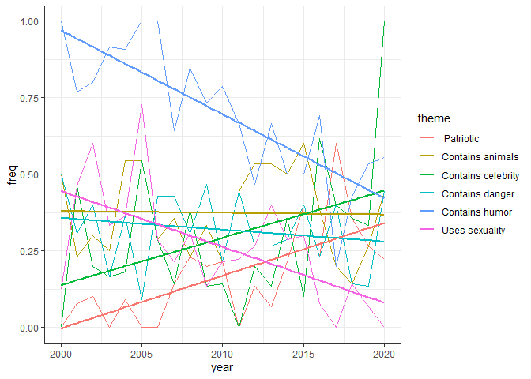
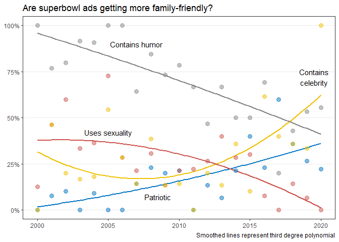

2021-03-02 SuperBowl Adss
================

``` r
library(tidyverse)
```

    ## -- Attaching packages --------------------------------------- tidyverse 1.3.0 --

    ## v ggplot2 3.3.3     v purrr   0.3.4
    ## v tibble  3.0.4     v dplyr   1.0.2
    ## v tidyr   1.1.2     v stringr 1.4.0
    ## v readr   1.4.0     v forcats 0.5.0

    ## -- Conflicts ------------------------------------------ tidyverse_conflicts() --
    ## x dplyr::filter() masks stats::filter()
    ## x dplyr::lag()    masks stats::lag()

``` r
library(skimr)
library(ggsci)
theme_set(theme_bw())
`%nin%` = Negate(`%in%`)
```

## First look

  - Potential questions
      - How did the themes of the adds change between 2000 and 2020?
      - Predict youtube metrics with brand and themes?

<!-- end list -->

``` r
youtube <- readr::read_csv('https://raw.githubusercontent.com/rfordatascience/tidytuesday/master/data/2021/2021-03-02/youtube.csv')
```

    ## 
    ## -- Column specification --------------------------------------------------------
    ## cols(
    ##   .default = col_character(),
    ##   year = col_double(),
    ##   funny = col_logical(),
    ##   show_product_quickly = col_logical(),
    ##   patriotic = col_logical(),
    ##   celebrity = col_logical(),
    ##   danger = col_logical(),
    ##   animals = col_logical(),
    ##   use_sex = col_logical(),
    ##   view_count = col_double(),
    ##   like_count = col_double(),
    ##   dislike_count = col_double(),
    ##   favorite_count = col_double(),
    ##   comment_count = col_double(),
    ##   published_at = col_datetime(format = ""),
    ##   category_id = col_double()
    ## )
    ## i Use `spec()` for the full column specifications.

``` r
skim(youtube)
```

|                                                  |         |
| :----------------------------------------------- | :------ |
| Name                                             | youtube |
| Number of rows                                   | 247     |
| Number of columns                                | 25      |
| \_\_\_\_\_\_\_\_\_\_\_\_\_\_\_\_\_\_\_\_\_\_\_   |         |
| Column type frequency:                           |         |
| character                                        | 10      |
| logical                                          | 7       |
| numeric                                          | 7       |
| POSIXct                                          | 1       |
| \_\_\_\_\_\_\_\_\_\_\_\_\_\_\_\_\_\_\_\_\_\_\_\_ |         |
| Group variables                                  | None    |

Data summary

**Variable type: character**

| skim\_variable                | n\_missing | complete\_rate | min |  max | empty | n\_unique | whitespace |
| :---------------------------- | ---------: | -------------: | --: | ---: | ----: | --------: | ---------: |
| brand                         |          0 |           1.00 |   3 |    9 |     0 |        10 |          0 |
| superbowl\_ads\_dot\_com\_url |          0 |           1.00 |  34 |  120 |     0 |       244 |          0 |
| youtube\_url                  |         11 |           0.96 |  43 |   43 |     0 |       233 |          0 |
| id                            |         11 |           0.96 |  11 |   11 |     0 |       233 |          0 |
| kind                          |         16 |           0.94 |  13 |   13 |     0 |         1 |          0 |
| etag                          |         16 |           0.94 |  27 |   27 |     0 |       228 |          0 |
| title                         |         16 |           0.94 |   6 |   99 |     0 |       228 |          0 |
| description                   |         50 |           0.80 |   3 | 3527 |     0 |       194 |          0 |
| thumbnail                     |        129 |           0.48 |  48 |   48 |     0 |       118 |          0 |
| channel\_title                |         16 |           0.94 |   3 |   37 |     0 |       185 |          0 |

**Variable type: logical**

| skim\_variable         | n\_missing | complete\_rate | mean | count             |
| :--------------------- | ---------: | -------------: | ---: | :---------------- |
| funny                  |          0 |              1 | 0.69 | TRU: 171, FAL: 76 |
| show\_product\_quickly |          0 |              1 | 0.68 | TRU: 169, FAL: 78 |
| patriotic              |          0 |              1 | 0.17 | FAL: 206, TRU: 41 |
| celebrity              |          0 |              1 | 0.29 | FAL: 176, TRU: 71 |
| danger                 |          0 |              1 | 0.30 | FAL: 172, TRU: 75 |
| animals                |          0 |              1 | 0.37 | FAL: 155, TRU: 92 |
| use\_sex               |          0 |              1 | 0.27 | FAL: 181, TRU: 66 |

**Variable type: numeric**

| skim\_variable  | n\_missing | complete\_rate |       mean |          sd |   p0 |  p25 |   p50 |       p75 |      p100 | hist  |
| :-------------- | ---------: | -------------: | ---------: | ----------: | ---: | ---: | ----: | --------: | --------: | :---- |
| year            |          0 |           1.00 |    2010.19 |        5.86 | 2000 | 2005 |  2010 |   2015.00 |      2020 | ▇▇▇▇▆ |
| view\_count     |         16 |           0.94 | 1407556.46 | 11971111.01 |   10 | 6431 | 41379 | 170015.50 | 176373378 | ▇▁▁▁▁ |
| like\_count     |         22 |           0.91 |    4146.03 |    23920.40 |    0 |   19 |   130 |    527.00 |    275362 | ▇▁▁▁▁ |
| dislike\_count  |         22 |           0.91 |     833.54 |     6948.52 |    0 |    1 |     7 |     24.00 |     92990 | ▇▁▁▁▁ |
| favorite\_count |         16 |           0.94 |       0.00 |        0.00 |    0 |    0 |     0 |      0.00 |         0 | ▁▁▇▁▁ |
| comment\_count  |         25 |           0.90 |     188.64 |      986.46 |    0 |    1 |    10 |     50.75 |      9190 | ▇▁▁▁▁ |
| category\_id    |         16 |           0.94 |      19.32 |        8.00 |    1 |   17 |    23 |     24.00 |        29 | ▃▁▂▆▇ |

**Variable type: POSIXct**

| skim\_variable | n\_missing | complete\_rate | min                 | max                 | median              | n\_unique |
| :------------- | ---------: | -------------: | :------------------ | :------------------ | :------------------ | --------: |
| published\_at  |         16 |           0.94 | 2006-02-06 10:02:36 | 2021-01-27 13:11:29 | 2013-01-31 09:13:55 |       227 |

## Exploratory analysis

``` r
youtube %>%  
  count(brand) %>% 
  arrange(desc(n))
```

    ## # A tibble: 10 x 2
    ##    brand         n
    ##    <chr>     <int>
    ##  1 Bud Light    63
    ##  2 Budweiser    43
    ##  3 Doritos      25
    ##  4 Pepsi        25
    ##  5 Hynudai      22
    ##  6 Coca-Cola    21
    ##  7 E-Trade      13
    ##  8 Kia          13
    ##  9 NFL          11
    ## 10 Toyota       11

  - There are only 10 brands represented

<!-- end list -->

``` r
youtube %>%  
  count(year) %>%
  arrange(year)
```

    ## # A tibble: 21 x 2
    ##     year     n
    ##    <dbl> <int>
    ##  1  2000     8
    ##  2  2001    13
    ##  3  2002    10
    ##  4  2003    12
    ##  5  2004    11
    ##  6  2005    11
    ##  7  2006     7
    ##  8  2007    14
    ##  9  2008    13
    ## 10  2009    15
    ## # ... with 11 more rows

  - The amount of ads varies across years

### Calculating the frequency of themes used in every year and renaming themes

``` r
themes_across_years <- youtube %>% 
  left_join(youtube %>% count(year)) %>% 
  rename(total_per_year = n) %>% 
  group_by(year) %>% 
  summarise(across(.cols = c(funny, patriotic, danger, use_sex, animals, celebrity), .fns= mean)) %>% 
  pivot_longer(cols = -year, names_to = "theme", values_to = "freq")
```

    ## Joining, by = "year"

    ## `summarise()` ungrouping output (override with `.groups` argument)

``` r
themes_across_years$theme[themes_across_years$theme == "funny"] <- "Contains humor"
themes_across_years$theme[themes_across_years$theme == "patriotic"] <- "    Patriotic"
themes_across_years$theme[themes_across_years$theme == "danger"] <- "Contains danger"
themes_across_years$theme[themes_across_years$theme == "use_sex"] <- "Uses sexuality"
themes_across_years$theme[themes_across_years$theme == "animals"] <- "Contains animals"
themes_across_years$theme[themes_across_years$theme == "celebrity"] <- "Contains celebrity"
```

### Graphing frequency

``` r
themes_across_years %>% 
  ggplot(aes(x= year, y= freq, color = theme, group = theme)) +
  geom_line() +
  geom_smooth(method = "lm", se = FALSE)
```

    ## `geom_smooth()` using formula 'y ~ x'

<!-- -->

  - Are superbowl ads getting more family friendly?
      - Picking only the themes that seem to change

<!-- end list -->

``` r
p <- themes_across_years %>% 
  filter(theme %nin% c("Contains animals", "Contains danger")) %>% 
  ggplot(aes(x= year, y= freq, color = theme, group = theme)) +
  stat_smooth(method="lm", fill=NA,
                formula=y ~ poly(x, 3, raw=TRUE)) +
  geom_point(alpha = 0.5, size = 3) +
  scale_color_jco() +
  scale_y_continuous(labels = scales::percent, breaks = c(0, 0.25, 0.5, 0.75, 1), limits = c(0,1))+
  labs(x = NULL, y = NULL, title = "Are superbowl ads getting more family-friendly?",
       caption= "Smoothed lines represent third degree polynomial") +
  theme(panel.grid.major.x = element_blank(),
        panel.grid.minor.x = element_blank(),
        panel.grid.minor.y = element_blank(),
        legend.position = "none") +
  annotate("text", x = 2007, y = 0.9, label= "Contains humor") +
  annotate("text", x = 2019.5, y = 0.72, label= "Contains\ncelebrity") +
  annotate("text", x = 2005, y = 0.42, label= "Uses sexuality") +
  annotate("text", x = 2008.5, y = 0.07, label = "Patriotic") 

p
```

    ## Warning in predict.lm(model, newdata = new_data_frame(list(x = xseq)), se.fit =
    ## se, : prediction from a rank-deficient fit may be misleading
    
    ## Warning in predict.lm(model, newdata = new_data_frame(list(x = xseq)), se.fit =
    ## se, : prediction from a rank-deficient fit may be misleading
    
    ## Warning in predict.lm(model, newdata = new_data_frame(list(x = xseq)), se.fit =
    ## se, : prediction from a rank-deficient fit may be misleading
    
    ## Warning in predict.lm(model, newdata = new_data_frame(list(x = xseq)), se.fit =
    ## se, : prediction from a rank-deficient fit may be misleading

<!-- -->

## Thoughts

  - What are best practices when including smoothing lines in plots?
      - How much should be explained?
      - Is it obscuring data / telling a story that is not there?
  - Still to explore
      - What is influential for youtube metrics?

<!-- end list -->

``` r
sessionInfo()
```

    ## R version 4.0.3 (2020-10-10)
    ## Platform: x86_64-w64-mingw32/x64 (64-bit)
    ## Running under: Windows 10 x64 (build 18363)
    ## 
    ## Matrix products: default
    ## 
    ## locale:
    ## [1] LC_COLLATE=English_United States.1252 
    ## [2] LC_CTYPE=English_United States.1252   
    ## [3] LC_MONETARY=English_United States.1252
    ## [4] LC_NUMERIC=C                          
    ## [5] LC_TIME=English_United States.1252    
    ## 
    ## attached base packages:
    ## [1] stats     graphics  grDevices utils     datasets  methods   base     
    ## 
    ## other attached packages:
    ##  [1] ggsci_2.9       skimr_2.1.2     forcats_0.5.0   stringr_1.4.0  
    ##  [5] dplyr_1.0.2     purrr_0.3.4     readr_1.4.0     tidyr_1.1.2    
    ##  [9] tibble_3.0.4    ggplot2_3.3.3   tidyverse_1.3.0
    ## 
    ## loaded via a namespace (and not attached):
    ##  [1] Rcpp_1.0.5        lubridate_1.7.9.2 lattice_0.20-41   assertthat_0.2.1 
    ##  [5] digest_0.6.27     utf8_1.1.4        R6_2.5.0          cellranger_1.1.0 
    ##  [9] repr_1.1.3        backports_1.2.0   reprex_0.3.0      evaluate_0.14    
    ## [13] httr_1.4.2        highr_0.8         pillar_1.4.7      rlang_0.4.10     
    ## [17] curl_4.3          readxl_1.3.1      rstudioapi_0.13   Matrix_1.2-18    
    ## [21] rmarkdown_2.6     labeling_0.4.2    splines_4.0.3     munsell_0.5.0    
    ## [25] broom_0.7.3       compiler_4.0.3    modelr_0.1.8      xfun_0.20        
    ## [29] pkgconfig_2.0.3   base64enc_0.1-3   mgcv_1.8-33       htmltools_0.5.0  
    ## [33] tidyselect_1.1.0  fansi_0.4.2       crayon_1.3.4      dbplyr_2.0.0     
    ## [37] withr_2.3.0       grid_4.0.3        nlme_3.1-149      jsonlite_1.7.2   
    ## [41] gtable_0.3.0      lifecycle_0.2.0   DBI_1.1.0         magrittr_2.0.1   
    ## [45] scales_1.1.1      cli_2.2.0         stringi_1.5.3     farver_2.0.3     
    ## [49] fs_1.5.0          xml2_1.3.2        ellipsis_0.3.1    generics_0.1.0   
    ## [53] vctrs_0.3.6       tools_4.0.3       glue_1.4.2        hms_1.0.0        
    ## [57] yaml_2.2.1        colorspace_2.0-0  rvest_0.3.6       knitr_1.30       
    ## [61] haven_2.3.1
