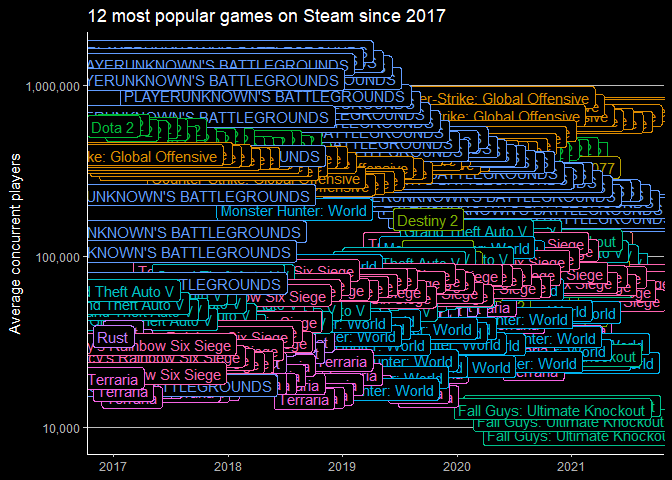

2021-03-16 Video Games + Sliced
================

``` r
library(tidyverse)
```

    ## -- Attaching packages --------------------------------------- tidyverse 1.3.0 --

    ## v ggplot2 3.3.3     v purrr   0.3.4
    ## v tibble  3.0.4     v dplyr   1.0.2
    ## v tidyr   1.1.2     v stringr 1.4.0
    ## v readr   1.4.0     v forcats 0.5.0

    ## -- Conflicts ------------------------------------------ tidyverse_conflicts() --
    ## x dplyr::filter() masks stats::filter()
    ## x dplyr::lag()    masks stats::lag()

``` r
library(ggdark)
```

    ## Warning: package 'ggdark' was built under R version 4.0.4

``` r
library(gganimate)
```

    ## Warning: package 'gganimate' was built under R version 4.0.4

## Prep data

``` r
games <- readr::read_csv('https://raw.githubusercontent.com/rfordatascience/tidytuesday/master/data/2021/2021-03-16/games.csv')
```

    ## 
    ## -- Column specification --------------------------------------------------------
    ## cols(
    ##   gamename = col_character(),
    ##   year = col_double(),
    ##   month = col_character(),
    ##   avg = col_double(),
    ##   gain = col_double(),
    ##   peak = col_double(),
    ##   avg_peak_perc = col_character()
    ## )

## Graph most popular games over time

``` r
most_popular <- games %>% 
  filter(year > 2016) %>% 
  arrange(desc(avg)) %>% 
  head(158) %>%  # This number is chosen to limit total games to 12
  select(gamename) %>% 
  distinct
```

``` r
p <- games %>% 
  filter(gamename %in% most_popular$gamename, 
         avg > 100,
         year > 2016) %>% 
  mutate(Date = lubridate::my(str_c(month, year))) %>% 
  ggplot(aes(x = Date, y = avg, color= gamename)) +
  geom_label(aes(x = Date, y = avg, label= gamename)) +
  dark_theme_classic() +
  theme(legend.position = "blank",
        panel.grid.major.y = element_line(color = "grey", size = 0.2)) +
  scale_y_log10(labels= scales::comma) +
  scale_x_date(limits = c(as.Date("2017-01-01"), as.Date("2021-08-01"))) +
  labs(x = NULL, y = "Average concurrent players", title = "12 most popular games on Steam since 2017")
```

    ## Inverted geom defaults of fill and color/colour.
    ## To change them back, use invert_geom_defaults().

``` r
p
```

<!-- -->

``` r
p_animate <- p + transition_time(Date)
games_animation <- animate(p_animate, nframes = 150, fps = 10,  height = 12, width = 14, units = "cm", res = 96)
anim_save("games.gif")
```

## Further analysis

  - Add game logos instead of “gamenames” into the animation

<!-- end list -->

``` r
sessionInfo()
```

    ## R version 4.0.3 (2020-10-10)
    ## Platform: x86_64-w64-mingw32/x64 (64-bit)
    ## Running under: Windows 10 x64 (build 18363)
    ## 
    ## Matrix products: default
    ## 
    ## locale:
    ## [1] LC_COLLATE=English_United States.1252 
    ## [2] LC_CTYPE=English_United States.1252   
    ## [3] LC_MONETARY=English_United States.1252
    ## [4] LC_NUMERIC=C                          
    ## [5] LC_TIME=English_United States.1252    
    ## 
    ## attached base packages:
    ## [1] stats     graphics  grDevices utils     datasets  methods   base     
    ## 
    ## other attached packages:
    ##  [1] gganimate_1.0.7 ggdark_0.2.1    forcats_0.5.0   stringr_1.4.0  
    ##  [5] dplyr_1.0.2     purrr_0.3.4     readr_1.4.0     tidyr_1.1.2    
    ##  [9] tibble_3.0.4    ggplot2_3.3.3   tidyverse_1.3.0
    ## 
    ## loaded via a namespace (and not attached):
    ##  [1] progress_1.2.2    tidyselect_1.1.0  xfun_0.20         haven_2.3.1      
    ##  [5] colorspace_2.0-0  vctrs_0.3.6       generics_0.1.0    htmltools_0.5.0  
    ##  [9] yaml_2.2.1        rlang_0.4.10      pillar_1.4.7      glue_1.4.2       
    ## [13] withr_2.3.0       DBI_1.1.0         tweenr_1.0.1      dbplyr_2.0.0     
    ## [17] modelr_0.1.8      readxl_1.3.1      plyr_1.8.6        lifecycle_0.2.0  
    ## [21] munsell_0.5.0     gtable_0.3.0      cellranger_1.1.0  rvest_0.3.6      
    ## [25] evaluate_0.14     knitr_1.30        curl_4.3          fansi_0.4.2      
    ## [29] broom_0.7.5       Rcpp_1.0.5        scales_1.1.1      backports_1.2.0  
    ## [33] magick_2.7.0      jsonlite_1.7.2    farver_2.0.3      fs_1.5.0         
    ## [37] hms_1.0.0         digest_0.6.27     stringi_1.5.3     grid_4.0.3       
    ## [41] cli_2.2.0         tools_4.0.3       magrittr_2.0.1    crayon_1.3.4     
    ## [45] pkgconfig_2.0.3   ellipsis_0.3.1    prettyunits_1.1.1 xml2_1.3.2       
    ## [49] reprex_0.3.0      lubridate_1.7.9.2 assertthat_0.2.1  rmarkdown_2.6    
    ## [53] httr_1.4.2        rstudioapi_0.13   R6_2.5.0          compiler_4.0.3
