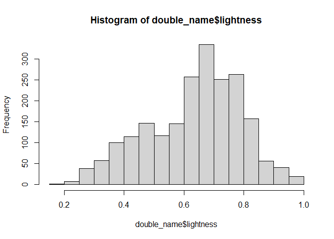
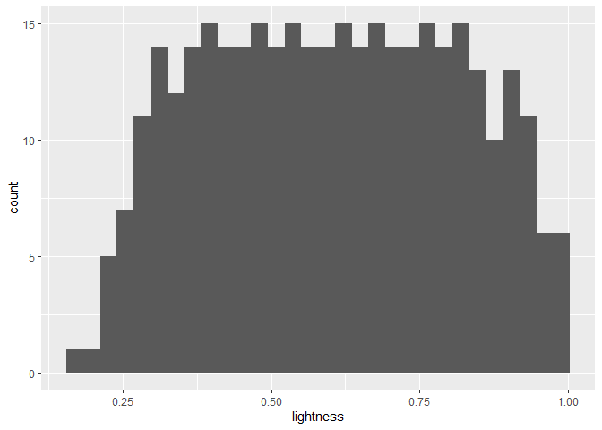
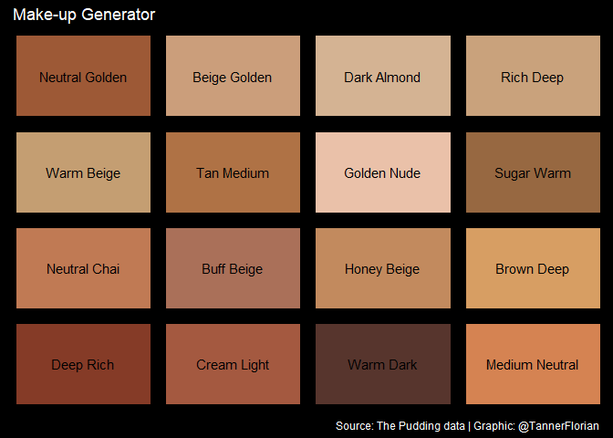

2021-03-30 Makeup Shades
================

``` r
library(tidyverse)
```

    ## -- Attaching packages --------------------------------------- tidyverse 1.3.0 --

    ## v ggplot2 3.3.3     v purrr   0.3.4
    ## v tibble  3.0.4     v dplyr   1.0.2
    ## v tidyr   1.1.2     v stringr 1.4.0
    ## v readr   1.4.0     v forcats 0.5.0

    ## -- Conflicts ------------------------------------------ tidyverse_conflicts() --
    ## x dplyr::filter() masks stats::filter()
    ## x dplyr::lag()    masks stats::lag()

``` r
library(patchwork)
```

### Load data

``` r
allCategories <- readr::read_csv('https://raw.githubusercontent.com/rfordatascience/tidytuesday/master/data/2021/2021-03-30/allCategories.csv')
```

    ## 
    ## -- Column specification --------------------------------------------------------
    ## cols(
    ##   brand = col_character(),
    ##   product = col_character(),
    ##   url = col_character(),
    ##   imgSrc = col_character(),
    ##   name = col_character(),
    ##   categories = col_character(),
    ##   specific = col_character(),
    ##   hex = col_character(),
    ##   lightness = col_double()
    ## )

## Building a random name and color generator for new make-up products

This script extracts names from existing products and randomly
recombines them, a random hex code (balanced sample for lightness) is
then added to the new name and a plot of 9 different invented make-up
products is created.

### Filter for those products that have a double name that can be recombined

``` r
double_name <- allCategories %>% 
  filter(!is.na(name), 
         str_detect(categories, "location", negate = TRUE),
         str_detect(name, "-", negate = TRUE)) %>% 
  mutate(names = str_split(name, " "), 
         length = lengths(names)) %>% 
  filter(length == 2) 
```

### Get sample of products with even distribution of lightness

``` r
hist(double_name$lightness)
```

<!-- -->

``` r
set.seed(123)

sample_even <- double_name %>% 
  group_by(lightness) %>% 
  slice_sample(n= 1) 

sample_even %>% 
  ggplot(aes(lightness)) +
  geom_histogram()
```

    ## `stat_bin()` using `bins = 30`. Pick better value with `binwidth`.

<!-- -->

### Extract first and last name

``` r
first <- double_name %>% 
  select(names) %>% 
  unnest(cols = c(names)) %>% 
  slice_head(n = nrow(double_name))
first <- first$names

second <- double_name %>% 
  select(names) %>% 
  unnest(cols = c(names)) %>% 
  slice_tail(n = nrow(double_name))
second <- second$names
```

### Extract HEX

``` r
hex_code_list <- double_name$hex
```

### Random Make-up generator

``` r
invent_makeup <- function(first_names = first, 
                          second_names = second,
                          hex_codes= hex_code_list){
  first <- sample(first_names, 1)
  second <- sample(second_names,1)
  hex <- sample(hex_codes, 1)
  out <- data.frame(name = str_to_title(str_c(first, second, sep = " ")),
                    hex = hex)
  return(out)
}

invent_makeup()
```

    ##           name     hex
    ## 1 Warm Neutral #F4C99C

### Plot new make-up

``` r
plot_random_makeup <- function(){
  
  make_up <- invent_makeup()
  p <- ggplot(data = make_up, aes(x = 1, y = 1)) +
    theme(plot.background = element_rect(fill = make_up$hex, color = make_up$hex),
          panel.background = element_rect(fill = make_up$hex, color = make_up$hex),
          panel.border = element_blank(),
          panel.grid.major = element_blank(),
          panel.grid.minor = element_blank(),
          axis.title.y=element_blank(),
          axis.text.y=element_blank(),
          axis.ticks.y=element_blank(),
          axis.ticks.x=element_blank(),
          axis.title.x = element_blank(),
          axis.text.x=element_blank()) +
    scale_y_continuous(limits = c(0,1)) +
    scale_x_continuous(limits = c(0,1)) +
    annotate(geom = "text", x = 0.5, y =0.5, 
             label = make_up$name)
  return(p)
}
```

### Combine plots into panel

``` r
p1 <- plot_random_makeup()
p2 <- plot_random_makeup()
p3 <- plot_random_makeup()
p4 <- plot_random_makeup()
p5 <- plot_random_makeup()
p6 <- plot_random_makeup()
p7 <- plot_random_makeup()
p8 <- plot_random_makeup() 
p9 <- plot_random_makeup() 


p <- p1 + p2 + p3 + p4+ p5 + p6 + p7 + p8 + p9 + plot_annotation(title = "Random Make-up Generator", caption = "Source: The Pudding data | Graphic: @TannerFlorian") &
  theme(plot.background = element_rect(fill = "black", color = "black"),
        text = element_text(color = "white"))

p
```

<!-- -->

### Save graph

``` r
ggsave(p, filename = "Random make-up.png", units = "in", width = 4, height = 2.25, dpi = 300, scale = 1.4)
```

``` r
sessionInfo()
```

    ## R version 4.0.3 (2020-10-10)
    ## Platform: x86_64-w64-mingw32/x64 (64-bit)
    ## Running under: Windows 10 x64 (build 18363)
    ## 
    ## Matrix products: default
    ## 
    ## locale:
    ## [1] LC_COLLATE=English_United States.1252 
    ## [2] LC_CTYPE=English_United States.1252   
    ## [3] LC_MONETARY=English_United States.1252
    ## [4] LC_NUMERIC=C                          
    ## [5] LC_TIME=English_United States.1252    
    ## 
    ## attached base packages:
    ## [1] stats     graphics  grDevices utils     datasets  methods   base     
    ## 
    ## other attached packages:
    ##  [1] patchwork_1.1.1 forcats_0.5.0   stringr_1.4.0   dplyr_1.0.2    
    ##  [5] purrr_0.3.4     readr_1.4.0     tidyr_1.1.2     tibble_3.0.4   
    ##  [9] ggplot2_3.3.3   tidyverse_1.3.0
    ## 
    ## loaded via a namespace (and not attached):
    ##  [1] tidyselect_1.1.0  xfun_0.20         haven_2.3.1       colorspace_2.0-0 
    ##  [5] vctrs_0.3.6       generics_0.1.0    htmltools_0.5.0   yaml_2.2.1       
    ##  [9] rlang_0.4.10      pillar_1.4.7      glue_1.4.2        withr_2.3.0      
    ## [13] DBI_1.1.0         dbplyr_2.0.0      modelr_0.1.8      readxl_1.3.1     
    ## [17] lifecycle_0.2.0   munsell_0.5.0     gtable_0.3.0      cellranger_1.1.0 
    ## [21] rvest_0.3.6       evaluate_0.14     labeling_0.4.2    knitr_1.30       
    ## [25] curl_4.3          fansi_0.4.2       broom_0.7.5       Rcpp_1.0.5       
    ## [29] scales_1.1.1      backports_1.2.0   jsonlite_1.7.2    farver_2.0.3     
    ## [33] fs_1.5.0          hms_1.0.0         digest_0.6.27     stringi_1.5.3    
    ## [37] grid_4.0.3        cli_2.2.0         tools_4.0.3       magrittr_2.0.1   
    ## [41] crayon_1.3.4      pkgconfig_2.0.3   ellipsis_0.3.1    xml2_1.3.2       
    ## [45] reprex_0.3.0      lubridate_1.7.9.2 assertthat_0.2.1  rmarkdown_2.6    
    ## [49] httr_1.4.2        rstudioapi_0.13   R6_2.5.0          compiler_4.0.3
