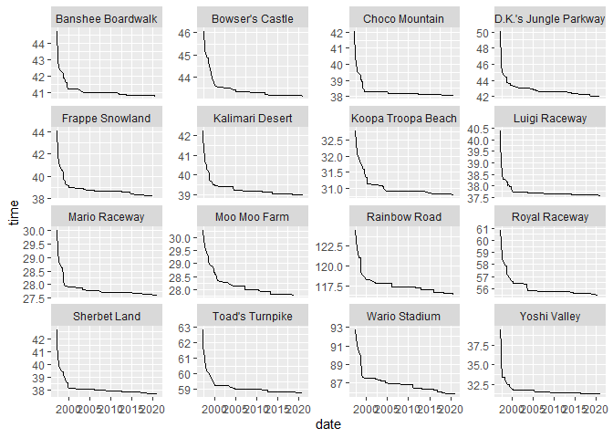
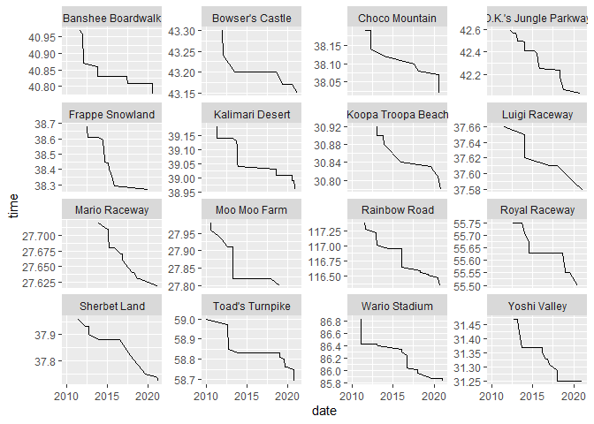
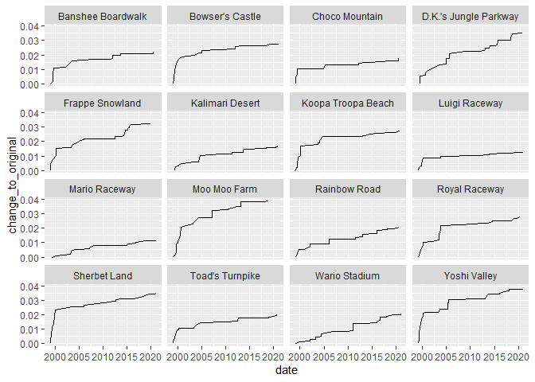
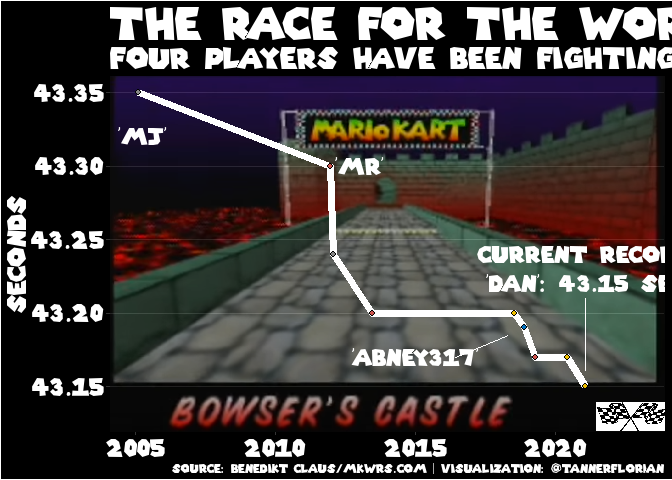

2021-05-25 Mario Kart World Records
================

``` r
library(tidyverse)
```

    ## Warning: package 'tidyverse' was built under R version 4.0.5

    ## -- Attaching packages --------------------------------------- tidyverse 1.3.1 --

    ## v ggplot2 3.3.3     v purrr   0.3.4
    ## v tibble  3.1.2     v dplyr   1.0.6
    ## v tidyr   1.1.3     v stringr 1.4.0
    ## v readr   1.4.0     v forcats 0.5.1

    ## Warning: package 'tibble' was built under R version 4.0.5

    ## Warning: package 'tidyr' was built under R version 4.0.5

    ## Warning: package 'dplyr' was built under R version 4.0.5

    ## Warning: package 'forcats' was built under R version 4.0.5

    ## -- Conflicts ------------------------------------------ tidyverse_conflicts() --
    ## x dplyr::filter() masks stats::filter()
    ## x dplyr::lag()    masks stats::lag()

``` r
library(extrafont)
```

    ## Registering fonts with R

``` r
library(showtext)
```

    ## Warning: package 'showtext' was built under R version 4.0.5

    ## Loading required package: sysfonts

    ## Warning: package 'sysfonts' was built under R version 4.0.5

    ## Loading required package: showtextdb

    ## Warning: package 'showtextdb' was built under R version 4.0.5

    ## 
    ## Attaching package: 'showtextdb'

    ## The following object is masked from 'package:extrafont':
    ## 
    ##     font_install

``` r
library(ggsci)
library(ggimage)
```

    ## Warning: package 'ggimage' was built under R version 4.0.4

## Read data

``` r
ds <- readr::read_csv('https://raw.githubusercontent.com/rfordatascience/tidytuesday/master/data/2021/2021-05-25/records.csv')
```

    ## 
    ## -- Column specification --------------------------------------------------------
    ## cols(
    ##   track = col_character(),
    ##   type = col_character(),
    ##   shortcut = col_character(),
    ##   player = col_character(),
    ##   system_played = col_character(),
    ##   date = col_date(format = ""),
    ##   time_period = col_character(),
    ##   time = col_double(),
    ##   record_duration = col_double()
    ## )

``` r
drivers <- readr::read_csv('https://raw.githubusercontent.com/rfordatascience/tidytuesday/master/data/2021/2021-05-25/drivers.csv')
```

    ## 
    ## -- Column specification --------------------------------------------------------
    ## cols(
    ##   position = col_double(),
    ##   player = col_character(),
    ##   total = col_double(),
    ##   year = col_double(),
    ##   records = col_double(),
    ##   nation = col_character()
    ## )

## Visualization

  - All times are PAL times
  - Most competitive tracks?
  - Number of records
  - Which tracks seem like they could improve more?
  - Normalization of records?
  - Percent improvement on original record?

<!-- end list -->

``` r
ds %>% 
  filter(shortcut == "No", type == "Single Lap") %>% 
  ggplot(aes(x= date, y = time, group = track)) +
  geom_line() +
  facet_wrap(~track, scales = "free_y")
```

<!-- -->

``` r
ds %>% 
  filter(date > "2010-01-01", shortcut == "No", type == "Single Lap") %>% 
  ggplot(aes(x= date, y = time, group = track)) +
  geom_line() +
  facet_wrap(~track, scales = "free_y")
```

<!-- -->
\#\# Compare change in time to first record

  - This graph is no better than the straight times

<!-- end list -->

``` r
ds %>% 
  filter(date > "1999-01-01", shortcut == "No", type == "Single Lap") %>% 
  group_by(track) %>% 
  mutate(original_record = max(time),
         change_to_original = 1- time/original_record) %>% 
  ggplot(aes(date, change_to_original, group = track)) +
  geom_line() +
  facet_wrap(~track)
```

<!-- -->

## Which ones are most competitive?

  - Not much difference

<!-- end list -->

``` r
ds %>% 
  filter(shortcut == "No", type == "Single Lap") %>% 
  group_by(track) %>% 
  summarise(records = n())
```

    ## # A tibble: 16 x 2
    ##    track                 records
    ##    <chr>                   <int>
    ##  1 Banshee Boardwalk          28
    ##  2 Bowser's Castle            29
    ##  3 Choco Mountain             32
    ##  4 D.K.'s Jungle Parkway      47
    ##  5 Frappe Snowland            44
    ##  6 Kalimari Desert            48
    ##  7 Koopa Troopa Beach         33
    ##  8 Luigi Raceway              33
    ##  9 Mario Raceway              39
    ## 10 Moo Moo Farm               37
    ## 11 Rainbow Road               40
    ## 12 Royal Raceway              36
    ## 13 Sherbet Land               35
    ## 14 Toad's Turnpike            36
    ## 15 Wario Stadium              65
    ## 16 Yoshi Valley               43

## Full graph

  - Focus on Bowser’s castle
  - The playerbase seems relatively small, highlight the race between
    the different players

### Read background image and symbols

``` r
bg <- "Capture75opCropmoved.png"
flag <- "flags_white_bg.png"
font_add(family = "mariokart", regular = "SuperMario256.ttf")
showtext_auto()
```

### Define theme

``` r
mk_font <- "mariokart"

mk64_theme <- theme_dark() +
  theme(panel.grid.major.x = element_blank(),
        panel.grid.minor.x = element_blank(),
        panel.grid.minor.y = element_blank(),
        panel.grid.major.y = element_line(),
        axis.title.x = element_blank(),
        plot.background = element_rect(fill = "black"),
        panel.background = element_rect(fill = "black"),
        text=element_text(family=mk_font, color = "white"),
        axis.text = element_text(family=mk_font, color = "white", size = 18),
        plot.title = element_text(family=mk_font, color = "white", size = 33),
        plot.subtitle = element_text(family=mk_font, color = "white", size = 22),
        axis.title.y = element_text(family=mk_font, color = "white", size = 19),
        legend.position = "none")
```

``` r
p <- ds %>% 
  filter(date > "2005-02-01", shortcut == "No", 
         type == "Single Lap", track == "Bowser's Castle") %>% 
  ggplot(aes(x= date, y = time, group = track)) +
  geom_line(color = "white", size = 2.5) +
  geom_point(aes(fill = player), size = 1.8, shape =21) +
  labs(title = "The race for the world record", y = "Seconds", 
       subtitle = "Four players have been fighting it out since 2005",
       caption = "") +
  scale_fill_jco() +
  scale_x_date(limits = c(as.Date("2005-01-01"), as.Date("2023-01-01"))) + 
  geom_bgimage(bg) +
  geom_image(aes(x= as.Date("2022-10-01"), y = 43.13, image = flag), size = 0.13) +
  # Dan
  annotate(geom = "text", x =  as.Date("2021-02-02"), 
           y = 43.24, label = "Current record:",
           color = "white", family = mk_font, size = 6) +
  annotate(geom = "text", x =  as.Date("2021-02-02"), 
           y = 43.22, label = "'Dan': 43.15 sec",
           color = "white", family = mk_font, size = 6) +
  annotate(geom = "segment", x = as.Date("2021-02-02"), xend = as.Date("2021-02-02") , 
           y = 43.21, yend = 43.16, color = "white", size = 0.65) +
  # Abney317
  annotate(geom = "text", x =  as.Date("2015-01-01"), 
           y = 43.17, label = "'Abney317'",
           color = "white", family = mk_font, size = 6) +
  annotate(geom = "segment", x = as.Date("2016-06-01"), xend = as.Date("2018-05-01"), 
           y = 43.17, yend = 43.185, color = "white", size = 0.65) +
  # MJ
  annotate(geom = "text", x =  as.Date("2005-04-01"), 
           y = 43.32, label = "'MJ'",
           color = "white", family = mk_font, size = 6) +
  # MR
  annotate(geom = "text", x =  as.Date("2013-01-01"), 
           y = 43.30, label = "'MR'",
           color = "white", family = mk_font, size = 6) +
  mk64_theme + 
  labs(caption = "Source: Benedikt Claus/mkwrs.com | Visualization: @TannerFlorian")
p
```

<!-- -->

``` r
ggsave("mario.png", p, device = "png", units = "in", width = 4, height = 2.25, scale = 1, type = "cairo")
```

# <https://www.dafont.com/super-mario-256.font>

``` r
sessionInfo()
```

    ## R version 4.0.3 (2020-10-10)
    ## Platform: x86_64-w64-mingw32/x64 (64-bit)
    ## Running under: Windows 10 x64 (build 18363)
    ## 
    ## Matrix products: default
    ## 
    ## locale:
    ## [1] LC_COLLATE=English_United States.1252 
    ## [2] LC_CTYPE=English_United States.1252   
    ## [3] LC_MONETARY=English_United States.1252
    ## [4] LC_NUMERIC=C                          
    ## [5] LC_TIME=English_United States.1252    
    ## 
    ## attached base packages:
    ## [1] stats     graphics  grDevices utils     datasets  methods   base     
    ## 
    ## other attached packages:
    ##  [1] ggimage_0.2.8   ggsci_2.9       showtext_0.9-2  showtextdb_3.0 
    ##  [5] sysfonts_0.8.3  extrafont_0.17  forcats_0.5.1   stringr_1.4.0  
    ##  [9] dplyr_1.0.6     purrr_0.3.4     readr_1.4.0     tidyr_1.1.3    
    ## [13] tibble_3.1.2    ggplot2_3.3.3   tidyverse_1.3.1
    ## 
    ## loaded via a namespace (and not attached):
    ##  [1] Rcpp_1.0.5          lubridate_1.7.10    assertthat_0.2.1   
    ##  [4] digest_0.6.27       utf8_1.1.4          R6_2.5.0           
    ##  [7] cellranger_1.1.0    backports_1.2.0     reprex_2.0.0       
    ## [10] evaluate_0.14       httr_1.4.2          pillar_1.6.1       
    ## [13] rlang_0.4.10        curl_4.3            readxl_1.3.1       
    ## [16] rstudioapi_0.13     extrafontdb_1.0     magick_2.7.0       
    ## [19] rmarkdown_2.6       labeling_0.4.2      munsell_0.5.0      
    ## [22] broom_0.7.6         compiler_4.0.3      modelr_0.1.8       
    ## [25] xfun_0.22           pkgconfig_2.0.3     gridGraphics_0.5-1 
    ## [28] htmltools_0.5.1.1   tidyselect_1.1.1    fansi_0.4.2        
    ## [31] crayon_1.4.1        dbplyr_2.1.1        withr_2.3.0        
    ## [34] grid_4.0.3          jsonlite_1.7.2      Rttf2pt1_1.3.8     
    ## [37] gtable_0.3.0        lifecycle_1.0.0     DBI_1.1.0          
    ## [40] magrittr_2.0.1      scales_1.1.1        cli_2.5.0          
    ## [43] stringi_1.5.3       farver_2.0.3        fs_1.5.0           
    ## [46] xml2_1.3.2          ellipsis_0.3.2      rvcheck_0.1.8      
    ## [49] generics_0.1.0      vctrs_0.3.8         tools_4.0.3        
    ## [52] ggplotify_0.0.5     glue_1.4.2          hms_1.0.0          
    ## [55] yaml_2.2.1          colorspace_2.0-0    BiocManager_1.30.10
    ## [58] rvest_1.0.0         knitr_1.30          haven_2.3.1
