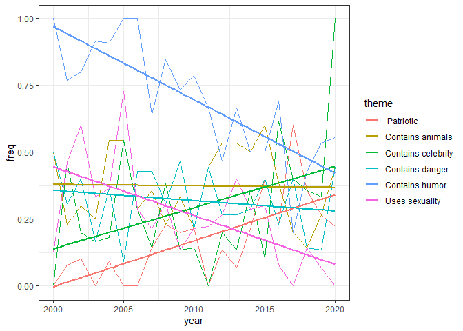
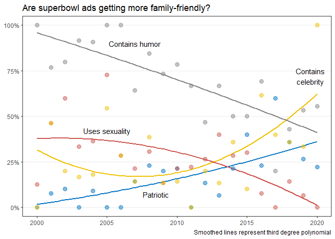
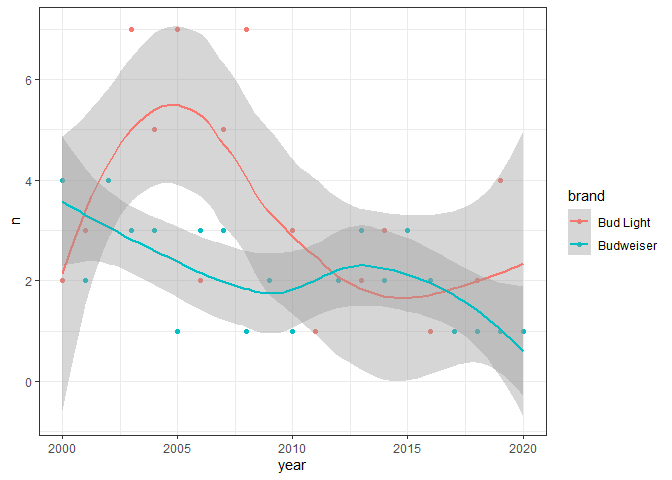
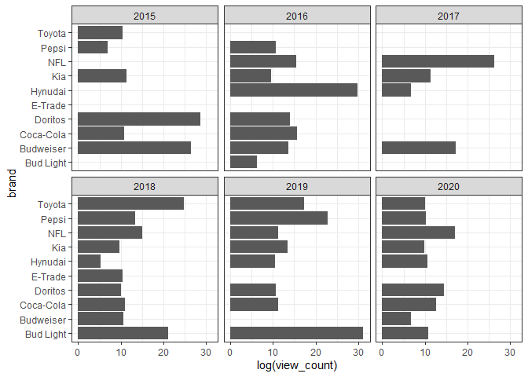
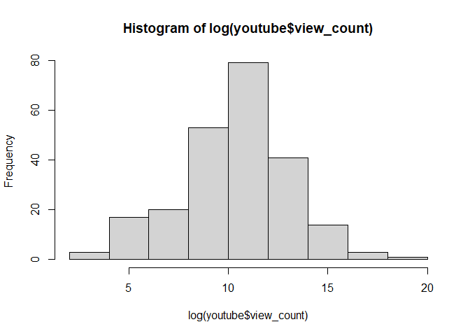
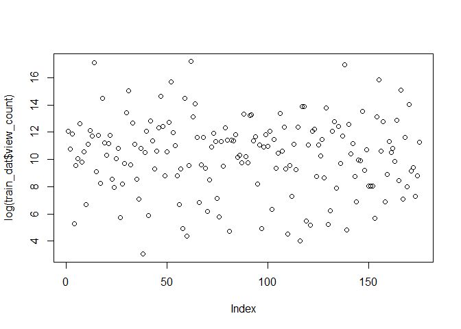
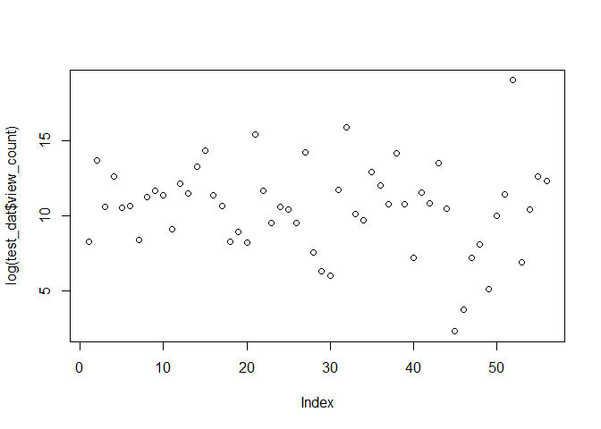
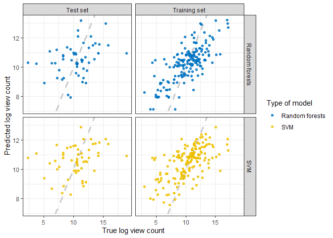
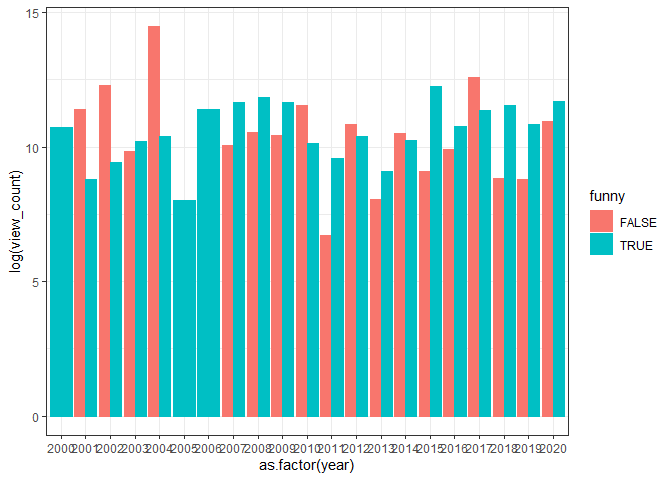
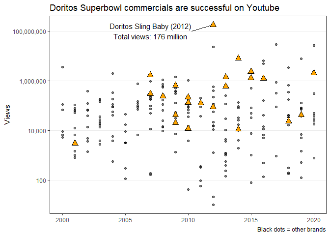

2021-03-02 SuperBowl Ads
================

``` r
library(tidyverse)
```

    ## -- Attaching packages --------------------------------------- tidyverse 1.3.0 --

    ## v ggplot2 3.3.3     v purrr   0.3.4
    ## v tibble  3.0.4     v dplyr   1.0.2
    ## v tidyr   1.1.2     v stringr 1.4.0
    ## v readr   1.4.0     v forcats 0.5.0

    ## -- Conflicts ------------------------------------------ tidyverse_conflicts() --
    ## x dplyr::filter() masks stats::filter()
    ## x dplyr::lag()    masks stats::lag()

``` r
library(skimr)
library(ggsci)
library(tidymodels)
```

    ## -- Attaching packages -------------------------------------- tidymodels 0.1.2 --

    ## v broom     0.7.3      v recipes   0.1.15
    ## v dials     0.0.9      v rsample   0.0.8 
    ## v infer     0.5.4      v tune      0.1.2 
    ## v modeldata 0.1.0      v workflows 0.2.1 
    ## v parsnip   0.1.4      v yardstick 0.0.7

    ## -- Conflicts ----------------------------------------- tidymodels_conflicts() --
    ## x scales::discard() masks purrr::discard()
    ## x dplyr::filter()   masks stats::filter()
    ## x recipes::fixed()  masks stringr::fixed()
    ## x dplyr::lag()      masks stats::lag()
    ## x yardstick::spec() masks readr::spec()
    ## x recipes::step()   masks stats::step()

``` r
theme_set(theme_bw())
`%nin%` = Negate(`%in%`)
```

## First look

  - Potential questions
      - How did the themes of the adds change between 2000 and 2020?
      - Beer preferences of superbowl watchers?
      - Predict youtube metrics with brand and themes?

<!-- end list -->

``` r
youtube <- readr::read_csv('https://raw.githubusercontent.com/rfordatascience/tidytuesday/master/data/2021/2021-03-02/youtube.csv')
```

    ## 
    ## -- Column specification --------------------------------------------------------
    ## cols(
    ##   .default = col_character(),
    ##   year = col_double(),
    ##   funny = col_logical(),
    ##   show_product_quickly = col_logical(),
    ##   patriotic = col_logical(),
    ##   celebrity = col_logical(),
    ##   danger = col_logical(),
    ##   animals = col_logical(),
    ##   use_sex = col_logical(),
    ##   view_count = col_double(),
    ##   like_count = col_double(),
    ##   dislike_count = col_double(),
    ##   favorite_count = col_double(),
    ##   comment_count = col_double(),
    ##   published_at = col_datetime(format = ""),
    ##   category_id = col_double()
    ## )
    ## i Use `spec()` for the full column specifications.

``` r
skim(youtube)
```

|                                                  |         |
| :----------------------------------------------- | :------ |
| Name                                             | youtube |
| Number of rows                                   | 247     |
| Number of columns                                | 25      |
| \_\_\_\_\_\_\_\_\_\_\_\_\_\_\_\_\_\_\_\_\_\_\_   |         |
| Column type frequency:                           |         |
| character                                        | 10      |
| logical                                          | 7       |
| numeric                                          | 7       |
| POSIXct                                          | 1       |
| \_\_\_\_\_\_\_\_\_\_\_\_\_\_\_\_\_\_\_\_\_\_\_\_ |         |
| Group variables                                  | None    |

Data summary

**Variable type: character**

| skim\_variable                | n\_missing | complete\_rate | min |  max | empty | n\_unique | whitespace |
| :---------------------------- | ---------: | -------------: | --: | ---: | ----: | --------: | ---------: |
| brand                         |          0 |           1.00 |   3 |    9 |     0 |        10 |          0 |
| superbowl\_ads\_dot\_com\_url |          0 |           1.00 |  34 |  120 |     0 |       244 |          0 |
| youtube\_url                  |         11 |           0.96 |  43 |   43 |     0 |       233 |          0 |
| id                            |         11 |           0.96 |  11 |   11 |     0 |       233 |          0 |
| kind                          |         16 |           0.94 |  13 |   13 |     0 |         1 |          0 |
| etag                          |         16 |           0.94 |  27 |   27 |     0 |       228 |          0 |
| title                         |         16 |           0.94 |   6 |   99 |     0 |       228 |          0 |
| description                   |         50 |           0.80 |   3 | 3527 |     0 |       194 |          0 |
| thumbnail                     |        129 |           0.48 |  48 |   48 |     0 |       118 |          0 |
| channel\_title                |         16 |           0.94 |   3 |   37 |     0 |       185 |          0 |

**Variable type: logical**

| skim\_variable         | n\_missing | complete\_rate | mean | count             |
| :--------------------- | ---------: | -------------: | ---: | :---------------- |
| funny                  |          0 |              1 | 0.69 | TRU: 171, FAL: 76 |
| show\_product\_quickly |          0 |              1 | 0.68 | TRU: 169, FAL: 78 |
| patriotic              |          0 |              1 | 0.17 | FAL: 206, TRU: 41 |
| celebrity              |          0 |              1 | 0.29 | FAL: 176, TRU: 71 |
| danger                 |          0 |              1 | 0.30 | FAL: 172, TRU: 75 |
| animals                |          0 |              1 | 0.37 | FAL: 155, TRU: 92 |
| use\_sex               |          0 |              1 | 0.27 | FAL: 181, TRU: 66 |

**Variable type: numeric**

| skim\_variable  | n\_missing | complete\_rate |       mean |          sd |   p0 |  p25 |   p50 |       p75 |      p100 | hist  |
| :-------------- | ---------: | -------------: | ---------: | ----------: | ---: | ---: | ----: | --------: | --------: | :---- |
| year            |          0 |           1.00 |    2010.19 |        5.86 | 2000 | 2005 |  2010 |   2015.00 |      2020 | ▇▇▇▇▆ |
| view\_count     |         16 |           0.94 | 1407556.46 | 11971111.01 |   10 | 6431 | 41379 | 170015.50 | 176373378 | ▇▁▁▁▁ |
| like\_count     |         22 |           0.91 |    4146.03 |    23920.40 |    0 |   19 |   130 |    527.00 |    275362 | ▇▁▁▁▁ |
| dislike\_count  |         22 |           0.91 |     833.54 |     6948.52 |    0 |    1 |     7 |     24.00 |     92990 | ▇▁▁▁▁ |
| favorite\_count |         16 |           0.94 |       0.00 |        0.00 |    0 |    0 |     0 |      0.00 |         0 | ▁▁▇▁▁ |
| comment\_count  |         25 |           0.90 |     188.64 |      986.46 |    0 |    1 |    10 |     50.75 |      9190 | ▇▁▁▁▁ |
| category\_id    |         16 |           0.94 |      19.32 |        8.00 |    1 |   17 |    23 |     24.00 |        29 | ▃▁▂▆▇ |

**Variable type: POSIXct**

| skim\_variable | n\_missing | complete\_rate | min                 | max                 | median              | n\_unique |
| :------------- | ---------: | -------------: | :------------------ | :------------------ | :------------------ | --------: |
| published\_at  |         16 |           0.94 | 2006-02-06 10:02:36 | 2021-01-27 13:11:29 | 2013-01-31 09:13:55 |       227 |

## Exploratory analysis for themes

``` r
youtube %>%  
  count(brand) %>% 
  arrange(desc(n))
```

    ## # A tibble: 10 x 2
    ##    brand         n
    ##    <chr>     <int>
    ##  1 Bud Light    63
    ##  2 Budweiser    43
    ##  3 Doritos      25
    ##  4 Pepsi        25
    ##  5 Hynudai      22
    ##  6 Coca-Cola    21
    ##  7 E-Trade      13
    ##  8 Kia          13
    ##  9 NFL          11
    ## 10 Toyota       11

  - There are only 10 brands represented
  - Light beers are taking off

<!-- end list -->

``` r
youtube %>%  
  count(year) %>%
  arrange(year)
```

    ## # A tibble: 21 x 2
    ##     year     n
    ##    <dbl> <int>
    ##  1  2000     8
    ##  2  2001    13
    ##  3  2002    10
    ##  4  2003    12
    ##  5  2004    11
    ##  6  2005    11
    ##  7  2006     7
    ##  8  2007    14
    ##  9  2008    13
    ## 10  2009    15
    ## # ... with 11 more rows

  - The amount of ads varies across years

### Calculating the frequency of themes used in every year and renaming themes

``` r
themes_across_years <- youtube %>% 
  left_join(youtube %>% count(year)) %>% 
  rename(total_per_year = n) %>% 
  group_by(year) %>% 
  summarise(across(.cols = c(funny, patriotic, danger, use_sex, animals, celebrity), .fns= mean)) %>% 
  pivot_longer(cols = -year, names_to = "theme", values_to = "freq")
```

    ## Joining, by = "year"

    ## `summarise()` ungrouping output (override with `.groups` argument)

``` r
themes_across_years$theme[themes_across_years$theme == "funny"] <- "Contains humor"
themes_across_years$theme[themes_across_years$theme == "patriotic"] <- "    Patriotic"
themes_across_years$theme[themes_across_years$theme == "danger"] <- "Contains danger"
themes_across_years$theme[themes_across_years$theme == "use_sex"] <- "Uses sexuality"
themes_across_years$theme[themes_across_years$theme == "animals"] <- "Contains animals"
themes_across_years$theme[themes_across_years$theme == "celebrity"] <- "Contains celebrity"
```

### Graphing frequency

``` r
themes_across_years %>% 
  ggplot(aes(x= year, y= freq, color = theme, group = theme)) +
  geom_line() +
  geom_smooth(method = "lm", se = FALSE)
```

    ## `geom_smooth()` using formula 'y ~ x'

<!-- -->

  - Are superbowl ads getting more family friendly?
      - Picking only the themes that seem to change

<!-- end list -->

``` r
p <- themes_across_years %>% 
  filter(theme %nin% c("Contains animals", "Contains danger")) %>% 
  ggplot(aes(x= year, y= freq, color = theme, group = theme)) +
  stat_smooth(method="lm", fill=NA,
                formula=y ~ poly(x, 3, raw=TRUE)) +
  geom_point(alpha = 0.5, size = 3) +
  scale_color_jco() +
  scale_y_continuous(labels = scales::percent, breaks = c(0, 0.25, 0.5, 0.75, 1), limits = c(0,1))+
  labs(x = NULL, y = NULL, title = "Are superbowl ads getting more family-friendly?",
       caption= "Smoothed lines represent third degree polynomial") +
  theme(panel.grid.major.x = element_blank(),
        panel.grid.minor.x = element_blank(),
        panel.grid.minor.y = element_blank(),
        legend.position = "none") +
  annotate("text", x = 2007, y = 0.9, label= "Contains humor") +
  annotate("text", x = 2019.5, y = 0.72, label= "Contains\ncelebrity") +
  annotate("text", x = 2005, y = 0.42, label= "Uses sexuality") +
  annotate("text", x = 2008.5, y = 0.07, label = "Patriotic") 

p
```

    ## Warning in predict.lm(model, newdata = new_data_frame(list(x = xseq)), se.fit =
    ## se, : prediction from a rank-deficient fit may be misleading
    
    ## Warning in predict.lm(model, newdata = new_data_frame(list(x = xseq)), se.fit =
    ## se, : prediction from a rank-deficient fit may be misleading
    
    ## Warning in predict.lm(model, newdata = new_data_frame(list(x = xseq)), se.fit =
    ## se, : prediction from a rank-deficient fit may be misleading
    
    ## Warning in predict.lm(model, newdata = new_data_frame(list(x = xseq)), se.fit =
    ## se, : prediction from a rank-deficient fit may be misleading

<!-- -->

### Thoughts theme trend plot

  - What are best practices when including smoothing lines in plots?
      - How much should be explained?
      - Is it obscuring data / telling a story that is not there?

## Exploratory analysis for beer preferences

  - Are people drinking more light beers? Does not seem so, mid 2000s
    was more popular
      - The higher total of Bud Light ads comes from that time period

<!-- end list -->

``` r
youtube %>%  
  filter(brand %in% c("Budweiser", "Bud Light")) %>%
  group_by(year) %>% 
  count(brand) %>% 
  ggplot(aes(x = year, y = n, color = brand)) +
  geom_point() +
  geom_smooth()
```

    ## `geom_smooth()` using method = 'loess' and formula 'y ~ x'

<!-- -->

## Exploratory analysis for youtube metrics

  - Metrics: views, likes, dislikes, number comments, favorite count
      - Views is probably most important for ads…
      - have to log - transform view\_count
      - Some companies have more than one ad per year, account for that

<!-- end list -->

``` r
youtube %>% 
  select(year, brand, view_count) %>% 
  arrange(desc(view_count))
```

    ## # A tibble: 247 x 3
    ##     year brand     view_count
    ##    <dbl> <chr>          <dbl>
    ##  1  2012 Doritos    176373378
    ##  2  2017 Budweiser   28785122
    ##  3  2020 NFL         26727063
    ##  4  2012 Coca-Cola   22849816
    ##  5  2014 Doritos      7952240
    ##  6  2019 Bud Light    7658201
    ##  7  2016 Coca-Cola    6428474
    ##  8  2016 NFL          4921309
    ##  9  2000 Budweiser    3624622
    ## 10  2018 NFL          3464175
    ## # ... with 237 more rows

``` r
youtube %>% 
  filter(year > 2014) %>% 
  ggplot(aes(x= log(view_count), y = brand)) +
  geom_col() +
  facet_wrap(~year)
```

    ## Warning: Removed 6 rows containing missing values (position_stack).

<!-- -->

``` r
hist(log(youtube$view_count))
```

<!-- -->
\#\# Predictive modeling for youtube metrics

### Preprocessing

``` r
mod_dat <- youtube %>% 
  select(-superbowl_ads_dot_com_url, - youtube_url, -kind, -etag, -published_at, - description, - thumbnail, -channel_title, - category_id)
```

### Test-train split

``` r
set.seed(123)

split <- mod_dat %>%
  filter(!is.na(view_count)) %>% 
  initial_split(p= 0.75, strata = view_count)
train_dat <- training(split)
test_dat <- testing(split)

plot(log(train_dat$view_count))
```

<!-- -->

``` r
plot(log(test_dat$view_count))
```

<!-- -->

### Recipe

``` r
football_recipe <- recipe((view_count ~.), 
                          data = train_dat %>% 
                            select(-like_count, -dislike_count, -favorite_count, -comment_count)) %>% 
  update_role(c(year, id, title), new_role = "ID") %>% 
  step_log(all_outcomes(), skip = TRUE) %>%
  step_dummy(brand) 

football_prep <- football_recipe %>% prep()
football_prep
```

    ## Data Recipe
    ## 
    ## Inputs:
    ## 
    ##       role #variables
    ##         ID          3
    ##    outcome          1
    ##  predictor          8
    ## 
    ## Training data contained 175 data points and no missing data.
    ## 
    ## Operations:
    ## 
    ## Log transformation on view_count [trained]
    ## Dummy variables from brand [trained]

### Specify models

``` r
rf_spec <- rand_forest() %>% 
  set_engine("ranger",importance = "permutation") %>% 
  set_mode("regression")

svm_spec <- svm_rbf() %>% 
  set_engine("kernlab") %>% 
  set_mode("regression") %>% 
  translate()
```

### Workflow

``` r
rf_workflow <- workflow() %>% 
  add_model(rf_spec) %>% 
  add_recipe(football_recipe)

svm_workflow <- workflow() %>% 
  add_model(svm_spec) %>% 
  add_recipe(football_recipe)
```

### Fit model

``` r
rf_fit <- 
  rf_workflow %>% 
  fit(data = train_dat)

svm_fit <-
  svm_workflow %>% 
  fit(data = train_dat)
```

### Predict

``` r
results_test <- rf_fit %>%
  predict(new_data = test_dat) %>%
  mutate(truth = log(test_dat$view_count),
    model = "Random forests") %>% 
  bind_rows(svm_fit %>% 
              predict(new_data = test_dat) %>% 
              mutate(truth = log(test_dat$view_count),
    model = "SVM"))


results_train <- rf_fit %>%
  predict(new_data = train_dat) %>%
  mutate(truth = log(train_dat$view_count),
    model = "Random forests") %>% 
  bind_rows(svm_fit %>% 
              predict(new_data = train_dat) %>% 
              mutate(truth = log(train_dat$view_count),
    model = "SVM"))
```

### Evaluate

``` r
results_test %>% 
  group_by(model) %>% 
  rsq(truth = truth, estimate = .pred)
```

    ## # A tibble: 2 x 4
    ##   model          .metric .estimator .estimate
    ##   <chr>          <chr>   <chr>          <dbl>
    ## 1 Random forests rsq     standard      0.118 
    ## 2 SVM            rsq     standard      0.0832

``` r
results_train %>% 
  group_by(model) %>% 
  rsq(truth = truth, estimate = .pred)
```

    ## # A tibble: 2 x 4
    ##   model          .metric .estimator .estimate
    ##   <chr>          <chr>   <chr>          <dbl>
    ## 1 Random forests rsq     standard       0.550
    ## 2 SVM            rsq     standard       0.399

### Plots

``` r
p <- results_test %>% 
  mutate(train = "Test set") %>% 
  bind_rows(results_train %>% 
              mutate(train = "Training set")) %>% 
  ggplot(aes(x = truth ,y = .pred, color = model)) +
  geom_abline(lty = 2, color = "gray80", size = 1.3) +
  geom_point(alpha = 0.8) +
  facet_grid(model~train) +
  labs(
    x = "True log view count",
    y = "Predicted log view count",
    color = "Type of model") +
  scale_color_jco()


p
```

<!-- -->

### Variable importance?

  - Doritos does well

<!-- end list -->

``` r
library(vip)
```

    ## 
    ## Attaching package: 'vip'

    ## The following object is masked from 'package:utils':
    ## 
    ##     vi

``` r
rf_fit %>%
  pull_workflow_fit() %>%
  vi()
```

    ## # A tibble: 16 x 2
    ##    Variable             Importance
    ##    <chr>                     <dbl>
    ##  1 danger                   0.675 
    ##  2 funny                    0.671 
    ##  3 animals                  0.436 
    ##  4 celebrity                0.427 
    ##  5 brand_Hynudai            0.243 
    ##  6 brand_Doritos            0.209 
    ##  7 brand_NFL                0.205 
    ##  8 brand_Pepsi              0.185 
    ##  9 brand_Coca.Cola          0.130 
    ## 10 brand_Kia                0.0957
    ## 11 brand_Budweiser          0.0620
    ## 12 use_sex                  0.0472
    ## 13 show_product_quickly    -0.0171
    ## 14 brand_Toyota            -0.0235
    ## 15 patriotic               -0.0645
    ## 16 brand_E.Trade           -0.125

``` r
youtube %>% 
  ggplot(aes(x = as.factor(year), y = log(view_count), color = funny, fill = funny)) +
  geom_bar(stat = "summary", fun.y = "mean", position = "dodge")
```

    ## Warning: Ignoring unknown parameters: fun.y

    ## Warning: Removed 16 rows containing non-finite values (stat_summary).

    ## No summary function supplied, defaulting to `mean_se()`

<!-- -->

``` r
p <- ggplot() +
  geom_point(data = youtube %>% filter(brand != "Doritos"),aes(x= year , y = view_count), alpha = 0.5) +
  annotate("segment", x = 2010.3, xend= 2012, y = 100000000, yend = 176373378) +
  geom_point(data = youtube %>% filter(brand == "Doritos"), 
             aes(x= year , y = view_count), color = "black", fill = "orange", shape = 24, size = 3) + 
  scale_y_log10(labels = comma) +
  theme(panel.grid.major.x = element_blank(),
        panel.grid.minor.x = element_blank(),
        panel.grid.minor.y = element_blank(),
        legend.position = "none") +
  labs(x= NULL, y = "Views", title = "Doritos Superbowl commercials are successful on Youtube", 
       caption= "Black dots = other brands") +
  annotate("text", x = 2007, y= 100000000, label = "Doritos Sling Baby (2012)\nTotal views: 176 million") 

p
```

    ## Warning: Removed 14 rows containing missing values (geom_point).

    ## Warning: Removed 2 rows containing missing values (geom_point).

<!-- -->

``` r
ggsave(p, filename = "doritos views.png", units = "cm", width = 14, height = 10, limitsize = F, scale = 1.4)
```

    ## Warning: Removed 14 rows containing missing values (geom_point).

    ## Warning: Removed 2 rows containing missing values (geom_point).

### Thoughts

  - The graph should be interactive (display brand, view\_count and
    youtube url)
  - Keep going with modeling
      - So far, I only used it to determine important predictors for
        view\_count
  - Make sure variable importance from random forests is stable

<!-- end list -->

``` r
sessionInfo()
```

    ## R version 4.0.3 (2020-10-10)
    ## Platform: x86_64-w64-mingw32/x64 (64-bit)
    ## Running under: Windows 10 x64 (build 18363)
    ## 
    ## Matrix products: default
    ## 
    ## locale:
    ## [1] LC_COLLATE=English_United States.1252 
    ## [2] LC_CTYPE=English_United States.1252   
    ## [3] LC_MONETARY=English_United States.1252
    ## [4] LC_NUMERIC=C                          
    ## [5] LC_TIME=English_United States.1252    
    ## 
    ## attached base packages:
    ## [1] stats     graphics  grDevices utils     datasets  methods   base     
    ## 
    ## other attached packages:
    ##  [1] vip_0.3.2        yardstick_0.0.7  workflows_0.2.1  tune_0.1.2      
    ##  [5] rsample_0.0.8    recipes_0.1.15   parsnip_0.1.4    modeldata_0.1.0 
    ##  [9] infer_0.5.4      dials_0.0.9      scales_1.1.1     broom_0.7.3     
    ## [13] tidymodels_0.1.2 ggsci_2.9        skimr_2.1.2      forcats_0.5.0   
    ## [17] stringr_1.4.0    dplyr_1.0.2      purrr_0.3.4      readr_1.4.0     
    ## [21] tidyr_1.1.2      tibble_3.0.4     ggplot2_3.3.3    tidyverse_1.3.0 
    ## 
    ## loaded via a namespace (and not attached):
    ##  [1] colorspace_2.0-0   ellipsis_0.3.1     class_7.3-17       base64enc_0.1-3   
    ##  [5] fs_1.5.0           rstudioapi_0.13    listenv_0.8.0      furrr_0.2.1       
    ##  [9] farver_2.0.3       prodlim_2019.11.13 fansi_0.4.2        lubridate_1.7.9.2 
    ## [13] ranger_0.12.1      xml2_1.3.2         codetools_0.2-16   splines_4.0.3     
    ## [17] knitr_1.30         jsonlite_1.7.2     pROC_1.16.2        kernlab_0.9-29    
    ## [21] dbplyr_2.0.0       compiler_4.0.3     httr_1.4.2         backports_1.2.0   
    ## [25] assertthat_0.2.1   Matrix_1.2-18      cli_2.2.0          htmltools_0.5.0   
    ## [29] tools_4.0.3        gtable_0.3.0       glue_1.4.2         Rcpp_1.0.5        
    ## [33] cellranger_1.1.0   DiceDesign_1.8-1   vctrs_0.3.6        nlme_3.1-149      
    ## [37] iterators_1.0.13   timeDate_3043.102  gower_0.2.2        xfun_0.20         
    ## [41] globals_0.14.0     rvest_0.3.6        lifecycle_0.2.0    future_1.21.0     
    ## [45] MASS_7.3-53        ipred_0.9-9        hms_1.0.0          parallel_4.0.3    
    ## [49] yaml_2.2.1         curl_4.3           gridExtra_2.3      rpart_4.1-15      
    ## [53] stringi_1.5.3      highr_0.8          foreach_1.5.1      lhs_1.1.1         
    ## [57] hardhat_0.1.5      lava_1.6.8.1       repr_1.1.3         rlang_0.4.10      
    ## [61] pkgconfig_2.0.3    evaluate_0.14      lattice_0.20-41    labeling_0.4.2    
    ## [65] tidyselect_1.1.0   parallelly_1.23.0  plyr_1.8.6         magrittr_2.0.1    
    ## [69] R6_2.5.0           generics_0.1.0     DBI_1.1.0          pillar_1.4.7      
    ## [73] haven_2.3.1        withr_2.3.0        mgcv_1.8-33        survival_3.2-7    
    ## [77] nnet_7.3-14        modelr_0.1.8       crayon_1.3.4       utf8_1.1.4        
    ## [81] rmarkdown_2.6      grid_4.0.3         readxl_1.3.1       reprex_0.3.0      
    ## [85] digest_0.6.27      GPfit_1.0-8        munsell_0.5.0
