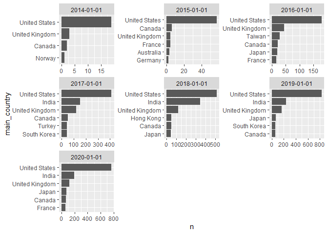
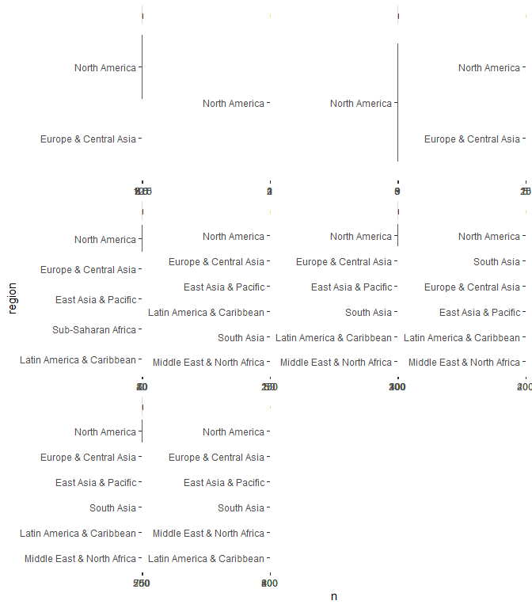
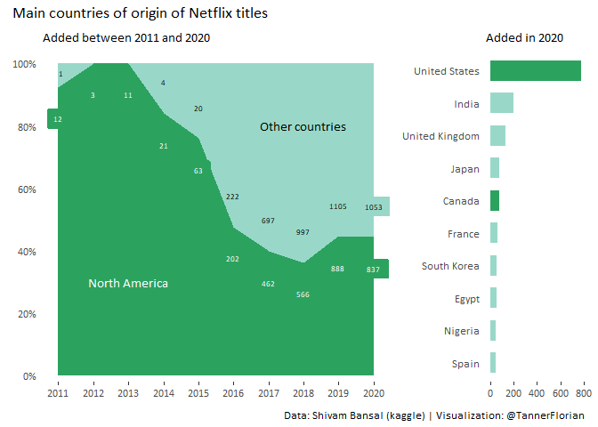

2021-04-20 Netflix Titles
================

``` r
library(tidyverse)
```

    ## -- Attaching packages --------------------------------------- tidyverse 1.3.0 --

    ## v ggplot2 3.3.3     v purrr   0.3.4
    ## v tibble  3.0.4     v dplyr   1.0.2
    ## v tidyr   1.1.2     v stringr 1.4.0
    ## v readr   1.4.0     v forcats 0.5.0

    ## -- Conflicts ------------------------------------------ tidyverse_conflicts() --
    ## x dplyr::filter() masks stats::filter()
    ## x dplyr::lag()    masks stats::lag()

``` r
library(patchwork)
library(extrafont)
```

    ## Registering fonts with R

``` r
library(lubridate)
```

    ## 
    ## Attaching package: 'lubridate'

    ## The following objects are masked from 'package:base':
    ## 
    ##     date, intersect, setdiff, union

``` r
library(stringr)
library(countrycode)
```

    ## Warning: package 'countrycode' was built under R version 4.0.4

## Read data

``` r
netflix_titles <- readr::read_csv('https://raw.githubusercontent.com/rfordatascience/tidytuesday/master/data/2021/2021-04-20/netflix_titles.csv')
```

    ## 
    ## -- Column specification --------------------------------------------------------
    ## cols(
    ##   show_id = col_character(),
    ##   type = col_character(),
    ##   title = col_character(),
    ##   director = col_character(),
    ##   cast = col_character(),
    ##   country = col_character(),
    ##   date_added = col_character(),
    ##   release_year = col_double(),
    ##   rating = col_character(),
    ##   duration = col_character(),
    ##   listed_in = col_character(),
    ##   description = col_character()
    ## )

## Visualization

  - Examine origin of shows over time
  - often multiple countries
  - str\_detect seems to only work for exact matches, why is that?
  - this needs to be fixed

<!-- end list -->

``` r
netflix_titles %>% 
  filter(str_detect("United States | ,United States | United States,",  country)) ###
```

    ## # A tibble: 2,556 x 12
    ##    show_id type  title director cast  country date_added release_year rating
    ##    <chr>   <chr> <chr> <chr>    <chr> <chr>   <chr>             <dbl> <chr> 
    ##  1 s4      Movie 9     Shane A~ Elij~ United~ November ~         2009 PG-13 
    ##  2 s5      Movie 21    Robert ~ Jim ~ United~ January 1~         2008 PG-13 
    ##  3 s8      Movie 187   Kevin R~ Samu~ United~ November ~         1997 R     
    ##  4 s11     Movie 1922  Zak Hil~ Thom~ United~ October 2~         2017 TV-MA 
    ##  5 s15     Movie 3022  John Su~ Omar~ United~ March 19,~         2019 R     
    ##  6 s26     Movie (T)E~ Lyric R~ <NA>  United~ June 30, ~         2015 NR    
    ##  7 s27     TV S~ (Un)~ <NA>     <NA>  United~ August 12~         2020 TV-MA 
    ##  8 s30     TV S~ #bla~ <NA>     Keny~ United~ April 17,~         2020 TV-MA 
    ##  9 s34     Movie #rea~ Fernand~ Nest~ United~ September~         2017 TV-14 
    ## 10 s36     Movie #Ruc~ Robert ~ <NA>  United~ December ~         2016 TV-PG 
    ## # ... with 2,546 more rows, and 3 more variables: duration <chr>,
    ## #   listed_in <chr>, description <chr>

``` r
netflix_titles_main_country <- netflix_titles %>% 
  filter(!is.na(country)) %>% 
  mutate(date_added = mdy(date_added),
         year_added = floor_date(date_added, unit = "years"),
         year_added = round_date(year_added, "year"),
         countries =  str_split(country, ", ")) 

netflix_titles_main_country$main_country <- NA
for (i in 1:nrow(netflix_titles_main_country)){
  netflix_titles_main_country$main_country[i] <- netflix_titles_main_country$countries[[i]][1]
  netflix_titles_main_country$main_country[i] <- str_remove(netflix_titles_main_country$main_country[i], ",")
}

productions_per_country <- netflix_titles_main_country %>% 
  group_by(year_added) %>% 
  count(main_country, sort = TRUE) 
```

### Top producing countries

``` r
productions_per_country %>% 
  filter(year_added > "2013-01-01", 
         year_added < "2021-01-01", 
         !is.na(year_added)) %>% 
  group_by(year_added) %>% 
  top_n(6) %>% 
  ungroup %>%
  mutate(year_added = as.factor(year_added),
         main_country = tidytext::reorder_within(main_country, n, year_added)) %>%
  ggplot(aes(x = main_country, y= n)) +
  geom_col() +
  facet_wrap(~year_added, scales = "free")   +
  coord_flip() +
  tidytext::scale_x_reordered() 
```

    ## Selecting by n

<!-- -->

## Top - producing regions

``` r
productions_per_region <- netflix_titles_main_country %>% 
  mutate(region = countrycode(main_country,origin = "country.name",
                              destination = "region")) %>% 
  group_by(year_added) %>% 
  count(region, sort = TRUE)
```

``` r
productions_per_region %>% 
  filter(year_added > "2010-01-01", 
         year_added < "2021-01-01", 
         !is.na(year_added)) %>% 
  group_by(year_added) %>% 
  top_n(6) %>% 
  ungroup %>%
  mutate(year_added = as.factor(year_added),
         region = tidytext::reorder_within(region, n, year_added)) %>%
  ggplot(aes(x = region, y= n)) +
  geom_col() +
  facet_wrap(~year_added, scales = "free")   +
  coord_flip() +
  tidytext::scale_x_reordered() 
```

    ## Selecting by n

<!-- -->

``` r
netflix_titles_main_region <- netflix_titles_main_country %>% 
  mutate(region = countrycode(main_country,origin = "country.name",
                              destination = "region"))

netflix_titles_main_region$NA_vs_others <- "Other"
netflix_titles_main_region$NA_vs_others[netflix_titles_main_region$region == "North America"] <-  "North America"
```

# 

``` r
NA_color <- "#2ca25f"
other_countries_color <-  "#99d8c9"
set_font <- "Calibri"
set_size <- 2.5
```

``` r
p_dat <- netflix_titles_main_region %>% 
  group_by(year_added) %>% 
  count(NA_vs_others, sort = TRUE) %>% 
  pivot_wider(names_from = NA_vs_others, values_from= n, values_fill = 0) %>% 
  mutate(ratio = `North America`/ (`North America` + Other)) %>% 
  filter(year_added > "2010-01-01", year_added < "2021-01-01")

p_over_time <- ggplot(data = p_dat, aes(x = year_added, y = ratio)) +
  theme(panel.background = element_blank(), 
        plot.background = element_blank(), 
        panel.grid.major.x  = element_blank(),
        panel.grid.minor.x  = element_blank(),
        axis.ticks.y = element_blank(),
        text=element_text(family=set_font)) +
  scale_y_continuous(limits = c(0,1.02), breaks = c(0,0.2,0.4,0.6,0.8,1), labels = scales::percent, expand = c(0.01,0.01)) +
  scale_x_date(date_breaks = "1 year", date_labels = "%Y", expand = c(0.05,0.05)) +
  geom_area(aes(x = year_added, y = 1), fill = other_countries_color) +
  geom_label(aes(x = year_added, y = ratio - 0.1, label = `North America`), color = NA_color, fill = NA_color) +
  geom_label(data = p_dat %>% filter(Other > 0),  
             aes(x = year_added, y = ratio + 0.1, label = Other), color = other_countries_color, fill = other_countries_color) +
  geom_area(fill = NA_color, alpha = 1) +
  geom_text(data = p_dat %>% filter(Other > 0),  
            aes(x = year_added, y = ratio + 0.1, label = Other),family=set_font, size = set_size) +
  geom_text(aes(x = year_added, y = ratio - 0.1, label = `North America`), color = "white",family=set_font, size = set_size) +
  annotate(geom = "text", x = as_date("2013-01-01"), y = 0.3, label = "North America", color = "white",family=set_font) +
  annotate(geom = "text", x = as_date("2018-01-01"), y = 0.8, label = "Other countries", color = "black",family=set_font)+ 
  annotate(geom = "text", x = as_date("2011-02-01"), y = 0.97, label = "1", color = "black",family=set_font, size = set_size)+
  labs(x = NULL, y = NULL, subtitle = "Added between 2011 and 2020")
```

``` r
dat_for_color_scale <- productions_per_country %>% 
  filter(year_added == "2020-01-01") %>% 
  top_n(10) %>% 
  filter(main_country != "United States")
```

    ## Selecting by n

``` r
dat_for_color_scale$main_country
```

    ## [1] "India"          "United Kingdom" "Japan"          "Canada"        
    ## [5] "France"         "South Korea"    "Egypt"          "Nigeria"       
    ## [9] "Spain"

``` r
colors <- c("United States" = NA_color, 
            "Egypt" = other_countries_color,
            "India" = other_countries_color,
            "United Kingdom" = other_countries_color,
            "Japan" = other_countries_color,
            "Canada" = NA_color,
            "France" = other_countries_color,
            "South Korea" = other_countries_color,
            "Nigeria" = other_countries_color,
            "Spain" = other_countries_color)

p_countries_2020 <- productions_per_country %>% 
  filter(year_added == "2020-01-01") %>% 
  top_n(10) %>% 
  ggplot(aes(x= n, y= reorder(main_country, n), color = main_country, fill = main_country)) +
  theme(panel.background = element_blank(), 
        plot.background = element_blank(), 
        panel.grid.major.x  = element_blank(),
        panel.grid.minor.x  = element_blank(),
        legend.position = "none",
        axis.ticks.y = element_blank(),
        text=element_text(family=set_font)) +
  geom_col(width = 0.6)+
  scale_colour_manual(values = colors) +
  scale_fill_manual(values = colors) +
  labs(subtitle = "Added in 2020", y = NULL, x = NULL)
```

    ## Selecting by n

``` r
p <- p_over_time+ p_countries_2020 + plot_layout(widths = c(3.5, 1)) + plot_annotation(title = "Main countries of origin of Netflix titles", caption = "Data: Shivam Bansal (kaggle) | Visualization: @TannerFlorian") & theme(text=element_text(family=set_font))
p
```

    ## Warning: Removed 1 rows containing missing values (geom_label).

    ## Warning: Removed 1 rows containing missing values (geom_text).

<!-- -->

``` r
ggsave(p, filename = "Countries.png", units = "in", width = 4, height = 2.25, dpi = 300, scale = 1.4)
```

    ## Warning: Removed 1 rows containing missing values (geom_label).
    
    ## Warning: Removed 1 rows containing missing values (geom_text).

``` r
sessionInfo()
```

    ## R version 4.0.3 (2020-10-10)
    ## Platform: x86_64-w64-mingw32/x64 (64-bit)
    ## Running under: Windows 10 x64 (build 18363)
    ## 
    ## Matrix products: default
    ## 
    ## locale:
    ## [1] LC_COLLATE=English_United States.1252 
    ## [2] LC_CTYPE=English_United States.1252   
    ## [3] LC_MONETARY=English_United States.1252
    ## [4] LC_NUMERIC=C                          
    ## [5] LC_TIME=English_United States.1252    
    ## 
    ## attached base packages:
    ## [1] stats     graphics  grDevices utils     datasets  methods   base     
    ## 
    ## other attached packages:
    ##  [1] countrycode_1.2.0 lubridate_1.7.9.2 extrafont_0.17    patchwork_1.1.1  
    ##  [5] forcats_0.5.0     stringr_1.4.0     dplyr_1.0.2       purrr_0.3.4      
    ##  [9] readr_1.4.0       tidyr_1.1.2       tibble_3.0.4      ggplot2_3.3.3    
    ## [13] tidyverse_1.3.0  
    ## 
    ## loaded via a namespace (and not attached):
    ##  [1] Rcpp_1.0.5        lattice_0.20-41   assertthat_0.2.1  digest_0.6.27    
    ##  [5] utf8_1.1.4        R6_2.5.0          cellranger_1.1.0  backports_1.2.0  
    ##  [9] reprex_0.3.0      evaluate_0.14     httr_1.4.2        pillar_1.4.7     
    ## [13] rlang_0.4.10      curl_4.3          readxl_1.3.1      rstudioapi_0.13  
    ## [17] extrafontdb_1.0   Matrix_1.2-18     rmarkdown_2.6     labeling_0.4.2   
    ## [21] tidytext_0.3.0    munsell_0.5.0     broom_0.7.5       compiler_4.0.3   
    ## [25] janeaustenr_0.1.5 modelr_0.1.8      xfun_0.20         pkgconfig_2.0.3  
    ## [29] htmltools_0.5.0   tidyselect_1.1.0  fansi_0.4.2       crayon_1.3.4     
    ## [33] dbplyr_2.0.0      withr_2.3.0       SnowballC_0.7.0   grid_4.0.3       
    ## [37] jsonlite_1.7.2    Rttf2pt1_1.3.8    gtable_0.3.0      lifecycle_0.2.0  
    ## [41] DBI_1.1.0         magrittr_2.0.1    scales_1.1.1      tokenizers_0.2.1 
    ## [45] cli_2.2.0         stringi_1.5.3     farver_2.0.3      fs_1.5.0         
    ## [49] xml2_1.3.2        ellipsis_0.3.1    generics_0.1.0    vctrs_0.3.6      
    ## [53] tools_4.0.3       glue_1.4.2        hms_1.0.0         yaml_2.2.1       
    ## [57] colorspace_2.0-0  rvest_0.3.6       knitr_1.30        haven_2.3.1
