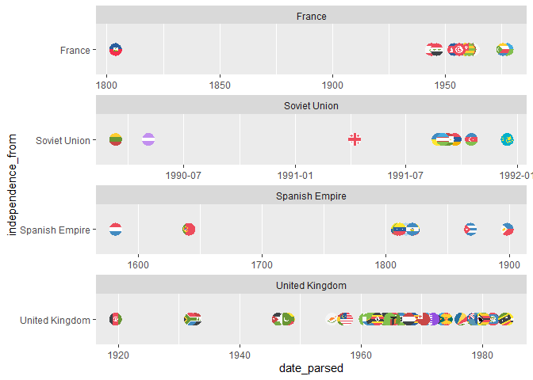
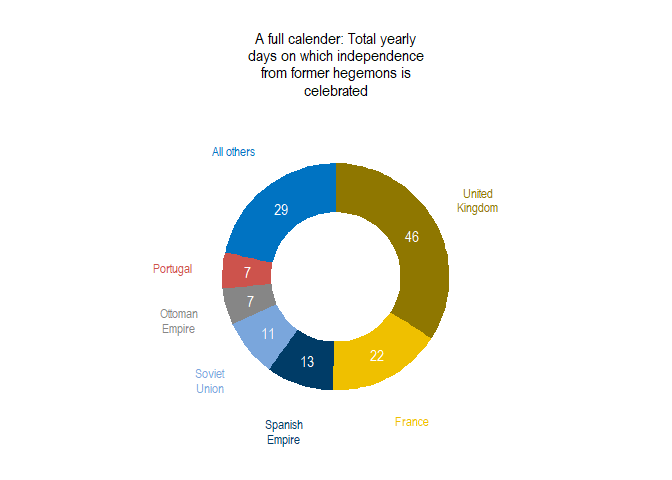
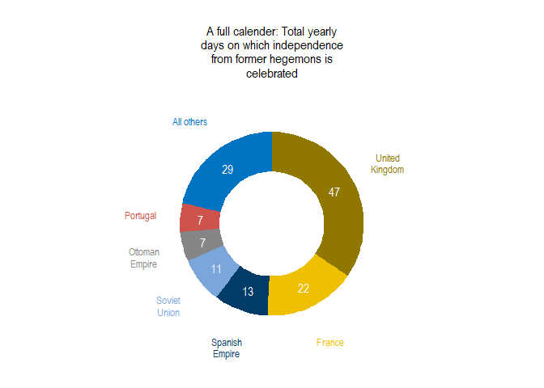
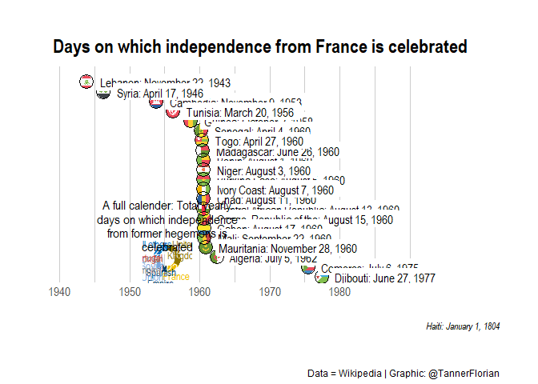
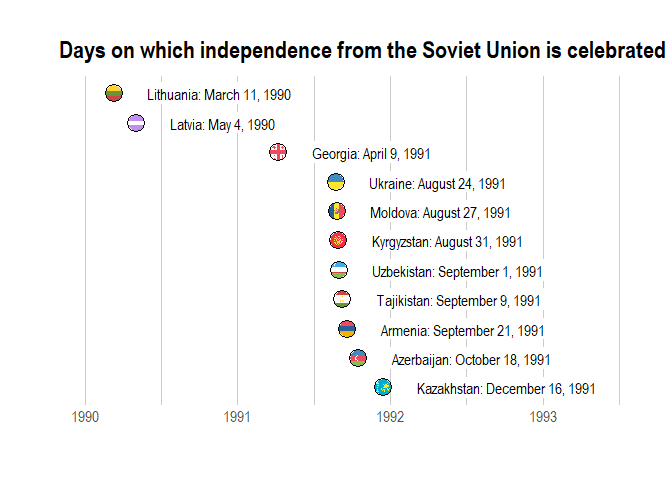
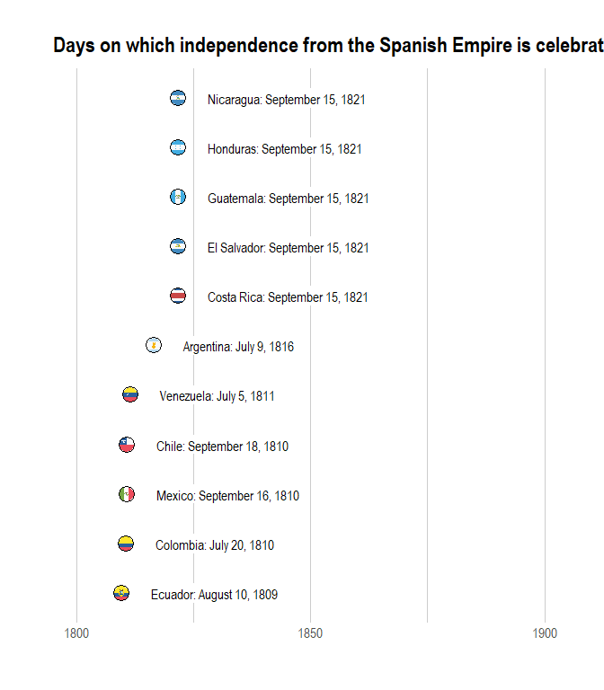

2021-07-06 Independence Days
================

    ## Warning: package 'tidyverse' was built under R version 4.0.5

    ## Warning: package 'tibble' was built under R version 4.0.5

    ## Warning: package 'tidyr' was built under R version 4.0.5

    ## Warning: package 'dplyr' was built under R version 4.0.5

    ## Warning: package 'forcats' was built under R version 4.0.5

    ## Warning: package 'countrycode' was built under R version 4.0.4

    ## Warning: package 'hrbrthemes' was built under R version 4.0.4

## Read data

``` r
holidays <- readr::read_csv('https://raw.githubusercontent.com/rfordatascience/tidytuesday/master/data/2021/2021-07-06/holidays.csv')
```

    ## 
    ## -- Column specification --------------------------------------------------------
    ## cols(
    ##   country = col_character(),
    ##   date_parsed = col_date(format = ""),
    ##   weekday = col_character(),
    ##   day = col_double(),
    ##   month = col_character(),
    ##   name_of_holiday = col_character(),
    ##   date_of_holiday = col_character(),
    ##   year_of_event = col_double(),
    ##   independence_from = col_character(),
    ##   event_commemorated_and_notes = col_character(),
    ##   year = col_double(),
    ##   date_mdy = col_character()
    ## )

## EDA

Could be interesting: Independence from \* UK \* Spanish Empire \*
France \* Fall of Soviet Union

``` r
holidays %>% 
  mutate(country_code = tolower(countrycode(country, origin = "country.name", destination = "iso2c"))) %>% 
  filter(independence_from %in% c("Spanish Empire", "United Kingdom", "Soviet Union", "France"),
         country != "Micronesia") %>% 
  ggplot(aes(y = independence_from, x = date_parsed, country = country_code)) +
  geom_flag()+
  theme(panel.grid.minor.y = element_blank(),
        panel.grid.major.y = element_blank()) +
  facet_wrap(~independence_from, nrow = 4, scales = "free")
```

    ## Warning in countrycode(country, origin = "country.name", destination = "iso2c"): Some values were not matched unambiguously: Micronesia

<!-- -->

### United Kingdom

``` r
p_uk <- holidays %>% 
  mutate(country_code = tolower(countrycode(country, origin = "country.name", destination = "iso2c")),
         country_name = str_replace(country, "Saint Vincent and the Grenadines", "St Vincent at. Grndns"),
         date_short = format(date_parsed, "%d %b %Y")) %>% 
  filter(independence_from == "United Kingdom",
         country %nin% c("Micronesia", "Cyprus")) %>% 
  mutate(country = reorder_within(country, desc(date_parsed), independence_from)) %>% 
  ggplot(aes(y = country, x = date_parsed, country = country_code)) +
  geom_flag()+
  geom_point(shape =1, size = 6) +
  theme_ipsum() +
  theme(panel.grid.minor.y = element_blank(),
        panel.grid.major.y = element_blank(),
        axis.text.y = element_blank(),
        plot.title =element_text(hjust = 1)) +
  scale_y_reordered() + 
  geom_label(aes(x = date_parsed + 850, y = country,
                 label = paste0(country_name, ": ", date_short, " ",sep = "")),
             label.size = NA,
             hjust = 0,
             family = "Arial Narrow") +
  scale_x_date(limits = c(as.Date("1912-01-01"), as.Date("2030-01-01")), 
               breaks = c(as.Date("1920-01-01"),
                          as.Date("1940-01-01"),
                          as.Date("1960-01-01"),
                          as.Date("1980-01-01"),
                          as.Date("2000-01-01")),
               date_labels = c("1920", "1940", "1960", "1980", "2000")) +
  labs(x = "", y = "", title= "Celebrations of independence from the United Kingdom")
```

    ## Warning in countrycode(country, origin = "country.name", destination = "iso2c"): Some values were not matched unambiguously: Micronesia

### France

``` r
p_france <- holidays %>% 
  mutate(country_code = tolower(countrycode(country, origin = "country.name", destination = "iso2c")),
         country_name = country,
         date_short = format(date_parsed, "%d %b %Y")) %>% 
  filter(independence_from %in% c("France"),
         country != "Micronesia",
         event_commemorated_and_notes %nin% c("Effective date when French Upper Volta became an autonomous republic in the French Community",
                                              "Effective date when Chad became an autonomous republic in the French Community[36]"
                                              ),
         name_of_holiday %nin% c("National Day", "Republic Day")) %>% 
  mutate(country = reorder_within(country, desc(date_parsed), independence_from)) %>% 
  ggplot(aes(y = country, x = date_parsed, country = country_code)) +
  geom_flag()+
  geom_point(shape =1, size = 6) +
  theme_ipsum() +
  theme(panel.grid.minor.y = element_blank(),
        panel.grid.major.y = element_blank(),
        axis.text.y = element_blank()) +
  scale_y_reordered() +
  geom_label(aes(x = date_parsed +500, y = country,
                 label = paste0(country_name, ": ", date_mdy, " ",sep = "")),
             label.size = NA,
             hjust = 0,
             family = "Arial Narrow") +
  scale_x_date(limits = c(as.Date("1942-01-01"), as.Date("2000-01-01")), 
               breaks = c(as.Date("1940-01-01"),
                          as.Date("1950-01-01"),
                          as.Date("1960-01-01"),
                          as.Date("1970-01-01"),
                          as.Date("1980-01-01")),
               date_labels = c("1940", "1950", "1960", "1970", "1980")) +
  labs(x = "", y = "", title= "Days on which independence from France is celebrated", caption = "Haiti: January 1, 1804")
```

    ## Warning in countrycode(country, origin = "country.name", destination = "iso2c"): Some values were not matched unambiguously: Micronesia

### How many countries from each colonizer?

``` r
holidays %>% 
  group_by(independence_from) %>% 
  select(date_parsed) %>%
  distinct() %>% 
  count %>% 
  arrange(desc(n))
```

    ## Adding missing grouping variables: `independence_from`

    ## # A tibble: 51 x 2
    ## # Groups:   independence_from [51]
    ##    independence_from                                                  n
    ##    <chr>                                                          <int>
    ##  1 United Kingdom                                                    50
    ##  2 France                                                            25
    ##  3 Spanish Empire                                                    13
    ##  4 Soviet Union                                                      11
    ##  5 <NA>                                                               9
    ##  6 Ottoman Empire                                                     7
    ##  7 Portugal                                                           7
    ##  8 Russian Soviet Federative Socialist Republic                       5
    ##  9 Spain                                                              4
    ## 10 Russian Soviet Federative Socialist Republic and German Empire     3
    ## # ... with 41 more rows

``` r
holidays %>% 
  select(date_of_holiday) %>% 
  distinct() %>% 
  count
```

    ## # A tibble: 1 x 1
    ##       n
    ##   <int>
    ## 1   139

### How many days per year per colonizer

``` r
independence_days <- data.frame(country = c("United Kingdom", "France", "Spanish Empire", "Soviet Union", "Ottoman Empire", "Portugal", "All others"), number = c(46,22,13,11,7,7,29) )
```

### Donut chart

<https://www.r-graph-gallery.com/128-ring-or-donut-plot.html>

``` r
independence_days$fraction <- independence_days$n / sum(independence_days$n)
independence_days$ymax <- cumsum(independence_days$fraction)
independence_days$ymin <- c(0, head(independence_days$ymax, n=-1))
independence_days$labelPosition <- (independence_days$ymax + independence_days$ymin) / 2

independence_days$label_inside <- paste0(independence_days$number)
independence_days$label_outside <- str_wrap(independence_days$country, width =10)

p_donut <- ggplot(independence_days, aes(ymax=ymax, ymin=ymin, xmax=2.5, xmin=1, fill=country)) +
  geom_rect() +
  geom_text( x=1.7, aes(y=labelPosition, label=label_inside, color=country), size=4, color = "white", family= "Arial Narrow") + 
  scale_color_jco() +
  scale_fill_jco() +
  geom_text(x=4, aes(y=labelPosition, label=label_outside, color=country), size=3.5, family= "Arial Narrow", lineheight = 0.9) +
  coord_polar(theta="y") +
  xlim(c(-1, 4)) +
  theme_void() +
  theme(legend.position = "none",
        plot.title = element_text(hjust = 0.5, vjust = -7, family= "Arial Narrow", size = 12),
        ) +
  labs(title= str_wrap("A full calender: Total yearly days on which independence from former hegemons is celebrated", width = 30))

p_donut
```

<!-- -->

``` r
p_uk_full <- p_uk + inset_element(p_donut, 0.01,0,0.5,0.5) + plot_annotation(caption = "Data = Wikipedia | Graphic: @TannerFlorian") + theme(plot.caption = element_text(family = "Arial Narrow", vjust = 10))
p_uk_full
```

<!-- -->

``` r
p_france_full <- p_france + inset_element(p_donut, 0.01,0,0.5,0.5) + plot_annotation(caption = "Data = Wikipedia | Graphic: @TannerFlorian") + theme(plot.caption = element_text(family = "Arial Narrow", vjust = 10))
p_france_full
```

    ## Warning: Removed 1 rows containing missing values (geom_flag).

    ## Warning: Removed 1 rows containing missing values (geom_point).

    ## Warning: Removed 1 rows containing missing values (geom_label).

<!-- -->

``` r
ggsave(filename = "uk_independence.png", device = "png",plot = p_uk_full, units = "cm", height = 30, width = 16, limitsize = FALSE)
ggsave(filename = "france_independence.png", device = "png",plot = p_france, units = "cm", height = 20, width = 16, limitsize = FALSE)
```

    ## Warning: Removed 1 rows containing missing values (geom_flag).

    ## Warning: Removed 1 rows containing missing values (geom_point).

    ## Warning: Removed 1 rows containing missing values (geom_label).

### Soviet Union

``` r
holidays %>% 
  mutate(country_code = tolower(countrycode(country, origin = "country.name", destination = "iso2c")),
         country_name = country) %>% 
  filter(independence_from %in% c("Soviet Union"),
         country != "Micronesia",
         event_commemorated_and_notes %nin% c()) %>% 
  mutate(country = reorder_within(country, desc(date_parsed), independence_from)) %>% 
  ggplot(aes(y = country, x = date_parsed, country = country_code)) +
  geom_flag()+
  geom_point(shape =1, size = 6) +
  theme_ipsum() +
  theme(panel.grid.minor.y = element_blank(),
        panel.grid.major.y = element_blank(),
        axis.text.y = element_blank()) +
  scale_y_reordered() +
  geom_label(aes(x = date_parsed + 70, y = country,
                 label = paste0(country_name, ": ", date_mdy, " ",sep = "")),
             label.size = NA,
             hjust = 0,
             family = "Arial Narrow") +
  scale_x_date(limits = c(as.Date("1990-01-01"), as.Date("1993-06-01"))) +
  labs(x = "", y = "", title= "Days on which independence from the Soviet Union is celebrated")
```

    ## Warning in countrycode(country, origin = "country.name", destination = "iso2c"): Some values were not matched unambiguously: Micronesia

<!-- -->

### Spanish Empire

``` r
holidays %>% 
  mutate(country_code = tolower(countrycode(country, origin = "country.name", destination = "iso2c")),
         country_name = country) %>% 
  filter(independence_from %in% c("Spanish Empire"),
         country != "Micronesia",
         year > 1800,
         year < 1840,
         event_commemorated_and_notes != "Battle of Pichincha") %>% 
  mutate(country = reorder_within(country, date_parsed, independence_from)) %>% 
  ggplot(aes(y = country, x = date_parsed, country = country_code)) +
  geom_flag()+
  geom_point(shape =1, size = 6) +
  theme_ipsum() +
  theme(panel.grid.minor.y = element_blank(),
        panel.grid.major.y = element_blank(),
        axis.text.y = element_blank()) +
  scale_y_reordered() +
  geom_label(aes(x = date_parsed + 2000, y = country,
                 label = paste0(country_name, ": ", date_mdy, " ",sep = "")),
             label.size = NA,
             hjust = 0,
             family = "Arial Narrow") +
  scale_x_date(limits = c(as.Date("1800-01-01"), as.Date("1900-01-01")))+
  labs(x = "", y = "", title= "Days on which independence from the Spanish Empire is celebrated")
```

    ## Warning in countrycode(country, origin = "country.name", destination = "iso2c"): Some values were not matched unambiguously: Micronesia

<!-- -->

``` r
sessionInfo()
```

    ## R version 4.0.3 (2020-10-10)
    ## Platform: x86_64-w64-mingw32/x64 (64-bit)
    ## Running under: Windows 10 x64 (build 18363)
    ## 
    ## Matrix products: default
    ## 
    ## locale:
    ## [1] LC_COLLATE=English_United States.1252 
    ## [2] LC_CTYPE=English_United States.1252   
    ## [3] LC_MONETARY=English_United States.1252
    ## [4] LC_NUMERIC=C                          
    ## [5] LC_TIME=English_United States.1252    
    ## 
    ## attached base packages:
    ## [1] stats     graphics  grDevices utils     datasets  methods   base     
    ## 
    ## other attached packages:
    ##  [1] ggsci_2.9         patchwork_1.1.1   tidytext_0.3.0    hrbrthemes_0.8.0 
    ##  [5] countrycode_1.2.0 ggflags_0.0.2     forcats_0.5.1     stringr_1.4.0    
    ##  [9] dplyr_1.0.6       purrr_0.3.4       readr_1.4.0       tidyr_1.1.3      
    ## [13] tibble_3.1.2      ggplot2_3.3.3     tidyverse_1.3.1  
    ## 
    ## loaded via a namespace (and not attached):
    ##  [1] httr_1.4.2        jsonlite_1.7.2    modelr_0.1.8      assertthat_0.2.1 
    ##  [5] cellranger_1.1.0  yaml_2.2.1        gdtools_0.2.3     Rttf2pt1_1.3.8   
    ##  [9] pillar_1.6.1      backports_1.2.0   lattice_0.20-41   glue_1.4.2       
    ## [13] extrafontdb_1.0   digest_0.6.27     rvest_1.0.0       colorspace_2.0-0 
    ## [17] htmltools_0.5.1.1 Matrix_1.2-18     XML_3.99-0.6      pkgconfig_2.0.3  
    ## [21] grImport2_0.2-0   broom_0.7.6       haven_2.3.1       scales_1.1.1     
    ## [25] jpeg_0.1-8.1      farver_2.0.3      generics_0.1.0    ellipsis_0.3.2   
    ## [29] withr_2.4.2       cli_2.5.0         magrittr_2.0.1    crayon_1.4.1     
    ## [33] readxl_1.3.1      evaluate_0.14     tokenizers_0.2.1  janeaustenr_0.1.5
    ## [37] fs_1.5.0          fansi_0.4.2       SnowballC_0.7.0   xml2_1.3.2       
    ## [41] tools_4.0.3       hms_1.0.0         lifecycle_1.0.0   munsell_0.5.0    
    ## [45] reprex_2.0.0      compiler_4.0.3    systemfonts_1.0.1 rlang_0.4.10     
    ## [49] grid_4.0.3        rstudioapi_0.13   labeling_0.4.2    base64enc_0.1-3  
    ## [53] rmarkdown_2.6     gtable_0.3.0      curl_4.3          DBI_1.1.0        
    ## [57] R6_2.5.0          lubridate_1.7.10  knitr_1.30        extrafont_0.17   
    ## [61] utf8_1.1.4        stringi_1.5.3     Rcpp_1.0.5        vctrs_0.3.8      
    ## [65] png_0.1-7         dbplyr_2.1.1      tidyselect_1.1.1  xfun_0.22
