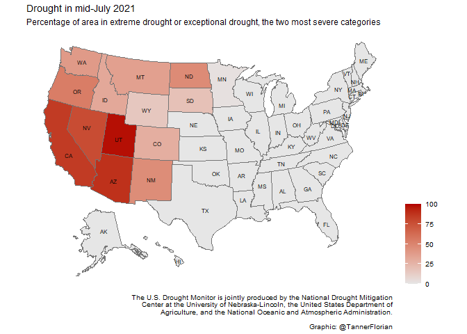

2021-07-20 US Droughts
================

    ## Warning: package 'tidyverse' was built under R version 4.0.5

    ## Warning: package 'tibble' was built under R version 4.0.5

    ## Warning: package 'tidyr' was built under R version 4.0.5

    ## Warning: package 'dplyr' was built under R version 4.0.5

    ## Warning: package 'forcats' was built under R version 4.0.5

    ## Warning: package 'usmap' was built under R version 4.0.5

## Read data

``` r
drought <- readr::read_csv('https://raw.githubusercontent.com/rfordatascience/tidytuesday/master/data/2021/2021-07-20/drought.csv')
```

    ## 
    ## -- Column specification --------------------------------------------------------
    ## cols(
    ##   map_date = col_double(),
    ##   state_abb = col_character(),
    ##   valid_start = col_date(format = ""),
    ##   valid_end = col_date(format = ""),
    ##   stat_fmt = col_double(),
    ##   drought_lvl = col_character(),
    ##   area_pct = col_double(),
    ##   area_total = col_double(),
    ##   pop_pct = col_double(),
    ##   pop_total = col_double()
    ## )

## EDA

  - Percentage of state in extreme or exceptional drought
  - Use last reported week
  - D3

Potential deeper analysis \* Compare this to other years \* Average over
seasons/ months \* This data only extends to 2001, so comparisons are
difficult

``` r
drought %>% 
  filter(valid_start == "2021-07-13",
         state_abb == "CA")
```

    ## # A tibble: 6 x 10
    ##   map_date state_abb valid_start valid_end  stat_fmt drought_lvl area_pct
    ##      <dbl> <chr>     <date>      <date>        <dbl> <chr>          <dbl>
    ## 1 20210713 CA        2021-07-13  2021-07-19        1 None             0  
    ## 2 20210713 CA        2021-07-13  2021-07-19        1 D0             100  
    ## 3 20210713 CA        2021-07-13  2021-07-19        1 D1             100  
    ## 4 20210713 CA        2021-07-13  2021-07-19        1 D2              94.8
    ## 5 20210713 CA        2021-07-13  2021-07-19        1 D3              85.7
    ## 6 20210713 CA        2021-07-13  2021-07-19        1 D4              33.3
    ## # ... with 3 more variables: area_total <dbl>, pop_pct <dbl>, pop_total <dbl>

``` r
drought_summary <- drought %>% 
  filter(valid_start == "2021-07-13",
         drought_lvl %in% c("D3", "D4")) %>% 
  pivot_wider(id_cols = state_abb, names_from = drought_lvl, values_from = area_pct) %>% 
  mutate(drought = as.integer(D4 + (D3 - D4)),
         fips = fips(state_abb)) %>% 
  select(fips, drought)
```

``` r
scale_color_high <- "#b30000"
scale_color_low <- "#e6e6e6"
credits <- "The U.S. Drought Monitor is jointly produced by the National Drought Mitigation Center at the University of Nebraska-Lincoln, the United States Department of Agriculture, and the National Oceanic and Atmospheric Administration."

 
p_map <- plot_usmap(data = drought_summary, values = "drought", color = "#747474",
           labels = TRUE) + 
  labs(title = "Drought in mid-July 2021",
       subtitle = "Percentage of area in extreme drought or exceptional drought, the two most severe categories",
       caption = paste0(str_wrap(credits), "\n\nGraphic: @TannerFlorian")) + 
  scale_fill_continuous(low = scale_color_low, high = scale_color_high, 
                         name = "", limits = c(0,100)) +
  theme(panel.background=element_blank(),
        legend.position = "right")

p_map$layers[[2]]$aes_params$size <- 2
p_map
```

<!-- -->

``` r
ggsave(p_map, filename = "drought_map.png", device = "png", units = "cm", width = 14, height = 12, scale = 1, type = "cairo")
```

### Credit

The U.S. Drought Monitor is jointly produced by the National Drought
Mitigation Center at the University of Nebraska-Lincoln, the United
States Department of Agriculture, and the National Oceanic and
Atmospheric Administration. Map courtesy of NDMC.

``` r
sessionInfo()
```

    ## R version 4.0.3 (2020-10-10)
    ## Platform: x86_64-w64-mingw32/x64 (64-bit)
    ## Running under: Windows 10 x64 (build 18363)
    ## 
    ## Matrix products: default
    ## 
    ## locale:
    ## [1] LC_COLLATE=English_United States.1252 
    ## [2] LC_CTYPE=English_United States.1252   
    ## [3] LC_MONETARY=English_United States.1252
    ## [4] LC_NUMERIC=C                          
    ## [5] LC_TIME=English_United States.1252    
    ## 
    ## attached base packages:
    ## [1] stats     graphics  grDevices utils     datasets  methods   base     
    ## 
    ## other attached packages:
    ##  [1] usmap_0.5.2     forcats_0.5.1   stringr_1.4.0   dplyr_1.0.6    
    ##  [5] purrr_0.3.4     readr_1.4.0     tidyr_1.1.3     tibble_3.1.2   
    ##  [9] ggplot2_3.3.3   tidyverse_1.3.1
    ## 
    ## loaded via a namespace (and not attached):
    ##  [1] tidyselect_1.1.1  xfun_0.22         haven_2.3.1       colorspace_2.0-0 
    ##  [5] vctrs_0.3.8       generics_0.1.0    htmltools_0.5.1.1 yaml_2.2.1       
    ##  [9] utf8_1.1.4        rlang_0.4.10      pillar_1.6.1      glue_1.4.2       
    ## [13] withr_2.4.2       DBI_1.1.0         dbplyr_2.1.1      modelr_0.1.8     
    ## [17] readxl_1.3.1      lifecycle_1.0.0   munsell_0.5.0     gtable_0.3.0     
    ## [21] cellranger_1.1.0  rvest_1.0.0       evaluate_0.14     labeling_0.4.2   
    ## [25] knitr_1.30        extrafont_0.17    curl_4.3          fansi_0.4.2      
    ## [29] Rttf2pt1_1.3.8    broom_0.7.6       Rcpp_1.0.5        scales_1.1.1     
    ## [33] backports_1.2.0   jsonlite_1.7.2    farver_2.0.3      fs_1.5.0         
    ## [37] hms_1.0.0         digest_0.6.27     stringi_1.5.3     grid_4.0.3       
    ## [41] cli_2.5.0         tools_4.0.3       magrittr_2.0.1    extrafontdb_1.0  
    ## [45] crayon_1.4.1      pkgconfig_2.0.3   ellipsis_0.3.2    xml2_1.3.2       
    ## [49] reprex_2.0.0      lubridate_1.7.10  assertthat_0.2.1  rmarkdown_2.6    
    ## [53] httr_1.4.2        rstudioapi_0.13   R6_2.5.0          compiler_4.0.3
