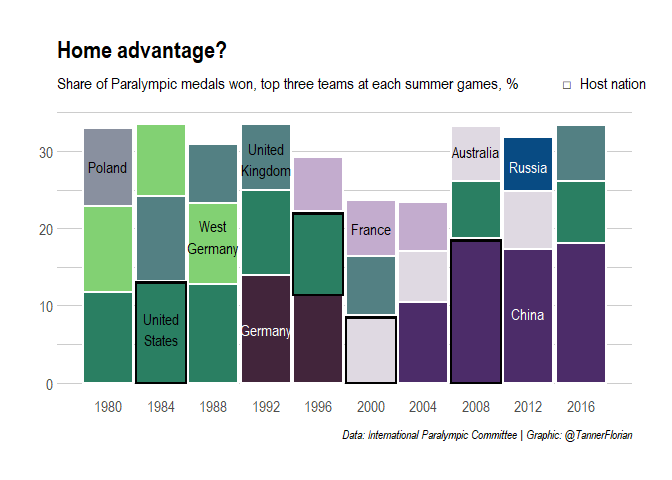

2021-08-03 Paralympic Medals
================

    ## Warning: package 'tidyverse' was built under R version 4.0.5

    ## Warning: package 'tibble' was built under R version 4.0.5

    ## Warning: package 'tidyr' was built under R version 4.0.5

    ## Warning: package 'dplyr' was built under R version 4.0.5

    ## Warning: package 'forcats' was built under R version 4.0.5

    ## Warning: package 'countrycode' was built under R version 4.0.4

    ## Warning: package 'hrbrthemes' was built under R version 4.0.4

## Read data

``` r
athletes <- readr::read_csv('https://raw.githubusercontent.com/rfordatascience/tidytuesday/master/data/2021/2021-08-03/athletes.csv')
```

    ## 
    ## -- Column specification --------------------------------------------------------
    ## cols(
    ##   gender = col_character(),
    ##   event = col_character(),
    ##   medal = col_character(),
    ##   athlete = col_character(),
    ##   abb = col_character(),
    ##   country = col_character(),
    ##   grp_id = col_double(),
    ##   type = col_character(),
    ##   year = col_double(),
    ##   guide = col_logical()
    ## )

    ## Warning: 53 parsing failures.
    ##  row   col           expected       actual                                                                                                     file
    ## 7548 guide 1/0/T/F/TRUE/FALSE AVERY Jerome 'https://raw.githubusercontent.com/rfordatascience/tidytuesday/master/data/2021/2021-08-03/athletes.csv'
    ## 7549 guide 1/0/T/F/TRUE/FALSE SILVA Celio  'https://raw.githubusercontent.com/rfordatascience/tidytuesday/master/data/2021/2021-08-03/athletes.csv'
    ## 7550 guide 1/0/T/F/TRUE/FALSE TJIVIJU Even 'https://raw.githubusercontent.com/rfordatascience/tidytuesday/master/data/2021/2021-08-03/athletes.csv'
    ## 7595 guide 1/0/T/F/TRUE/FALSE TJIVIJU Even 'https://raw.githubusercontent.com/rfordatascience/tidytuesday/master/data/2021/2021-08-03/athletes.csv'
    ## 7596 guide 1/0/T/F/TRUE/FALSE SILVA Jonas  'https://raw.githubusercontent.com/rfordatascience/tidytuesday/master/data/2021/2021-08-03/athletes.csv'
    ## .... ..... .................. ............ ........................................................................................................
    ## See problems(...) for more details.

## Aim

Reproduce this graph by The Economist Graphic Detail
<https://www.economist.com/graphic-detail/2021/07/25/which-is-the-strongest-olympic-team-of-all-time>

## EDA Paralympics

  - Why so many missing country names?
  - Need to manually add event locations

<!-- end list -->

``` r
skimr::skim(athletes)
```

|                                                  |          |
| :----------------------------------------------- | :------- |
| Name                                             | athletes |
| Number of rows                                   | 19547    |
| Number of columns                                | 10       |
| \_\_\_\_\_\_\_\_\_\_\_\_\_\_\_\_\_\_\_\_\_\_\_   |          |
| Column type frequency:                           |          |
| character                                        | 7        |
| logical                                          | 1        |
| numeric                                          | 2        |
| \_\_\_\_\_\_\_\_\_\_\_\_\_\_\_\_\_\_\_\_\_\_\_\_ |          |
| Group variables                                  | None     |

Data summary

**Variable type: character**

| skim\_variable | n\_missing | complete\_rate | min | max | empty | n\_unique | whitespace |
| :------------- | ---------: | -------------: | --: | --: | ----: | --------: | ---------: |
| gender         |        144 |           0.99 |   3 |   5 |     0 |         3 |          0 |
| event          |          0 |           1.00 |   3 |  40 |     0 |      1670 |          0 |
| medal          |          0 |           1.00 |   4 |   6 |     0 |         3 |          0 |
| athlete        |        435 |           0.98 |   1 |  44 |     0 |      6779 |          0 |
| abb            |         49 |           1.00 |   1 |   3 |     0 |       117 |          0 |
| country        |      14428 |           0.26 |   1 |  24 |     0 |       137 |          0 |
| type           |          0 |           1.00 |   5 |  17 |     0 |        11 |          0 |

**Variable type: logical**

| skim\_variable | n\_missing | complete\_rate | mean | count |
| :------------- | ---------: | -------------: | ---: | :---- |
| guide          |      19547 |              0 |  NaN | :     |

**Variable type: numeric**

| skim\_variable | n\_missing | complete\_rate |    mean |    sd |   p0 |  p25 |  p50 |  p75 | p100 | hist  |
| :------------- | ---------: | -------------: | ------: | ----: | ---: | ---: | ---: | ---: | ---: | :---- |
| grp\_id        |      14428 |           0.26 |    3.42 |  3.08 |    1 |    1 |    2 |    4 |   24 | ▇▁▁▁▁ |
| year           |          0 |           1.00 | 1996.72 | 11.30 | 1980 | 1988 | 1996 | 2008 | 2016 | ▇▇▇▆▆ |

``` r
disciplines <- athletes %>% select(event) %>% distinct
disciplines
```

    ## # A tibble: 1,670 x 1
    ##    event                               
    ##    <chr>                               
    ##  1 Double FITA Round Amputee           
    ##  2 Double FITA Round Paraplegic        
    ##  3 Double FITA Round Tetraplegic       
    ##  4 Double FITA Round Novice Paraplegic 
    ##  5 Double FITA Round Novice Tetraplegic
    ##  6 Short Metric Round Paraplegic       
    ##  7 Short Metric Round Tetraplegic      
    ##  8 Advanced Metric Round Paraplegic    
    ##  9 Double FITA Round Team Amputee      
    ## 10 Double FITA Round Team Paraplegic   
    ## # ... with 1,660 more rows

Observations: \* Data is for summer paralympics

## Summarise data

``` r
country_medal_shares <- athletes %>% 
  filter(!is.na(abb)) %>% 
  group_by(abb, year) %>% 
  summarise(medal_count = n()) %>% 
  mutate(country_fill = countrycode(abb, origin= 'ioc', destination = 'country.name')) %>% 
  ungroup() %>% 
  group_by(year) %>% 
  mutate(total_medals = sum(medal_count),
         medals_share = 100* medal_count/total_medals)
```

    ## `summarise()` has grouped output by 'abb'. You can override using the `.groups` argument.

    ## Warning in countrycode(abb, origin = "ioc", destination = "country.name"): Some values were not matched unambiguously: -

    ## Warning in countrycode(abb, origin = "ioc", destination = "country.name"): Some values were not matched unambiguously: BIR

    ## Warning in countrycode(abb, origin = "ioc", destination = "country.name"): Some values were not matched unambiguously: EUN

    ## Warning in countrycode(abb, origin = "ioc", destination = "country.name"): Some values were not matched unambiguously: FRG

    ## Warning in countrycode(abb, origin = "ioc", destination = "country.name"): Some values were not matched unambiguously: FRO

    ## Warning in countrycode(abb, origin = "ioc", destination = "country.name"): Some values were not matched unambiguously: GDR

    ## Warning in countrycode(abb, origin = "ioc", destination = "country.name"): Some values were not matched unambiguously: IPP

    ## Warning in countrycode(abb, origin = "ioc", destination = "country.name"): Some values were not matched unambiguously: SCG

    ## Warning in countrycode(abb, origin = "ioc", destination = "country.name"): Some values were not matched unambiguously: TCH

    ## Warning in countrycode(abb, origin = "ioc", destination = "country.name"): Some values were not matched unambiguously: URS

    ## Warning in countrycode(abb, origin = "ioc", destination = "country.name"): Some values were not matched unambiguously: YUG

## Manually fill country\_fill

``` r
country_medal_shares$country_fill[country_medal_shares$abb == "URS"] <- "Soviet Union"
country_medal_shares$country_fill[country_medal_shares$abb == "SCG"] <- "Serbia and Montenegro"
country_medal_shares$country_fill[country_medal_shares$abb == "FRO"] <- "Faroe Islands"
country_medal_shares$country_fill[country_medal_shares$abb == "YUG"] <- "Yugoslavia"
country_medal_shares$country_fill[country_medal_shares$abb == "EUN"] <- "Unified Team"
country_medal_shares$country_fill[country_medal_shares$abb == "BIR"] <- "Burma"
country_medal_shares$country_fill[country_medal_shares$abb == "GDR"] <- "East Germany"
country_medal_shares$country_fill[country_medal_shares$abb == "TCH"] <- "Czechoslovakia"
country_medal_shares$country_fill[country_medal_shares$abb == "FRG"] <- "West Germany"
country_medal_shares$country_fill[country_medal_shares$abb == "IPP"] <- "Independent Paralympic Participants"
```

### Top teams

``` r
top_three_per_year <- country_medal_shares %>% 
  mutate(country_fill = as.factor(country_fill)) %>% 
  group_by(year) %>% 
  slice_max(medals_share, n = 3)
```

Add grouping variable

``` r
levels <- data.frame(levels = rep(c("3rd", "2nd", "1st"), 10))
top_three_per_year <- cbind(top_three_per_year, levels)
```

Host nations

``` r
host_nations <- data.frame(year = seq(1980, 2016, 4), host = c("Netherlands", "United States", "South Korea", "Spain", "United States", "Australia", "Greece", "China", "United Kingdom", "Brazil"))

host_in_top <- top_three_per_year %>% 
  left_join(host_nations)
```

    ## Joining, by = "year"

``` r
host_in_top$is_host_nation <- "no"
host_in_top$is_host_nation[host_in_top$country_fill == host_in_top$host] <- "yes"
```

Paralympics theme

``` r
color_scheme2 <- c("#dfd9e2","#c3acce","#89909f","#538083","#2a7f62","#82d173","#4c2c69","#42253b","#084b83")

paralympics_theme <- theme_ipsum() +
  theme(
    legend.position = "none",
        axis.title.x  = element_blank(),
        axis.title.y = element_blank(),
        panel.grid.major.x =  element_blank(),
        panel.grid.minor.x = element_blank())

label_family = "Arial Narrow"
```

``` r
p <- host_in_top %>%
  ggplot(aes(x = year, 
             y = medals_share,
             fill = country_fill, 
             group = levels,
             color = is_host_nation)) +
  geom_col(position = position_stack(), size= 1, width=3.8) + 
  scale_color_manual(values = c("yes" = "black", "no" = "white")) +
  labs(title = "Home advantage?",
       subtitle = "Share of Paralympic medals won, top three teams at each summer games, %           \U25A1  Host nation",
       caption = "Data: International Paralympic Committee | Graphic: @TannerFlorian") +
  scale_fill_manual(values = color_scheme2) + 
  scale_x_continuous(breaks = seq(1980, 2016, 4)) +
  annotate(geom = "text", x = 2012, y = 9, label = "China", family= label_family, color = "white") + 
  annotate(geom = "text", x = 1992, y = 7, label = "Germany", family= label_family, color = "white") + 
  annotate(geom = "text", x = 1984, y = 7, label = "United\nStates", family= label_family) +
  annotate(geom = "text", x = 2000, y = 20, label = "France", family= label_family) +
  annotate(geom = "text", x = 1992, y = 29, label = "United\nKingdom", family= label_family) +
  annotate(geom = "text", x = 1988, y = 19, label = "West\nGermany", family= label_family) +
  annotate(geom = "text", x = 2008, y = 30, label = "Australia", family= label_family) +
  annotate(geom = "text", x = 1980, y = 28, label = "Poland", family= label_family) +
  annotate(geom = "text", x = 2012, y = 28, label = "Russia", family = label_family, color = "white") + 
  annotate(geom  = "segment", x = 1982.02, xend = 1985.98, y = 13, yend = 13, size = 1.15) +
  annotate(geom  = "segment", x = 1994.02, xend = 1997.98, y = 22, yend = 22, size = 1.15) +
    annotate(geom  = "segment", x = 1998.02, xend = 2001.98, y = 8.5, yend = 8.5, size = 1.15) +
      annotate(geom  = "segment", x = 2006.02, xend = 2009.98, y = 18.5, yend = 18.5, size = 1.15) +
  paralympics_theme

p
```

<!-- -->

``` r
ggsave(plot = p, filename = "paralympics.png", device = "png", units = "in", width = 4, height = 2.25, scale = 2, type = "cairo")
```

``` r
sessionInfo()
```

    ## R version 4.0.3 (2020-10-10)
    ## Platform: x86_64-w64-mingw32/x64 (64-bit)
    ## Running under: Windows 10 x64 (build 18363)
    ## 
    ## Matrix products: default
    ## 
    ## locale:
    ## [1] LC_COLLATE=English_United States.1252 
    ## [2] LC_CTYPE=English_United States.1252   
    ## [3] LC_MONETARY=English_United States.1252
    ## [4] LC_NUMERIC=C                          
    ## [5] LC_TIME=English_United States.1252    
    ## 
    ## attached base packages:
    ## [1] stats     graphics  grDevices utils     datasets  methods   base     
    ## 
    ## other attached packages:
    ##  [1] hrbrthemes_0.8.0  tidytext_0.3.0    countrycode_1.2.0 forcats_0.5.1    
    ##  [5] stringr_1.4.0     dplyr_1.0.6       purrr_0.3.4       readr_1.4.0      
    ##  [9] tidyr_1.1.3       tibble_3.1.2      ggplot2_3.3.3     tidyverse_1.3.1  
    ## 
    ## loaded via a namespace (and not attached):
    ##  [1] Rcpp_1.0.5        lubridate_1.7.10  lattice_0.20-41   assertthat_0.2.1 
    ##  [5] digest_0.6.27     utf8_1.1.4        repr_1.1.3        R6_2.5.0         
    ##  [9] cellranger_1.1.0  backports_1.2.0   reprex_2.0.0      evaluate_0.14    
    ## [13] highr_0.8         httr_1.4.2        pillar_1.6.1      gdtools_0.2.3    
    ## [17] rlang_0.4.10      curl_4.3          readxl_1.3.1      rstudioapi_0.13  
    ## [21] extrafontdb_1.0   Matrix_1.2-18     rmarkdown_2.6     labeling_0.4.2   
    ## [25] extrafont_0.17    munsell_0.5.0     broom_0.7.6       compiler_4.0.3   
    ## [29] janeaustenr_0.1.5 modelr_0.1.8      xfun_0.22         base64enc_0.1-3  
    ## [33] systemfonts_1.0.1 pkgconfig_2.0.3   htmltools_0.5.1.1 tidyselect_1.1.1 
    ## [37] fansi_0.4.2       crayon_1.4.1      dbplyr_2.1.1      withr_2.4.2      
    ## [41] SnowballC_0.7.0   grid_4.0.3        jsonlite_1.7.2    Rttf2pt1_1.3.8   
    ## [45] gtable_0.3.0      lifecycle_1.0.0   DBI_1.1.0         magrittr_2.0.1   
    ## [49] scales_1.1.1      tokenizers_0.2.1  cli_2.5.0         stringi_1.5.3    
    ## [53] farver_2.0.3      fs_1.5.0          skimr_2.1.2       xml2_1.3.2       
    ## [57] ellipsis_0.3.2    generics_0.1.0    vctrs_0.3.8       tools_4.0.3      
    ## [61] glue_1.4.2        hms_1.0.0         yaml_2.2.1        colorspace_2.0-0 
    ## [65] rvest_1.0.0       knitr_1.30        haven_2.3.1
