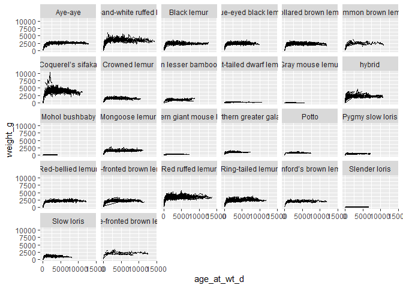
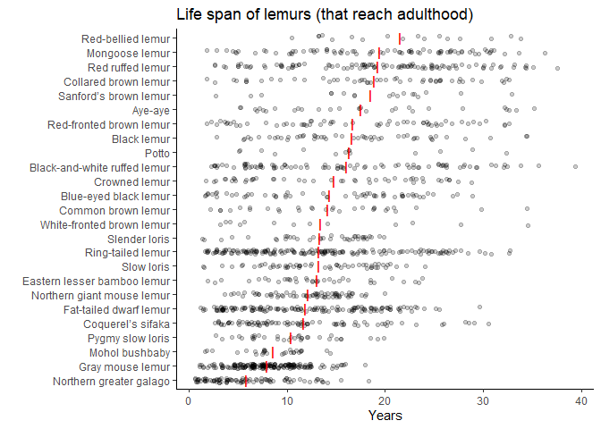
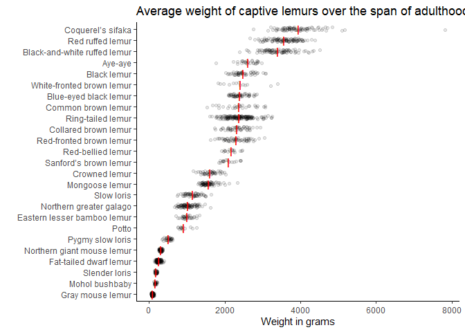
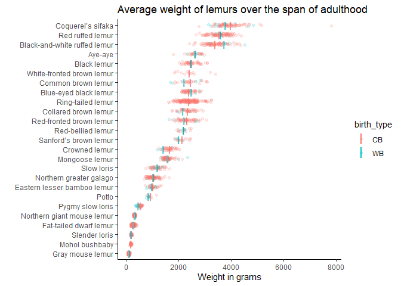
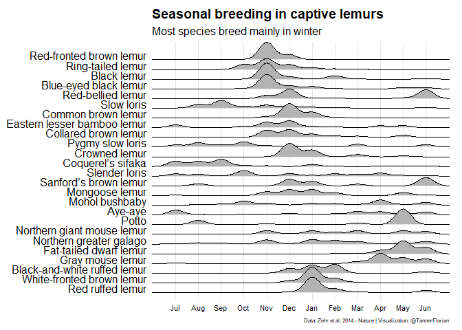

2021-08-24 Lemurs
================

    ## Warning: package 'tidyverse' was built under R version 4.0.5

    ## Warning: package 'tibble' was built under R version 4.0.5

    ## Warning: package 'tidyr' was built under R version 4.0.5

    ## Warning: package 'dplyr' was built under R version 4.0.5

    ## Warning: package 'forcats' was built under R version 4.0.5

    ## Warning: package 'ggridges' was built under R version 4.0.5

    ## Warning: package 'lubridate' was built under R version 4.0.5

## Read data

  - Took taxon names from data dictionary
  - Assuming CMED means CMEAD

<!-- end list -->

``` r
lemurs <- readr::read_csv('https://raw.githubusercontent.com/rfordatascience/tidytuesday/master/data/2021/2021-08-24/lemur_data.csv')
```

    ## 
    ## -- Column specification --------------------------------------------------------
    ## cols(
    ##   .default = col_double(),
    ##   taxon = col_character(),
    ##   dlc_id = col_character(),
    ##   hybrid = col_character(),
    ##   sex = col_character(),
    ##   name = col_character(),
    ##   current_resident = col_character(),
    ##   stud_book = col_character(),
    ##   dob = col_date(format = ""),
    ##   estimated_dob = col_character(),
    ##   birth_type = col_character(),
    ##   birth_institution = col_character(),
    ##   estimated_concep = col_date(format = ""),
    ##   dam_id = col_character(),
    ##   dam_name = col_character(),
    ##   dam_taxon = col_character(),
    ##   dam_dob = col_date(format = ""),
    ##   sire_id = col_character(),
    ##   sire_name = col_character(),
    ##   sire_taxon = col_character(),
    ##   sire_dob = col_date(format = "")
    ##   # ... with 8 more columns
    ## )
    ## i Use `spec()` for the full column specifications.

    ## Warning: 29130 parsing failures.
    ##  row             col           expected actual                                                                                                       file
    ## 1324 age_of_living_y 1/0/T/F/TRUE/FALSE  23.77 'https://raw.githubusercontent.com/rfordatascience/tidytuesday/master/data/2021/2021-08-24/lemur_data.csv'
    ## 1325 age_of_living_y 1/0/T/F/TRUE/FALSE  23.77 'https://raw.githubusercontent.com/rfordatascience/tidytuesday/master/data/2021/2021-08-24/lemur_data.csv'
    ## 1326 age_of_living_y 1/0/T/F/TRUE/FALSE  23.77 'https://raw.githubusercontent.com/rfordatascience/tidytuesday/master/data/2021/2021-08-24/lemur_data.csv'
    ## 1327 age_of_living_y 1/0/T/F/TRUE/FALSE  23.77 'https://raw.githubusercontent.com/rfordatascience/tidytuesday/master/data/2021/2021-08-24/lemur_data.csv'
    ## 1328 age_of_living_y 1/0/T/F/TRUE/FALSE  23.77 'https://raw.githubusercontent.com/rfordatascience/tidytuesday/master/data/2021/2021-08-24/lemur_data.csv'
    ## .... ............... .................. ...... ..........................................................................................................
    ## See problems(...) for more details.

``` r
lemurs$taxon[lemurs$taxon == "CMED"] <- "CMEAD"
taxons <- readxl::read_xlsx("taxons.xlsx") %>% janitor::clean_names()

dat <- lemurs %>% left_join(taxons)
```

    ## Joining, by = "taxon"

## Ideas

  - Popularity of names of lemurs (names assigned at Duke Lemur Center)
    
      - All lemurs in the dataset have names though

  - Which names for which species, at which center, over time…

  - What about the movie Madagascar? -\> did that have an influence?
    came out in 2005

  - “Julien the ring-tailed lemur, Maurice the aye-aye, and Mort the
    mouse lemur”

  - Weight of various species, lifespan per species

  - Differences between wild-born or captivity born
    
      - Does something change when more and more generations are born in
        captivity?

  - Seasonal breeding

## Observations

  - There are only 2270 individuals in the dataset
  - Names are assigned to two lemurs max

## EDA Lemurs

``` r
skimr::skim(dat)
```

|                                                  |       |
| :----------------------------------------------- | :---- |
| Name                                             | dat   |
| Number of rows                                   | 82609 |
| Number of columns                                | 56    |
| \_\_\_\_\_\_\_\_\_\_\_\_\_\_\_\_\_\_\_\_\_\_\_   |       |
| Column type frequency:                           |       |
| character                                        | 21    |
| Date                                             | 8     |
| logical                                          | 1     |
| numeric                                          | 26    |
| \_\_\_\_\_\_\_\_\_\_\_\_\_\_\_\_\_\_\_\_\_\_\_\_ |       |
| Group variables                                  | None  |

Data summary

**Variable type: character**

| skim\_variable     | n\_missing | complete\_rate | min | max | empty | n\_unique | whitespace |
| :----------------- | ---------: | -------------: | --: | --: | ----: | --------: | ---------: |
| taxon              |          0 |           1.00 |   3 |   5 |     0 |        27 |          0 |
| dlc\_id            |          0 |           1.00 |   3 |   4 |     0 |      2270 |          0 |
| hybrid             |          0 |           1.00 |   1 |   2 |     0 |         2 |          0 |
| sex                |          0 |           1.00 |   1 |   2 |     0 |         3 |          0 |
| name               |          0 |           1.00 |   2 |  19 |     0 |      2244 |          0 |
| current\_resident  |          0 |           1.00 |   1 |   1 |     0 |         2 |          0 |
| stud\_book         |       2745 |           0.97 |   1 |   7 |     0 |      1234 |          0 |
| estimated\_dob     |      72080 |           0.13 |   1 |   3 |     0 |         8 |          0 |
| birth\_type        |          0 |           1.00 |   2 |   3 |     0 |         3 |          0 |
| birth\_institution |          0 |           1.00 |   7 |  44 |     0 |        88 |          0 |
| dam\_id            |       1056 |           0.99 |   3 |   9 |     0 |       581 |          0 |
| dam\_name          |      15239 |           0.82 |   2 |  15 |     0 |       498 |          0 |
| dam\_taxon         |      15239 |           0.82 |   3 |   4 |     0 |        27 |          0 |
| sire\_id           |       1761 |           0.98 |   3 |   9 |     0 |       501 |          0 |
| sire\_name         |      24855 |           0.70 |   2 |  17 |     0 |       420 |          0 |
| sire\_taxon        |      24855 |           0.70 |   3 |   4 |     0 |        26 |          0 |
| dob\_estimated     |      72080 |           0.13 |   1 |   3 |     0 |         8 |          0 |
| age\_category      |          0 |           1.00 |   2 |  11 |     0 |         3 |          0 |
| preg\_status       |          0 |           1.00 |   1 |   2 |     0 |         2 |          0 |
| latin\_name        |          0 |           1.00 |  11 |  28 |     0 |        27 |          0 |
| common\_name       |          0 |           1.00 |   5 |  28 |     0 |        26 |          0 |

**Variable type: Date**

| skim\_variable         | n\_missing | complete\_rate | min        | max        | median     | n\_unique |
| :--------------------- | ---------: | -------------: | :--------- | :--------- | :--------- | --------: |
| dob                    |          8 |           1.00 | 1946-10-01 | 2018-07-24 | 1994-03-20 |      1534 |
| estimated\_concep      |          8 |           1.00 | 1946-06-03 | 2018-05-22 | 1993-11-01 |      1572 |
| dam\_dob               |      15239 |           0.82 | 1958-10-01 | 2015-01-08 | 1986-06-26 |       428 |
| sire\_dob              |      24855 |           0.70 | 1946-10-01 | 2014-08-07 | 1985-11-29 |       377 |
| dod                    |      37361 |           0.55 | 1969-06-02 | 2019-01-15 | 2008-11-13 |      1339 |
| weight\_date           |          0 |           1.00 | 1968-09-16 | 2019-02-05 | 2005-12-14 |     10291 |
| concep\_date\_if\_preg |      80692 |           0.02 | 1971-11-09 | 2018-05-22 | 2003-09-11 |       656 |
| infant\_dob\_if\_preg  |      80692 |           0.02 | 1972-03-08 | 2018-07-24 | 2004-02-18 |       639 |

**Variable type: logical**

| skim\_variable     | n\_missing | complete\_rate | mean | count |
| :----------------- | ---------: | -------------: | ---: | :---- |
| age\_of\_living\_y |      82609 |              0 |  NaN | :     |

**Variable type: numeric**

| skim\_variable                     | n\_missing | complete\_rate |    mean |      sd |        p0 |     p25 |     p50 |     p75 |     p100 | hist  |
| :--------------------------------- | ---------: | -------------: | ------: | ------: | --------: | ------: | ------: | ------: | -------: | :---- |
| birth\_month                       |          8 |           1.00 |    5.58 |    2.70 |      1.00 |    4.00 |    5.00 |    7.00 |    12.00 | ▇▇▇▃▃ |
| litter\_size                       |      18169 |           0.78 |    1.65 |    0.82 |      1.00 |    1.00 |    1.00 |    2.00 |     4.00 | ▇▅▁▂▁ |
| expected\_gestation                |          0 |           1.00 |  119.50 |   39.71 |     62.00 |   90.00 |  124.00 |  160.00 |   193.00 | ▆▃▇▅▂ |
| concep\_month                      |          8 |           1.00 |    6.62 |    3.69 |      1.00 |    4.00 |    6.00 |   11.00 |    12.00 | ▆▆▃▂▇ |
| dam\_age\_at\_concep\_y            |      15247 |           0.82 |    7.18 |    4.63 |      0.59 |    3.62 |    6.43 |   10.16 |    26.03 | ▇▆▂▁▁ |
| sire\_age\_at\_concep\_y           |      24863 |           0.70 |    9.12 |    6.27 |      0.61 |    4.63 |    7.44 |   12.44 |    33.36 | ▇▅▂▁▁ |
| age\_at\_death\_y                  |      37369 |           0.55 |   17.51 |    8.43 |      0.00 |   11.13 |   17.36 |   23.40 |    39.39 | ▃▇▇▅▂ |
| age\_last\_verified\_y             |      74378 |           0.10 |   12.87 |    8.21 |      0.36 |    6.74 |   10.33 |   19.14 |    34.26 | ▆▇▃▃▂ |
| age\_max\_live\_or\_dead\_y        |          8 |           1.00 |   15.63 |    8.82 |      0.00 |    7.81 |   14.56 |   22.54 |    39.39 | ▇▇▆▅▂ |
| n\_known\_offspring                |      36563 |           0.56 |    5.59 |    4.75 |      1.00 |    2.00 |    4.00 |    7.00 |    36.00 | ▇▂▁▁▁ |
| weight\_g                          |          0 |           1.00 | 1485.81 | 1313.24 |      4.74 |  199.00 | 1310.00 | 2480.00 | 10337.00 | ▇▅▁▁▁ |
| month\_of\_weight                  |          0 |           1.00 |    6.50 |    3.40 |      1.00 |    4.00 |    7.00 |    9.00 |    12.00 | ▇▆▆▆▇ |
| age\_at\_wt\_d                     |          8 |           1.00 | 3102.37 | 2823.60 |      0.00 |  768.00 | 2303.00 | 4808.00 | 14373.00 | ▇▃▂▁▁ |
| age\_at\_wt\_wk                    |          8 |           1.00 |  443.20 |  403.37 |      0.00 |  109.71 |  329.00 |  686.86 |  2053.29 | ▇▃▂▁▁ |
| age\_at\_wt\_mo                    |          8 |           1.00 |  102.00 |   92.83 |      0.00 |   25.25 |   75.72 |  158.07 |   472.54 | ▇▃▂▁▁ |
| age\_at\_wt\_mo\_no\_dec           |          8 |           1.00 |  101.51 |   92.82 |      0.00 |   25.00 |   75.00 |  158.00 |   472.00 | ▇▃▂▁▁ |
| age\_at\_wt\_y                     |          8 |           1.00 |    8.50 |    7.74 |      0.00 |    2.10 |    6.31 |   13.17 |    39.38 | ▇▃▂▁▁ |
| change\_since\_prev\_wt\_g         |       2253 |           0.97 |   20.05 |  176.30 | \-1760.00 | \-20.00 |    2.00 |   48.00 |  4303.00 | ▁▇▁▁▁ |
| days\_since\_prev\_wt              |       2253 |           0.97 |   55.15 |  147.18 |      0.00 |   13.00 |   28.00 |   55.00 |  7113.00 | ▇▁▁▁▁ |
| avg\_daily\_wt\_change\_g          |       2470 |           0.97 |    0.59 |   11.22 |  \-920.00 |  \-0.63 |    0.13 |    1.81 |   300.00 | ▁▁▁▇▁ |
| days\_before\_death                |      37361 |           0.55 | 2693.57 | 2280.20 |      0.00 |  852.00 | 2099.00 | 4063.00 | 13052.00 | ▇▃▂▁▁ |
| r\_min\_dam\_age\_at\_concep\_y    |          0 |           1.00 |    1.56 |    0.91 |      0.40 |    0.79 |    1.53 |    1.76 |     4.22 | ▆▇▂▁▁ |
| expected\_gestation\_d             |      80692 |           0.02 |  141.28 |   33.37 |     62.00 |  124.00 |  145.00 |  160.00 |   193.00 | ▂▂▇▇▅ |
| days\_before\_inf\_birth\_if\_preg |      80692 |           0.02 |   67.74 |   46.35 |      0.00 |   28.00 |   62.00 |  104.00 |   193.00 | ▇▆▅▃▁ |
| pct\_preg\_remain\_if\_preg        |      80692 |           0.02 |    0.48 |    0.30 |      0.00 |    0.21 |    0.48 |    0.74 |     1.00 | ▇▆▆▇▆ |
| infant\_lit\_sz\_if\_preg          |      80704 |           0.02 |    1.30 |    0.58 |      1.00 |    1.00 |    1.00 |    1.00 |     4.00 | ▇▂▁▁▁ |

``` r
dat %>% 
  group_by(common_name) %>% 
  count() %>% 
  arrange(desc(n))
```

    ## # A tibble: 26 x 2
    ## # Groups:   common_name [26]
    ##    common_name                      n
    ##    <chr>                        <int>
    ##  1 Gray mouse lemur             12275
    ##  2 Coquerel’s sifaka             8996
    ##  3 Fat-tailed dwarf lemur        8070
    ##  4 Ring-tailed lemur             7490
    ##  5 Aye-aye                       5077
    ##  6 Red ruffed lemur              4166
    ##  7 Mongoose lemur                3645
    ##  8 Blue-eyed black lemur         3217
    ##  9 Pygmy slow loris              2757
    ## 10 Black-and-white ruffed lemur  2735
    ## # ... with 16 more rows

``` r
dat %>% 
  group_by(name) %>% 
  count() %>% 
  arrange(n)
```

    ## # A tibble: 2,244 x 2
    ## # Groups:   name [2,244]
    ##    name           n
    ##    <chr>      <int>
    ##  1 ABNER          1
    ##  2 ACMITE         1
    ##  3 ADAMANTIUM     1
    ##  4 ADHARA         1
    ##  5 ADRIANA        1
    ##  6 AGATHA         1
    ##  7 ALABASTER      1
    ##  8 ALCMENE        1
    ##  9 ALCOR          1
    ## 10 ALPHABET       1
    ## # ... with 2,234 more rows

``` r
length(unique(dat$name))
```

    ## [1] 2244

``` r
length(unique(dat$dlc_id))
```

    ## [1] 2270

  - No

<!-- end list -->

``` r
names <- dat %>% 
  select(dob, dlc_id, common_name, name) %>% 
  distinct() %>% 
  mutate(birth_year = lubridate::floor_date(dob, "years")) %>% 
  group_by(common_name, birth_year) %>% 
  mutate(total_specimens_oer_year = n()) %>% 
  ungroup() %>% 
  group_by(name) %>% 
  count() %>% 
  arrange(desc(n))
```

## The real Maurice

  - This is the only lemur with a name from the movie Madagascar,
    however he was born before the movie came out.
  - I will look at something else instead.

<!-- end list -->

``` r
dat %>% 
  filter(name == 
           "MAURICE")
```

    ## # A tibble: 98 x 56
    ##    taxon dlc_id hybrid sex   name    current_resident stud_book dob       
    ##    <chr> <chr>  <chr>  <chr> <chr>   <chr>            <chr>     <date>    
    ##  1 ECOL  5973   N      M     MAURICE N                1132      1985-03-27
    ##  2 ECOL  5973   N      M     MAURICE N                1132      1985-03-27
    ##  3 ECOL  5973   N      M     MAURICE N                1132      1985-03-27
    ##  4 ECOL  5973   N      M     MAURICE N                1132      1985-03-27
    ##  5 ECOL  5973   N      M     MAURICE N                1132      1985-03-27
    ##  6 ECOL  5973   N      M     MAURICE N                1132      1985-03-27
    ##  7 ECOL  5973   N      M     MAURICE N                1132      1985-03-27
    ##  8 ECOL  5973   N      M     MAURICE N                1132      1985-03-27
    ##  9 ECOL  5973   N      M     MAURICE N                1132      1985-03-27
    ## 10 ECOL  5973   N      M     MAURICE N                1132      1985-03-27
    ## # ... with 88 more rows, and 48 more variables: birth_month <dbl>,
    ## #   estimated_dob <chr>, birth_type <chr>, birth_institution <chr>,
    ## #   litter_size <dbl>, expected_gestation <dbl>, estimated_concep <date>,
    ## #   concep_month <dbl>, dam_id <chr>, dam_name <chr>, dam_taxon <chr>,
    ## #   dam_dob <date>, dam_age_at_concep_y <dbl>, sire_id <chr>, sire_name <chr>,
    ## #   sire_taxon <chr>, sire_dob <date>, sire_age_at_concep_y <dbl>, dod <date>,
    ## #   age_at_death_y <dbl>, age_of_living_y <lgl>, age_last_verified_y <dbl>,
    ## #   age_max_live_or_dead_y <dbl>, n_known_offspring <dbl>, dob_estimated <chr>,
    ## #   weight_g <dbl>, weight_date <date>, month_of_weight <dbl>,
    ## #   age_at_wt_d <dbl>, age_at_wt_wk <dbl>, age_at_wt_mo <dbl>,
    ## #   age_at_wt_mo_no_dec <dbl>, age_at_wt_y <dbl>, change_since_prev_wt_g <dbl>,
    ## #   days_since_prev_wt <dbl>, avg_daily_wt_change_g <dbl>,
    ## #   days_before_death <dbl>, r_min_dam_age_at_concep_y <dbl>,
    ## #   age_category <chr>, preg_status <chr>, expected_gestation_d <dbl>,
    ## #   concep_date_if_preg <date>, infant_dob_if_preg <date>,
    ## #   days_before_inf_birth_if_preg <dbl>, pct_preg_remain_if_preg <dbl>,
    ## #   infant_lit_sz_if_preg <dbl>, latin_name <chr>, common_name <chr>

## Weight and lifespan

``` r
dat %>% 
  ggplot(aes(x = age_at_wt_d, y = weight_g, group = dlc_id)) +
  geom_line() +
  facet_wrap(~common_name, scales = "fixed")
```

    ## Warning: Removed 8 row(s) containing missing values (geom_path).

<!-- -->

## Lifespan

``` r
dat %>% 
  filter(age_category != "IJ",
         common_name != "hybrid") %>% 
  mutate(common_name = as.factor(common_name)) %>% 
  select(common_name, dlc_id, age_max_live_or_dead_y) %>% 
  distinct() %>% 
  ggplot(aes(x = age_max_live_or_dead_y, y = reorder(common_name, age_max_live_or_dead_y, FUN = mean))) +
  geom_jitter(alpha = 0.2, height = 0.15, width = 0) + 
  stat_summary(fun = mean, color = "red", shape = 73, size = 1) + 
  labs(y = "", x = "Years", title = "Life span of lemurs (that reach adulthood)") +
  theme_classic()
```

    ## Warning: Removed 25 rows containing missing values (geom_segment).

<!-- -->
\#\# Weight \* Coquerel’s sifaka = outlier?

``` r
p_weight <- dat %>% 
  filter(age_category != "IJ",
         common_name != "hybrid") %>% 
  mutate(common_name = as.factor(common_name)) %>% 
  group_by(common_name, dlc_id) %>% 
  summarise(avg_weight = mean(weight_g)) %>% 
  ggplot(aes(x = avg_weight, y = reorder(common_name, avg_weight, FUN = mean))) +
  geom_jitter(alpha = 0.1, height = 0.15, width = 0) + 
  stat_summary(fun = mean, color = "red", shape = 73, size = 1) + 
  labs(y = "", x = "Weight in grams", title = "Average weight of captive lemurs over the span of adulthood") +
  theme_classic()
```

    ## `summarise()` has grouped output by 'common_name'. You can override using the `.groups` argument.

``` r
p_weight
```

    ## Warning: Removed 25 rows containing missing values (geom_segment).

<!-- -->

``` r
dat %>% 
  filter(name == "SABINA")
```

    ## # A tibble: 23 x 56
    ##    taxon dlc_id hybrid sex   name   current_resident stud_book dob       
    ##    <chr> <chr>  <chr>  <chr> <chr>  <chr>            <chr>     <date>    
    ##  1 PCOQ  6117   N      F     SABINA N                136       1986-07-07
    ##  2 PCOQ  6117   N      F     SABINA N                136       1986-07-07
    ##  3 PCOQ  6117   N      F     SABINA N                136       1986-07-07
    ##  4 PCOQ  6117   N      F     SABINA N                136       1986-07-07
    ##  5 PCOQ  6117   N      F     SABINA N                136       1986-07-07
    ##  6 PCOQ  6117   N      F     SABINA N                136       1986-07-07
    ##  7 PCOQ  6117   N      F     SABINA N                136       1986-07-07
    ##  8 PCOQ  6117   N      F     SABINA N                136       1986-07-07
    ##  9 PCOQ  6117   N      F     SABINA N                136       1986-07-07
    ## 10 PCOQ  6117   N      F     SABINA N                136       1986-07-07
    ## # ... with 13 more rows, and 48 more variables: birth_month <dbl>,
    ## #   estimated_dob <chr>, birth_type <chr>, birth_institution <chr>,
    ## #   litter_size <dbl>, expected_gestation <dbl>, estimated_concep <date>,
    ## #   concep_month <dbl>, dam_id <chr>, dam_name <chr>, dam_taxon <chr>,
    ## #   dam_dob <date>, dam_age_at_concep_y <dbl>, sire_id <chr>, sire_name <chr>,
    ## #   sire_taxon <chr>, sire_dob <date>, sire_age_at_concep_y <dbl>, dod <date>,
    ## #   age_at_death_y <dbl>, age_of_living_y <lgl>, age_last_verified_y <dbl>,
    ## #   age_max_live_or_dead_y <dbl>, n_known_offspring <dbl>, dob_estimated <chr>,
    ## #   weight_g <dbl>, weight_date <date>, month_of_weight <dbl>,
    ## #   age_at_wt_d <dbl>, age_at_wt_wk <dbl>, age_at_wt_mo <dbl>,
    ## #   age_at_wt_mo_no_dec <dbl>, age_at_wt_y <dbl>, change_since_prev_wt_g <dbl>,
    ## #   days_since_prev_wt <dbl>, avg_daily_wt_change_g <dbl>,
    ## #   days_before_death <dbl>, r_min_dam_age_at_concep_y <dbl>,
    ## #   age_category <chr>, preg_status <chr>, expected_gestation_d <dbl>,
    ## #   concep_date_if_preg <date>, infant_dob_if_preg <date>,
    ## #   days_before_inf_birth_if_preg <dbl>, pct_preg_remain_if_preg <dbl>,
    ## #   infant_lit_sz_if_preg <dbl>, latin_name <chr>, common_name <chr>

# Difference between wild-born and captivity -born?

## Weight difference wild-born and captivity-born lemurs

  - Nothing striking

<!-- end list -->

``` r
dat %>% 
  filter(age_category != "IJ",
         birth_type != "Unk",
         common_name != "hybrid") %>% 
  mutate(common_name = as.factor(common_name)) %>% 
  group_by(common_name, dlc_id, birth_type) %>% 
  summarise(avg_weight = mean(weight_g)) %>% 
  ggplot(aes(x = avg_weight, y = reorder(common_name, avg_weight, FUN = mean), color = birth_type)) +
  geom_jitter(alpha = 0.15, height = 0.15, width = 0) + 
  stat_summary(fun = mean, shape = 73, size = 1) + 
  labs(y = "", x = "Weight in grams", title = "Average weight of lemurs over the span of adulthood") +
  theme_classic()
```

    ## `summarise()` has grouped output by 'common_name', 'dlc_id'. You can override using the `.groups` argument.

    ## Warning: Removed 47 rows containing missing values (geom_segment).

<!-- -->

# Seasonal breeding in captive lemurs

``` r
p_breeding <- dat %>% 
  filter(birth_type != "Unk",
         common_name != "hybrid",
         !is.na(estimated_concep)) %>% 
  mutate(common_name = as.factor(common_name),
         estimated_month_numeric = month(estimated_concep),
         estimated_month_character = month(estimated_concep, label = TRUE),
         estimated_month_character = fct_relevel(estimated_month_character, 
            "Jul", "Aug", 
            "Sep", "Oct", "Nov",
            "Dec", "Jan", "Feb", 
            "Mar", "Apr", "May", "Jun")) %>% 
  ggplot(aes(x = estimated_month_character, y = reorder(common_name, estimated_month_numeric, FUN = mean), 
             group= common_name)) +
  geom_density_ridges() + 
  scale_fill_cyclical(values = c("grey", "red", "blue")) + 
  theme_ridges() +
  theme(axis.title.x = element_blank(),
        axis.title.y = element_blank(),
        plot.caption = element_text(size = 6),
        axis.text.x = element_text(size = 8)) + 
  labs(title = "Seasonal breeding in captive lemurs", 
       subtitle = "Most species breed mainly in winter",
       caption = "Data: Zehr et al, 2014 - Nature | Visualization: @TannerFlorian")

p_breeding
```

    ## Picking joint bandwidth of 0.34

<!-- -->

``` r
ggsave(plot = p_breeding, filename = "Lemurs.png", units = "in", width = 3, height = 3, dpi = 300, scale = 2)
```

    ## Picking joint bandwidth of 0.34

``` r
sessionInfo()
```

    ## R version 4.0.3 (2020-10-10)
    ## Platform: x86_64-w64-mingw32/x64 (64-bit)
    ## Running under: Windows 10 x64 (build 19042)
    ## 
    ## Matrix products: default
    ## 
    ## locale:
    ## [1] LC_COLLATE=English_United States.1252 
    ## [2] LC_CTYPE=English_United States.1252   
    ## [3] LC_MONETARY=English_United States.1252
    ## [4] LC_NUMERIC=C                          
    ## [5] LC_TIME=English_United States.1252    
    ## 
    ## attached base packages:
    ## [1] stats     graphics  grDevices utils     datasets  methods   base     
    ## 
    ## other attached packages:
    ##  [1] lubridate_1.7.10 ggridges_0.5.3   forcats_0.5.1    stringr_1.4.0   
    ##  [5] dplyr_1.0.6      purrr_0.3.4      readr_1.4.0      tidyr_1.1.3     
    ##  [9] tibble_3.1.2     ggplot2_3.3.3    tidyverse_1.3.1 
    ## 
    ## loaded via a namespace (and not attached):
    ##  [1] Rcpp_1.0.5        assertthat_0.2.1  digest_0.6.27     utf8_1.1.4       
    ##  [5] R6_2.5.0          cellranger_1.1.0  plyr_1.8.6        repr_1.1.3       
    ##  [9] backports_1.2.0   reprex_2.0.0      evaluate_0.14     highr_0.8        
    ## [13] httr_1.4.2        pillar_1.6.1      rlang_0.4.10      curl_4.3         
    ## [17] readxl_1.3.1      rstudioapi_0.13   extrafontdb_1.0   rmarkdown_2.6    
    ## [21] labeling_0.4.2    extrafont_0.17    munsell_0.5.0     broom_0.7.6      
    ## [25] compiler_4.0.3    modelr_0.1.8      janitor_2.1.0     xfun_0.22        
    ## [29] pkgconfig_2.0.3   base64enc_0.1-3   htmltools_0.5.1.1 tidyselect_1.1.1 
    ## [33] fansi_0.4.2       crayon_1.4.1      dbplyr_2.1.1      withr_2.4.2      
    ## [37] grid_4.0.3        jsonlite_1.7.2    Rttf2pt1_1.3.8    gtable_0.3.0     
    ## [41] lifecycle_1.0.0   DBI_1.1.0         magrittr_2.0.1    scales_1.1.1     
    ## [45] cli_2.5.0         stringi_1.5.3     farver_2.0.3      fs_1.5.0         
    ## [49] snakecase_0.11.0  skimr_2.1.2       xml2_1.3.2        ellipsis_0.3.2   
    ## [53] generics_0.1.0    vctrs_0.3.8       tools_4.0.3       glue_1.4.2       
    ## [57] hms_1.0.0         yaml_2.2.1        colorspace_2.0-0  rvest_1.0.0      
    ## [61] knitr_1.33        haven_2.3.1
