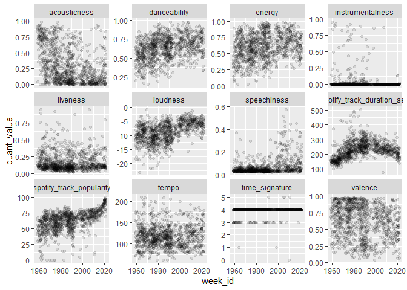

2021-09-14 Billboard Top 100
================

    ## Warning: package 'tidyverse' was built under R version 4.0.5

    ## Warning: package 'tibble' was built under R version 4.0.5

    ## Warning: package 'tidyr' was built under R version 4.0.5

    ## Warning: package 'dplyr' was built under R version 4.0.5

    ## Warning: package 'forcats' was built under R version 4.0.5

    ## Warning: package 'lubridate' was built under R version 4.0.5

    ## Warning: package 'hrbrthemes' was built under R version 4.0.4

    ## Warning: package 'ggtext' was built under R version 4.0.5

    ## Warning: package 'showtext' was built under R version 4.0.5

    ## Warning: package 'sysfonts' was built under R version 4.0.5

    ## Warning: package 'showtextdb' was built under R version 4.0.5

    ## function (enable = TRUE, record = TRUE) 
    ## {
    ##     showtext_hook = structure(function() showtext_begin_internal(record), 
    ##         class = "showtext_hook")
    ##     remove_hook = function(name) {
    ##         hooks = getHook(name)
    ##         is_showtext_hook = vapply(hooks, inherits, logical(1), 
    ##             "showtext_hook")
    ##         setHook(name, hooks[!is_showtext_hook], "replace")
    ##     }
    ##     remove_hook("plot.new")
    ##     remove_hook("grid.newpage")
    ##     if (isTRUE(enable)) {
    ##         setHook("plot.new", showtext_hook, "append")
    ##         setHook("grid.newpage", showtext_hook, "append")
    ##     }
    ## }
    ## <bytecode: 0x0000000020720548>
    ## <environment: namespace:showtext>

## Read data

``` r
billboard <- readr::read_csv('https://raw.githubusercontent.com/rfordatascience/tidytuesday/master/data/2021/2021-09-14/billboard.csv')
```

    ## 
    ## -- Column specification --------------------------------------------------------
    ## cols(
    ##   url = col_character(),
    ##   week_id = col_character(),
    ##   week_position = col_double(),
    ##   song = col_character(),
    ##   performer = col_character(),
    ##   song_id = col_character(),
    ##   instance = col_double(),
    ##   previous_week_position = col_double(),
    ##   peak_position = col_double(),
    ##   weeks_on_chart = col_double()
    ## )

``` r
audio_features <- readr::read_csv('https://raw.githubusercontent.com/rfordatascience/tidytuesday/master/data/2021/2021-09-14/audio_features.csv')
```

    ## 
    ## -- Column specification --------------------------------------------------------
    ## cols(
    ##   .default = col_double(),
    ##   song_id = col_character(),
    ##   performer = col_character(),
    ##   song = col_character(),
    ##   spotify_genre = col_character(),
    ##   spotify_track_id = col_character(),
    ##   spotify_track_preview_url = col_character(),
    ##   spotify_track_explicit = col_logical(),
    ##   spotify_track_album = col_character()
    ## )
    ## i Use `spec()` for the full column specifications.

## Ideas

  - Plot audio features over time, overlay points of songs, size and
    alpha as aes of popularity (time in charts / top 10 or something
    like that)
      - weeks on chart should work, peak position is also helpful
      - maybe just use those that reach top 1 at all
      - How to make a top hit?

<!-- end list -->

``` r
skimr::skim(billboard)
```

|                                                  |           |
| :----------------------------------------------- | :-------- |
| Name                                             | billboard |
| Number of rows                                   | 327895    |
| Number of columns                                | 10        |
| \_\_\_\_\_\_\_\_\_\_\_\_\_\_\_\_\_\_\_\_\_\_\_   |           |
| Column type frequency:                           |           |
| character                                        | 5         |
| numeric                                          | 5         |
| \_\_\_\_\_\_\_\_\_\_\_\_\_\_\_\_\_\_\_\_\_\_\_\_ |           |
| Group variables                                  | None      |

Data summary

**Variable type: character**

| skim\_variable | n\_missing | complete\_rate | min | max | empty | n\_unique | whitespace |
| :------------- | ---------: | -------------: | --: | --: | ----: | --------: | ---------: |
| url            |          0 |              1 |  50 |  51 |     0 |      3279 |          0 |
| week\_id       |          0 |              1 |   8 |  10 |     0 |      3279 |          0 |
| song           |          0 |              1 |   1 |  75 |     0 |     24360 |          0 |
| performer      |          0 |              1 |   1 | 113 |     0 |     10061 |          0 |
| song\_id       |          0 |              1 |   5 | 123 |     0 |     29389 |          0 |

**Variable type: numeric**

| skim\_variable           | n\_missing | complete\_rate |  mean |    sd | p0 |  p25 | p50 | p75 | p100 | hist  |
| :----------------------- | ---------: | -------------: | ----: | ----: | -: | ---: | --: | --: | ---: | :---- |
| week\_position           |          0 |            1.0 | 50.50 | 28.87 |  1 | 25.5 |  50 |  75 |  100 | ▇▇▇▇▇ |
| instance                 |          0 |            1.0 |  1.07 |  0.33 |  1 |  1.0 |   1 |   1 |   10 | ▇▁▁▁▁ |
| previous\_week\_position |      31954 |            0.9 | 47.60 | 28.06 |  1 | 23.0 |  47 |  72 |  100 | ▇▇▇▇▆ |
| peak\_position           |          0 |            1.0 | 41.36 | 29.54 |  1 | 14.0 |  39 |  66 |  100 | ▇▅▅▅▃ |
| weeks\_on\_chart         |          0 |            1.0 |  9.15 |  7.59 |  1 |  4.0 |   7 |  13 |   87 | ▇▁▁▁▁ |

``` r
skimr::skim(audio_features)
```

|                                                  |                 |
| :----------------------------------------------- | :-------------- |
| Name                                             | audio\_features |
| Number of rows                                   | 29503           |
| Number of columns                                | 22              |
| \_\_\_\_\_\_\_\_\_\_\_\_\_\_\_\_\_\_\_\_\_\_\_   |                 |
| Column type frequency:                           |                 |
| character                                        | 7               |
| logical                                          | 1               |
| numeric                                          | 14              |
| \_\_\_\_\_\_\_\_\_\_\_\_\_\_\_\_\_\_\_\_\_\_\_\_ |                 |
| Group variables                                  | None            |

Data summary

**Variable type: character**

| skim\_variable               | n\_missing | complete\_rate | min |  max | empty | n\_unique | whitespace |
| :--------------------------- | ---------: | -------------: | --: | ---: | ----: | --------: | ---------: |
| song\_id                     |          0 |           1.00 |   5 |  123 |     0 |     29386 |          0 |
| performer                    |          0 |           1.00 |   1 |  113 |     0 |     10059 |          0 |
| song                         |          0 |           1.00 |   1 |   75 |     0 |     24359 |          0 |
| spotify\_genre               |       1600 |           0.95 |   2 |  319 |     0 |      3375 |          0 |
| spotify\_track\_id           |       5106 |           0.83 |  22 |   22 |     0 |     24177 |          0 |
| spotify\_track\_preview\_url |      15012 |           0.49 | 107 |  107 |     0 |     14371 |          0 |
| spotify\_track\_album        |       5112 |           0.83 |   1 | 2688 |     0 |     13125 |          0 |

**Variable type: logical**

| skim\_variable           | n\_missing | complete\_rate | mean | count                 |
| :----------------------- | ---------: | -------------: | ---: | :-------------------- |
| spotify\_track\_explicit |       5106 |           0.83 | 0.12 | FAL: 21449, TRU: 2948 |

**Variable type: numeric**

| skim\_variable               | n\_missing | complete\_rate |      mean |       sd |       p0 |       p25 |       p50 |       p75 |       p100 | hist  |
| :--------------------------- | ---------: | -------------: | --------: | -------: | -------: | --------: | --------: | --------: | ---------: | :---- |
| spotify\_track\_duration\_ms |       5106 |           0.83 | 220684.26 | 67746.71 | 29688.00 | 175053.00 | 214850.00 | 253253.00 | 3079157.00 | ▇▁▁▁▁ |
| danceability                 |       5169 |           0.82 |      0.60 |     0.15 |     0.00 |      0.50 |      0.61 |      0.71 |       0.99 | ▁▂▆▇▂ |
| energy                       |       5169 |           0.82 |      0.62 |     0.20 |     0.00 |      0.48 |      0.63 |      0.78 |       1.00 | ▁▃▆▇▅ |
| key                          |       5169 |           0.82 |      5.23 |     3.56 |     0.00 |      2.00 |      5.00 |      8.00 |      11.00 | ▇▃▃▅▆ |
| loudness                     |       5169 |           0.82 |    \-8.66 |     3.60 |  \-28.03 |   \-11.03 |    \-8.20 |    \-5.86 |       2.29 | ▁▁▅▇▁ |
| mode                         |       5169 |           0.82 |      0.73 |     0.45 |     0.00 |      0.00 |      1.00 |      1.00 |       1.00 | ▃▁▁▁▇ |
| speechiness                  |       5169 |           0.82 |      0.07 |     0.08 |     0.00 |      0.03 |      0.04 |      0.07 |       0.95 | ▇▁▁▁▁ |
| acousticness                 |       5169 |           0.82 |      0.29 |     0.28 |     0.00 |      0.05 |      0.20 |      0.51 |       0.99 | ▇▃▂▂▁ |
| instrumentalness             |       5169 |           0.82 |      0.03 |     0.14 |     0.00 |      0.00 |      0.00 |      0.00 |       0.98 | ▇▁▁▁▁ |
| liveness                     |       5169 |           0.82 |      0.19 |     0.16 |     0.01 |      0.09 |      0.13 |      0.25 |       1.00 | ▇▂▁▁▁ |
| valence                      |       5169 |           0.82 |      0.60 |     0.24 |     0.00 |      0.42 |      0.62 |      0.80 |       0.99 | ▂▅▇▇▇ |
| tempo                        |       5169 |           0.82 |    120.28 |    28.05 |     0.00 |     99.06 |    118.91 |    136.48 |     241.01 | ▁▃▇▂▁ |
| time\_signature              |       5169 |           0.82 |      3.93 |     0.32 |     0.00 |      4.00 |      4.00 |      4.00 |       5.00 | ▁▁▁▇▁ |
| spotify\_track\_popularity   |       5106 |           0.83 |     41.22 |    22.48 |     0.00 |     23.00 |     43.00 |     59.00 |     100.00 | ▆▆▇▆▁ |

## Notes

  - does every track have audio features?
      - 86.7% do
  - maybe build model to check which audio features are best predictors
    (time should interact with this too though)

## EDA

``` r
billboard %>% 
  left_join(audio_features) %>% 
  skimr::skim()
```

    ## Joining, by = c("song", "performer", "song_id")

|                                                  |            |
| :----------------------------------------------- | :--------- |
| Name                                             | Piped data |
| Number of rows                                   | 330461     |
| Number of columns                                | 29         |
| \_\_\_\_\_\_\_\_\_\_\_\_\_\_\_\_\_\_\_\_\_\_\_   |            |
| Column type frequency:                           |            |
| character                                        | 9          |
| logical                                          | 1          |
| numeric                                          | 19         |
| \_\_\_\_\_\_\_\_\_\_\_\_\_\_\_\_\_\_\_\_\_\_\_\_ |            |
| Group variables                                  | None       |

Data summary

**Variable type: character**

| skim\_variable               | n\_missing | complete\_rate | min |  max | empty | n\_unique | whitespace |
| :--------------------------- | ---------: | -------------: | --: | ---: | ----: | --------: | ---------: |
| url                          |          0 |           1.00 |  50 |   51 |     0 |      3279 |          0 |
| week\_id                     |          0 |           1.00 |   8 |   10 |     0 |      3279 |          0 |
| song                         |          0 |           1.00 |   1 |   75 |     0 |     24360 |          0 |
| performer                    |          0 |           1.00 |   1 |  113 |     0 |     10061 |          0 |
| song\_id                     |          0 |           1.00 |   5 |  123 |     0 |     29389 |          0 |
| spotify\_genre               |      14761 |           0.96 |   2 |  319 |     0 |      3373 |          0 |
| spotify\_track\_id           |      43395 |           0.87 |  22 |   22 |     0 |     24173 |          0 |
| spotify\_track\_preview\_url |     160546 |           0.51 | 107 |  107 |     0 |     14367 |          0 |
| spotify\_track\_album        |      43457 |           0.87 |   1 | 2688 |     0 |     13122 |          0 |

**Variable type: logical**

| skim\_variable           | n\_missing | complete\_rate | mean | count                   |
| :----------------------- | ---------: | -------------: | ---: | :---------------------- |
| spotify\_track\_explicit |      43395 |           0.87 | 0.12 | FAL: 253952, TRU: 33114 |

**Variable type: numeric**

| skim\_variable               | n\_missing | complete\_rate |      mean |       sd |       p0 |       p25 |       p50 |       p75 |       p100 | hist  |
| :--------------------------- | ---------: | -------------: | --------: | -------: | -------: | --------: | --------: | --------: | ---------: | :---- |
| week\_position               |          0 |           1.00 |     50.42 |    28.87 |     1.00 |     25.00 |     50.00 |     75.00 |     100.00 | ▇▇▇▇▇ |
| instance                     |          0 |           1.00 |      1.08 |     0.36 |     1.00 |      1.00 |      1.00 |      1.00 |      10.00 | ▇▁▁▁▁ |
| previous\_week\_position     |      32181 |           0.90 |     47.54 |    28.06 |     1.00 |     23.00 |     47.00 |     71.00 |     100.00 | ▇▇▇▇▆ |
| peak\_position               |          0 |           1.00 |     41.27 |    29.54 |     1.00 |     14.00 |     38.00 |     66.00 |     100.00 | ▇▅▅▅▃ |
| weeks\_on\_chart             |          0 |           1.00 |      9.21 |     7.66 |     1.00 |      4.00 |      7.00 |     13.00 |      87.00 | ▇▁▁▁▁ |
| spotify\_track\_duration\_ms |      43395 |           0.87 | 228584.03 | 64765.45 | 29688.00 | 188600.00 | 224106.00 | 258986.00 | 3079157.00 | ▇▁▁▁▁ |
| danceability                 |      43953 |           0.87 |      0.61 |     0.15 |     0.00 |      0.52 |      0.62 |      0.72 |       0.99 | ▁▂▆▇▂ |
| energy                       |      43953 |           0.87 |      0.63 |     0.19 |     0.00 |      0.49 |      0.65 |      0.79 |       1.00 | ▁▂▆▇▅ |
| key                          |      43953 |           0.87 |      5.25 |     3.56 |     0.00 |      2.00 |      5.00 |      8.00 |      11.00 | ▇▃▃▅▆ |
| loudness                     |      43953 |           0.87 |    \-8.35 |     3.55 |  \-28.03 |   \-10.68 |    \-7.77 |    \-5.59 |       2.29 | ▁▁▃▇▁ |
| mode                         |      43953 |           0.87 |      0.72 |     0.45 |     0.00 |      0.00 |      1.00 |      1.00 |       1.00 | ▃▁▁▁▇ |
| speechiness                  |      43953 |           0.87 |      0.07 |     0.08 |     0.00 |      0.03 |      0.04 |      0.07 |       0.95 | ▇▁▁▁▁ |
| acousticness                 |      43953 |           0.87 |      0.26 |     0.27 |     0.00 |      0.04 |      0.16 |      0.43 |       0.99 | ▇▂▂▂▁ |
| instrumentalness             |      43953 |           0.87 |      0.03 |     0.13 |     0.00 |      0.00 |      0.00 |      0.00 |       0.98 | ▇▁▁▁▁ |
| liveness                     |      43953 |           0.87 |      0.19 |     0.15 |     0.01 |      0.09 |      0.13 |      0.24 |       1.00 | ▇▂▁▁▁ |
| valence                      |      43953 |           0.87 |      0.60 |     0.24 |     0.00 |      0.42 |      0.62 |      0.80 |       0.99 | ▂▅▇▇▇ |
| tempo                        |      43953 |           0.87 |    120.05 |    27.78 |     0.00 |     99.03 |    118.56 |    135.98 |     241.01 | ▁▃▇▂▁ |
| time\_signature              |      43953 |           0.87 |      3.95 |     0.28 |     0.00 |      4.00 |      4.00 |      4.00 |       5.00 | ▁▁▁▇▁ |
| spotify\_track\_popularity   |      43395 |           0.87 |     47.96 |    21.54 |     0.00 |     33.00 |     50.00 |     65.00 |     100.00 | ▃▅▇▆▁ |

``` r
joined <- billboard %>% 
  left_join(audio_features) %>% 
  filter(!is.na(loudness), # remove those without audio features
         peak_position == 1) %>% 
  mutate(spotify_track_duration_sec = round(spotify_track_duration_ms/1000)) %>% 
  pivot_longer(cols = c(spotify_track_duration_sec, 
                        danceability, 
                        energy, 
                        loudness, 
                        speechiness, 
                        acousticness, 
                        instrumentalness, 
                        liveness, 
                        valence, 
                        tempo, 
                        time_signature, 
                        spotify_track_popularity), 
               names_to = "quant_feature", 
               values_to = "quant_value") %>% 
  mutate(week_id = lubridate::mdy(week_id)) %>% 
  group_by(song_id) %>% 
  slice_max(weeks_on_chart, n = 1) %>%  # selecting last instance on charts
  mutate(length_group = case_when(weeks_on_chart >= 52 ~ "> 1 year",
                                  weeks_on_chart < 52 & weeks_on_chart >= 26 ~ "> 6 months",
                                  weeks_on_chart < 26 & weeks_on_chart >= 12 ~ "> 3 months"))
```

    ## Joining, by = c("song", "performer", "song_id")

``` r
joined %>% 
  ggplot(aes(x = week_id, y = quant_value)) +
  geom_point(alpha = 0.1) +
  facet_wrap(~quant_feature, scales = "free_y")
```

<!-- -->

``` r
filtered <- joined %>% 
  filter(quant_feature %nin% c("time_signature", "instrumentalness", "spotify_track_popularity"),
                               weeks_on_chart > 12) %>% 
  mutate(quant_feature = str_to_title(quant_feature))

filtered$quant_feature[filtered$quant_feature == "Loudness"] <- "Loudness [db]"
filtered$quant_feature[filtered$quant_feature == "Spotify_track_duration_sec"] <- "Duration [sec]"
filtered$quant_feature[filtered$quant_feature == "Tempo"] <- "Tempo [BPM]"
```

### Which ones to label

``` r
labels_min <- filtered %>%
  filter(length_group == "> 1 year") %>%
  select(performer, song, week_id, quant_feature, quant_value) %>%
  group_by(quant_feature) %>%
  slice_min(n = 1, quant_value) %>%
  mutate(label = str_c(performer, " -", "\n", song),
         label = str_replace(label, " Featuring ", ", ")) %>%
  dplyr::distinct()
```

    ## Adding missing grouping variables: `song_id`

``` r
labels_max <- filtered %>%
  filter(length_group == "> 1 year") %>%
  select(performer, song, week_id, quant_feature, quant_value) %>%
  group_by(quant_feature) %>%
  slice_max(n = 1, quant_value)%>%
  mutate(label = str_c(performer, "\n", song),
         label = str_replace(label, " Featuring ", ", "))%>%
  dplyr::distinct()
```

    ## Adding missing grouping variables: `song_id`

``` r
labelled <- filtered %>%  
  left_join(labels_max %>%bind_rows(labels_min)) %>% 
  dplyr::distinct()
```

    ## Joining, by = c("week_id", "song", "performer", "song_id", "quant_feature", "quant_value")

## Define text

``` r
plot_subtitle <- "Spotify audio features of #1 hits on the Billboard Hot 100 from 1960 to 2020. The Billboard Hot 100 is the music industry standard record chart in the United States for songs. Chart rankings are based on sales (physical and digital), radio play, and online streaming in the United States. The graphic shows the audio features of all #1 hits that remained in the Hot 100 for <span style = 'color: #118AB2;'>more than three months,</span> <span style = 'color: #FFD166;'>more than six months,</span> or <span style = 'color: #EF476F;'>more than a year.</span> "
```

``` r
key <- "**Acousticness** - A confidence measure from 0.0 to 1.0 of whether the track is acoustic. 1.0 represents high confidence the track is acoustic.<br>
**Danceability** describes how suitable a track is for dancing based on a combination of musical elements including tempo, rhythm stability, beat strength, and overall regularity. A value of 0.0 is least danceable and 1.0 is most danceable.<br>
**Energy** is a measure from 0.0 to 1.0 and represents a perceptual measure of intensity and activity. Typically, energetic tracks feel fast, loud, and noisy. For example, death metal has high energy, while a Bach prelude scores low on the scale. Perceptual features contributing to this attribute include dynamic range, perceived loudness, timbre, onset rate, and general entropy.<br>
**Liveness** detects the presence of an audience in the recording. Higher liveness values represent an increased probability that the track was performed live. A value above 0.8 provides strong likelihood that the track is live.<br>
**Loudness** - The overall loudness of a track in decibels (dB). Loudness values are averaged across the entire track and are useful for comparing relative loudness of tracks. Loudness is the quality of a sound that is the primary psychological correlate of physical strength (amplitude). Values typical range between -60 and 0 db.<br>
**Speechiness** detects the presence of spoken words in a track. The more exclusively speech-like the recording (e.g. talk show, audio book, poetry), the closer to 1.0 the attribute value. Values above 0.66 describe tracks that are probably made entirely of spoken words. Values between 0.33 and 0.66 describe tracks that may contain both music and speech, either in sections or layered, including such cases as rap music. Values below 0.33 most likely represent music and other non-speech-like tracks.<br>
**Tempo** - The overall estimated tempo of a track in beats per minute (BPM). In musical terminology, tempo is the speed or pace of a given piece and derives directly from the average beat duration.<br>
**Valence** - A measure from 0.0 to 1.0 describing the musical positiveness conveyed by a track. Tracks with high valence sound more positive (e.g. happy, cheerful, euphoric), while tracks with low valence sound more negative (e.g. sad, depressed, angry).
<br><br>
**Data:** Data.World by way of Sean Miller, Billboard.com and Spotify | **Graphic:** @TannerFlorian"
```

``` r
p <- ggplot() +
  geom_point(data = labelled %>% filter(length_group == "> 3 months"), 
             aes(x = week_id, y = quant_value), color = "#118AB2", alpha = 0.3) +
  geom_point(data = labelled %>% filter(length_group == "> 6 months"), 
             aes(x = week_id, y = quant_value), color = "#FFD166", alpha = 0.4) +
  geom_point(data = labelled %>% filter(length_group == "> 1 year"), 
             aes(x = week_id, y = quant_value), color = "#EF476F", alpha = 0.8) +
    geom_point(data = labelled %>% filter(length_group == "> 1 year",
                                        !is.na(label)), 
             aes(x = week_id, y = quant_value), color = "white", alpha = 0.9, size =3) +
  geom_point(data = labelled %>% filter(length_group == "> 1 year",
                                        !is.na(label)), 
             aes(x = week_id, y = quant_value), color = "#EF476F", alpha = 0.9, size =2.5) +
  geom_smooth(data = labelled, aes(x = week_id, y = quant_value), color = "black", size = 1.2, se = FALSE) +
  geom_smooth(data = labelled, aes(x = week_id, y = quant_value), color = "#e6e6f1") +
  geom_text_repel(data = labelled, aes(x = week_id, y = quant_value, label = label),
                  min.segment.length = 0, seed = 42, box.padding = 0.5, 
                  color = "#e6e6f1",bg.color = "black", bg.r = 0.1,
                  size = 3.3) +
  facet_wrap(~quant_feature, scales = "free_y") +
  theme_ft_rc() +
  theme(panel.grid.major.x = element_blank(),
        panel.grid.minor.x = element_blank(),
        axis.title.x = element_blank(),
        axis.title.y = element_blank(),
        plot.subtitle= element_textbox_simple(size = 13,lineheight = 1.3,
                                              padding = margin(5.5, 5.5, 5.5, 5.5),
                                              margin = margin(0, 0, 5.5, 0),
                                              maxheight = NULL),
        plot.title = element_text(size = 30),
        plot.caption =element_textbox_simple(size = 9,lineheight = 1.2,
                                              padding = margin(5.5, 5.5, 5.5, 5.5),
                                              margin = margin(25, 0, 0, 0),
                                              maxheight = NULL)) +
  labs(title = "How to Write a Hit Song",
       subtitle = plot_subtitle,
       caption = key)
```

``` r
ggsave(plot = p, filename = "Billboard100.png", units = "cm", width = 24, height = 20, dpi = 300, scale = 1.4, type = "cairo")
```

    ## `geom_smooth()` using method = 'loess' and formula 'y ~ x'
    ## `geom_smooth()` using method = 'loess' and formula 'y ~ x'

    ## Warning: Removed 8550 rows containing missing values (geom_text_repel).

``` r
sessionInfo()
```

    ## R version 4.0.3 (2020-10-10)
    ## Platform: x86_64-w64-mingw32/x64 (64-bit)
    ## Running under: Windows 10 x64 (build 19042)
    ## 
    ## Matrix products: default
    ## 
    ## locale:
    ## [1] LC_COLLATE=English_United States.1252 
    ## [2] LC_CTYPE=English_United States.1252   
    ## [3] LC_MONETARY=English_United States.1252
    ## [4] LC_NUMERIC=C                          
    ## [5] LC_TIME=English_United States.1252    
    ## 
    ## attached base packages:
    ## [1] stats     graphics  grDevices utils     datasets  methods   base     
    ## 
    ## other attached packages:
    ##  [1] showtext_0.9-2   showtextdb_3.0   sysfonts_0.8.3   ggrepel_0.9.1   
    ##  [5] ggtext_0.1.1     hrbrthemes_0.8.0 lubridate_1.7.10 forcats_0.5.1   
    ##  [9] stringr_1.4.0    dplyr_1.0.6      purrr_0.3.4      readr_1.4.0     
    ## [13] tidyr_1.1.3      tibble_3.1.2     ggplot2_3.3.3    tidyverse_1.3.1 
    ## 
    ## loaded via a namespace (and not attached):
    ##  [1] httr_1.4.2        jsonlite_1.7.2    splines_4.0.3     modelr_0.1.8     
    ##  [5] assertthat_0.2.1  highr_0.8         cellranger_1.1.0  yaml_2.2.1       
    ##  [9] gdtools_0.2.3     Rttf2pt1_1.3.8    pillar_1.6.1      backports_1.2.0  
    ## [13] lattice_0.20-41   glue_1.4.2        extrafontdb_1.0   digest_0.6.27    
    ## [17] gridtext_0.1.4    rvest_1.0.0       colorspace_2.0-0  Matrix_1.2-18    
    ## [21] htmltools_0.5.1.1 pkgconfig_2.0.3   broom_0.7.6       haven_2.3.1      
    ## [25] scales_1.1.1      mgcv_1.8-33       generics_0.1.0    farver_2.0.3     
    ## [29] ellipsis_0.3.2    withr_2.4.2       repr_1.1.3        skimr_2.1.2      
    ## [33] cli_2.5.0         magrittr_2.0.1    crayon_1.4.1      readxl_1.3.1     
    ## [37] evaluate_0.14     fs_1.5.0          fansi_0.4.2       nlme_3.1-149     
    ## [41] xml2_1.3.2        tools_4.0.3       hms_1.0.0         lifecycle_1.0.0  
    ## [45] munsell_0.5.0     reprex_2.0.0      compiler_4.0.3    systemfonts_1.0.1
    ## [49] rlang_0.4.10      grid_4.0.3        rstudioapi_0.13   base64enc_0.1-3  
    ## [53] labeling_0.4.2    rmarkdown_2.6     gtable_0.3.0      DBI_1.1.0        
    ## [57] curl_4.3          markdown_1.1      R6_2.5.0          knitr_1.33       
    ## [61] extrafont_0.17    utf8_1.1.4        stringi_1.5.3     Rcpp_1.0.7       
    ## [65] vctrs_0.3.8       dbplyr_2.1.1      tidyselect_1.1.1  xfun_0.22
