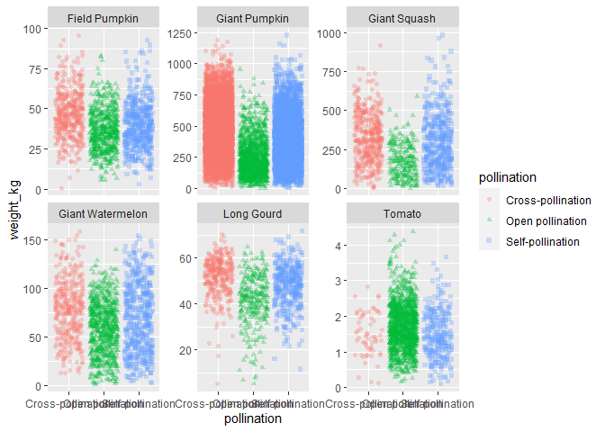
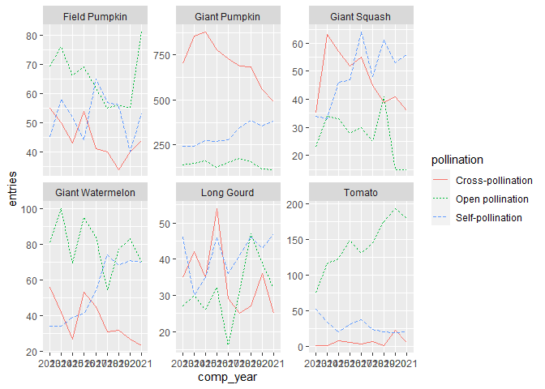
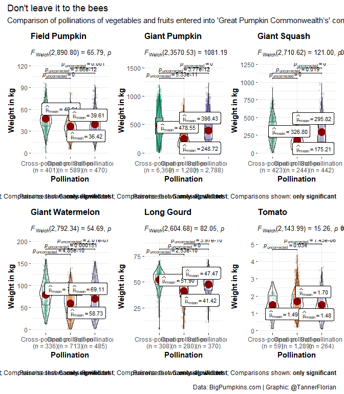
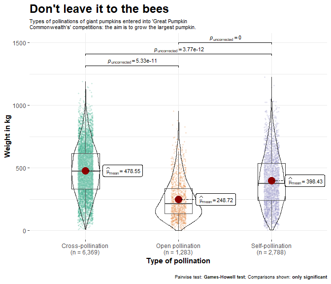

2021-10-19 Big Pumpkins
================

    ## Warning in .recacheSubclasses(def@className, def, env): undefined subclass
    ## "numericVector" of class "Mnumeric"; definition not updated

## Read data

``` r
pumpkins <- readr::read_csv('https://raw.githubusercontent.com/rfordatascience/tidytuesday/master/data/2021/2021-10-19/pumpkins.csv')
```

    ## Rows: 28065 Columns: 14

    ## -- Column specification --------------------------------------------------------
    ## Delimiter: ","
    ## chr (14): id, place, weight_lbs, grower_name, city, state_prov, country, gpc...

    ## 
    ## i Use `spec()` to retrieve the full column specification for this data.
    ## i Specify the column types or set `show_col_types = FALSE` to quiet this message.

## EDA

Add year and crop

``` r
pumpkins_clean <- pumpkins %>% 
  mutate(comp_year = substr(id,  1, 4),
         crop = case_when(str_detect(id, "F") ~ "Field Pumpkin",
                          str_detect(id, "P") ~ "Giant Pumpkin",
                          str_detect(id, "S") ~ "Giant Squash",
                          str_detect(id, "W") ~ "Giant Watermelon",
                          str_detect(id, "L") ~ "Long Gourd",
                          str_detect(id, "T") ~ "Tomato"),
         weight_lbs_num = as.numeric(str_remove(weight_lbs, ",")),
         weight_kg = weight_lbs_num * 0.453592) %>% 
  filter(!is.na(weight_lbs_num)) # Removing multiple entries
```

    ## Warning in mask$eval_all_mutate(quo): NAs introduced by coercion

``` r
skimr::skim(pumpkins_clean)
```

|                                                  |                |
|:-------------------------------------------------|:---------------|
| Name                                             | pumpkins_clean |
| Number of rows                                   | 28011          |
| Number of columns                                | 18             |
| \_\_\_\_\_\_\_\_\_\_\_\_\_\_\_\_\_\_\_\_\_\_\_   |                |
| Column type frequency:                           |                |
| character                                        | 16             |
| numeric                                          | 2              |
| \_\_\_\_\_\_\_\_\_\_\_\_\_\_\_\_\_\_\_\_\_\_\_\_ |                |
| Group variables                                  | None           |

Data summary

**Variable type: character**

| skim_variable     | n_missing | complete_rate | min | max | empty | n_unique | whitespace |
|:------------------|----------:|--------------:|----:|----:|------:|---------:|-----------:|
| id                |         0 |          1.00 |   6 |   6 |     0 |       54 |          0 |
| place             |         0 |          1.00 |   1 |   4 |     0 |     1797 |          0 |
| weight_lbs        |         0 |          1.00 |   4 |   8 |     0 |     7491 |          0 |
| grower_name       |         0 |          1.00 |   4 |  64 |     0 |     7928 |          0 |
| city              |      2779 |          0.90 |   1 |  28 |     0 |     3164 |          0 |
| state_prov        |         0 |          1.00 |   4 |  22 |     0 |      134 |          0 |
| country           |         0 |          1.00 |   5 |  15 |     0 |       21 |          0 |
| gpc_site          |         0 |          1.00 |   8 |  69 |     0 |      166 |          0 |
| seed_mother       |      8537 |          0.70 |   1 |  50 |     0 |     9942 |          0 |
| pollinator_father |     10302 |          0.63 |   1 |  50 |     0 |     4484 |          0 |
| ott               |      3157 |          0.89 |   3 |   6 |     0 |      448 |          0 |
| est_weight        |      3157 |          0.89 |   4 |   9 |     0 |     1614 |          0 |
| pct_chart         |      3157 |          0.89 |   3 |   6 |     0 |      181 |          0 |
| variety           |     27296 |          0.03 |   1 |  22 |     0 |       77 |          0 |
| comp_year         |         0 |          1.00 |   4 |   4 |     0 |        9 |          0 |
| crop              |         0 |          1.00 |   6 |  16 |     0 |        6 |          0 |

**Variable type: numeric**

| skim_variable  | n_missing | complete_rate |   mean |     sd |   p0 |   p25 |    p50 |    p75 |    p100 | hist  |
|:---------------|----------:|--------------:|-------:|-------:|-----:|------:|-------:|-------:|--------:|:------|
| weight_lbs_num |         0 |             1 | 499.81 | 503.86 | 0.10 | 86.50 | 308.60 | 831.00 | 2702.90 | ▇▃▂▁▁ |
| weight_kg      |         0 |             1 | 226.71 | 228.55 | 0.05 | 39.24 | 139.98 | 376.93 | 1226.01 | ▇▃▂▁▁ |

### How many of each crop?

``` r
pumpkins_clean %>% 
  filter(!is.na(pollinator_father)) %>% 
  count(crop)
```

    ## # A tibble: 6 x 2
    ##   crop                 n
    ##   <chr>            <int>
    ## 1 Field Pumpkin     1531
    ## 2 Giant Pumpkin    10796
    ## 3 Giant Squash      1123
    ## 4 Giant Watermelon  1564
    ## 5 Long Gourd        1011
    ## 6 Tomato            1684

## Ideas

-   Heterosis?
-   Which ones have known pollinators?

### Group forms of pollination

``` r
unknown_pollination <- pumpkins_clean %>% 
  filter(is.na(seed_mother) | 
           is.na(pollinator_father) |
           str_detect(seed_mother, "\\?") |
           str_detect(pollinator_father, "\\?") |
           pollinator_father %in% c("unknown", "Unknown", "mystery", "Mystery") |
           seed_mother %in% c("unknown", "Unknown", "mystery", "Mystery"))

selfed_plants <- pumpkins_clean %>% 
  anti_join(unknown_pollination) %>% 
  filter(pollinator_father %in% c("Sibbed", "sibbed", "self", "Self", "selfed", "Selfed", "sib", "sibb", "Sib") | 
           pollinator_father == seed_mother) %>% 
  mutate(pollination = "Self-pollination")
```

    ## Joining, by = c("id", "place", "weight_lbs", "grower_name", "city", "state_prov", "country", "gpc_site", "seed_mother", "pollinator_father", "ott", "est_weight", "pct_chart", "variety", "comp_year", "crop", "weight_lbs_num", "weight_kg")

``` r
open_pollinated <-pumpkins_clean %>%
  anti_join(unknown_pollination) %>% 
  anti_join(selfed_plants) %>% 
  filter(pollinator_father %in% c("open", "Open")) %>% 
  mutate(pollination = "Open pollination")
```

    ## Joining, by = c("id", "place", "weight_lbs", "grower_name", "city", "state_prov", "country", "gpc_site", "seed_mother", "pollinator_father", "ott", "est_weight", "pct_chart", "variety", "comp_year", "crop", "weight_lbs_num", "weight_kg")
    ## Joining, by = c("id", "place", "weight_lbs", "grower_name", "city", "state_prov", "country", "gpc_site", "seed_mother", "pollinator_father", "ott", "est_weight", "pct_chart", "variety", "comp_year", "crop", "weight_lbs_num", "weight_kg")

``` r
cross_pollinated <- pumpkins_clean %>% 
  anti_join(selfed_plants) %>% 
  anti_join(open_pollinated) %>% 
  anti_join(unknown_pollination)%>% 
  mutate(pollination = "Cross-pollination")
```

    ## Joining, by = c("id", "place", "weight_lbs", "grower_name", "city", "state_prov", "country", "gpc_site", "seed_mother", "pollinator_father", "ott", "est_weight", "pct_chart", "variety", "comp_year", "crop", "weight_lbs_num", "weight_kg")
    ## Joining, by = c("id", "place", "weight_lbs", "grower_name", "city", "state_prov", "country", "gpc_site", "seed_mother", "pollinator_father", "ott", "est_weight", "pct_chart", "variety", "comp_year", "crop", "weight_lbs_num", "weight_kg")
    ## Joining, by = c("id", "place", "weight_lbs", "grower_name", "city", "state_prov", "country", "gpc_site", "seed_mother", "pollinator_father", "ott", "est_weight", "pct_chart", "variety", "comp_year", "crop", "weight_lbs_num", "weight_kg")

### Combining the entries with evident form of pollination

``` r
pumpkins_known_pollination <- rbind(selfed_plants, open_pollinated, cross_pollinated)
```

### Weights per pollination

``` r
pumpkins_known_pollination %>% 
  ggplot(aes(x = pollination, y = weight_kg, color = pollination, shape = pollination)) +
  geom_jitter(alpha = 0.3) +
  facet_wrap(~crop, scales= "free_y")
```

<!-- -->

### Trends in pollination over time?

``` r
pumpkins_known_pollination %>% 
  group_by(comp_year, crop, pollination) %>% 
  summarise(entries = n()) %>% 
  ggplot(aes(x = comp_year, y = entries, color = pollination, linetype = pollination, group = pollination)) +
  geom_line() +
  facet_wrap(~crop, scales= "free_y")
```

    ## `summarise()` has grouped output by 'comp_year', 'crop'. You can override using the `.groups` argument.

<!-- -->

``` r
set.seed(123)
p_all <- grouped_ggbetweenstats(
  data = pumpkins_known_pollination,
  x = pollination,
  y = weight_kg,
  grouping.var = crop,
  type = "parametric",
  xlab= "Pollination", 
  ylab = "Weight in kg",
  p.adjust.method = "none",
  pairwise.display = "significant",
  point.args = list(position = ggplot2::position_jitterdodge(dodge.width = 0.6), alpha
    = 0.15, size = 1.5, stroke = 0),
  annotation.args = list(
    title = "Don't leave it to the bees",
    subtitle = "Comparison of pollinations of vegetables and fruits entered into 'Great Pumpkin Commonwealth’s' competitions. The aim is to grow the largest crop.",
    caption = "Data: BigPumpkins.com | Graphic: @TannerFlorian"
  )
)
p_all
```

<!-- -->

``` r
ggsave(plot = p_all, filename = "big_pumpkins_all.png", device = "png", units = "cm", width = 28, height= 28, limitsize = F)
```

``` r
set.seed(123)
p_giant_pumpkin <- ggbetweenstats(
  data = pumpkins_known_pollination %>% filter(crop == "Giant Pumpkin"),
  x = pollination,
  y = weight_kg,
  type = "parametric",
  xlab= "Type of pollination", 
  ylab = "Weight in kg",
  p.adjust.method = "none",
  pairwise.display = "significant",
  point.args = list(position = ggplot2::position_jitterdodge(dodge.width = 0.7), alpha
    = 0.15, size = 1, stroke = 0),
  results.subtitle = FALSE,
  title = "Don't leave it to the bees",
  subtitle = str_wrap("Types of pollinations of giant pumpkins entered into 'Great Pumpkin Commonwealth’s' competitions: the aim is to grow the largest pumpkin.\n", 80),
  ggstatsplot.layer = FALSE,
  ggplot.component = list(theme(plot.title = element_text(size = 18),
                                plot.subtitle = element_text(size = 8),
                                plot.caption = element_text(size = 7))))
p_giant_pumpkin
```

<!-- -->

``` r
ggsave(plot = p_giant_pumpkin, filename = "big_giant_pumpkins.png", device = "png", units = "cm", width = 14, height= 14, limitsize = F)
```

``` r
sessionInfo()
```

    ## R version 4.1.1 (2021-08-10)
    ## Platform: x86_64-w64-mingw32/x64 (64-bit)
    ## Running under: Windows 10 x64 (build 19042)
    ## 
    ## Matrix products: default
    ## 
    ## locale:
    ## [1] LC_COLLATE=English_United States.1252 
    ## [2] LC_CTYPE=English_United States.1252   
    ## [3] LC_MONETARY=English_United States.1252
    ## [4] LC_NUMERIC=C                          
    ## [5] LC_TIME=English_United States.1252    
    ## 
    ## attached base packages:
    ## [1] stats     graphics  grDevices utils     datasets  methods   base     
    ## 
    ## other attached packages:
    ##  [1] showtext_0.9-4    showtextdb_3.0    sysfonts_0.8.5    ggstatsplot_0.8.0
    ##  [5] forcats_0.5.1     stringr_1.4.0     dplyr_1.0.7       purrr_0.3.4      
    ##  [9] readr_2.0.2       tidyr_1.1.4       tibble_3.1.5      ggplot2_3.3.5    
    ## [13] tidyverse_1.3.1  
    ## 
    ## loaded via a namespace (and not attached):
    ##   [1] colorspace_2.0-2          ggsignif_0.6.3           
    ##   [3] ellipsis_0.3.2            base64enc_0.1-3          
    ##   [5] parameters_0.14.0         fs_1.5.0                 
    ##   [7] mc2d_0.1-21               rstudioapi_0.13          
    ##   [9] farver_2.1.0              MatrixModels_0.5-0       
    ##  [11] ggrepel_0.9.1             bit64_4.0.5              
    ##  [13] fansi_0.5.0               mvtnorm_1.1-2            
    ##  [15] lubridate_1.7.10          xml2_1.3.2               
    ##  [17] cachem_1.0.6              knitr_1.36               
    ##  [19] SuppDists_1.1-9.5         zeallot_0.1.0            
    ##  [21] jsonlite_1.7.2            broom_0.7.9              
    ##  [23] Rmpfr_0.8-4               dbplyr_2.1.1             
    ##  [25] effectsize_0.5            compiler_4.1.1           
    ##  [27] httr_1.4.2                PMCMRplus_1.9.0          
    ##  [29] backports_1.2.1           assertthat_0.2.1         
    ##  [31] Matrix_1.3-4              fastmap_1.1.0            
    ##  [33] cli_3.0.1                 htmltools_0.5.2          
    ##  [35] tools_4.1.1               gmp_0.6-2                
    ##  [37] coda_0.19-4               gtable_0.3.0             
    ##  [39] glue_1.4.2                Rcpp_1.0.7               
    ##  [41] cellranger_1.1.0          vctrs_0.3.8              
    ##  [43] insight_0.14.4            xfun_0.26                
    ##  [45] rvest_1.0.1               lifecycle_1.0.1          
    ##  [47] ipmisc_6.0.2              gtools_3.9.2             
    ##  [49] MASS_7.3-54               scales_1.1.1             
    ##  [51] vroom_1.5.5               BayesFactor_0.9.12-4.2   
    ##  [53] hms_1.1.1                 parallel_4.1.1           
    ##  [55] rematch2_2.1.2            prismatic_1.0.0          
    ##  [57] yaml_2.2.1                curl_4.3.2               
    ##  [59] memoise_2.0.0             pbapply_1.5-0            
    ##  [61] reshape_0.8.8             stringi_1.7.5            
    ##  [63] highr_0.9                 paletteer_1.4.0          
    ##  [65] bayestestR_0.11.0         boot_1.3-28              
    ##  [67] repr_1.1.3                rlang_0.4.11             
    ##  [69] pkgconfig_2.0.3           evaluate_0.14            
    ##  [71] lattice_0.20-44           labeling_0.4.2           
    ##  [73] patchwork_1.1.1           bit_4.0.4                
    ##  [75] tidyselect_1.1.1          plyr_1.8.6               
    ##  [77] magrittr_2.0.1            R6_2.5.1                 
    ##  [79] pairwiseComparisons_3.1.6 generics_0.1.0           
    ##  [81] multcompView_0.1-8        BWStest_0.2.2            
    ##  [83] DBI_1.1.1                 pillar_1.6.3             
    ##  [85] haven_2.4.3               withr_2.4.2              
    ##  [87] datawizard_0.2.1          performance_0.8.0        
    ##  [89] modelr_0.1.8              crayon_1.4.1             
    ##  [91] WRS2_1.1-3                utf8_1.2.2               
    ##  [93] correlation_0.7.1         tzdb_0.1.2               
    ##  [95] rmarkdown_2.11            kSamples_1.2-9           
    ##  [97] grid_4.1.1                readxl_1.3.1             
    ##  [99] reprex_2.0.1              digest_0.6.28            
    ## [101] statsExpressions_1.1.0    munsell_0.5.0            
    ## [103] skimr_2.1.3
