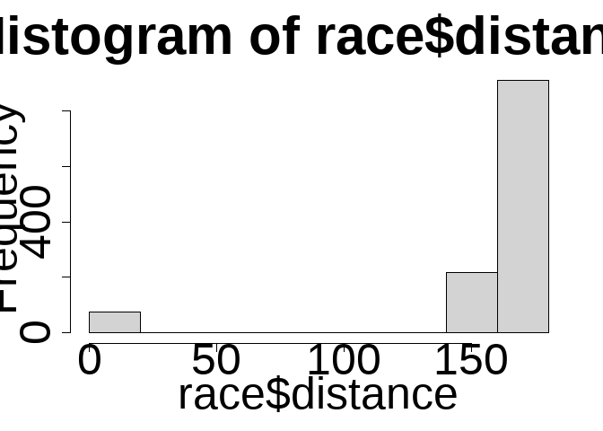

2021-10-26 Ultra Trail Running
================

## Read data

``` r
ultra_rankings <- readr::read_csv('https://raw.githubusercontent.com/rfordatascience/tidytuesday/master/data/2021/2021-10-26/ultra_rankings.csv')
```

    ## Rows: 137803 Columns: 8

    ## -- Column specification --------------------------------------------------------
    ## Delimiter: ","
    ## chr (4): runner, time, gender, nationality
    ## dbl (4): race_year_id, rank, age, time_in_seconds

    ## 
    ## i Use `spec()` to retrieve the full column specification for this data.
    ## i Specify the column types or set `show_col_types = FALSE` to quiet this message.

``` r
race <- readr::read_csv('https://raw.githubusercontent.com/rfordatascience/tidytuesday/master/data/2021/2021-10-26/race.csv')
```

    ## Rows: 1207 Columns: 13

    ## -- Column specification --------------------------------------------------------
    ## Delimiter: ","
    ## chr  (5): event, race, city, country, participation
    ## dbl  (6): race_year_id, distance, elevation_gain, elevation_loss, aid_statio...
    ## date (1): date
    ## time (1): start_time

    ## 
    ## i Use `spec()` to retrieve the full column specification for this data.
    ## i Specify the column types or set `show_col_types = FALSE` to quiet this message.

## Ideas

-   Rank races by difficulty
-   Average finishing times
-   Lengths, vert
-   Competitiveness
-   Map of events with initial year?
-   Not really enough data + COVID effect
-   How much slower is average than the winners?
-   Big wins, course records? (% faster than second place)
-   Cut-offs?
-   DNF - rate

## EDA

-   0 participants in ‘race’ df is wrong

``` r
event_creation <- race %>% 
  filter(participants > 0) %>% 
  group_by(race_year_id, race) %>% 
  summarise(first_date = min(date)) %>% 
  mutate(first_year = floor_date(first_date, unit = "year")) %>% 
  ungroup()
```

    ## `summarise()` has grouped output by 'race_year_id'. You can override using the `.groups` argument.

``` r
event_creation %>% 
  count(first_year)
```

    ## # A tibble: 8 x 2
    ##   first_year     n
    ##   <date>     <int>
    ## 1 2014-01-01     7
    ## 2 2015-01-01    18
    ## 3 2016-01-01    68
    ## 4 2017-01-01   108
    ## 5 2018-01-01   124
    ## 6 2019-01-01   155
    ## 7 2020-01-01    75
    ## 8 2021-01-01    70

``` r
race %>%
  filter(participants > 0) %>% 
  mutate(year = floor_date(date, unit = "year")) |>
  group_by(year) |> 
  count()
```

    ## # A tibble: 8 x 2
    ## # Groups:   year [8]
    ##   year           n
    ##   <date>     <int>
    ## 1 2014-01-01     7
    ## 2 2015-01-01    18
    ## 3 2016-01-01    68
    ## 4 2017-01-01   108
    ## 5 2018-01-01   124
    ## 6 2019-01-01   155
    ## 7 2020-01-01    75
    ## 8 2021-01-01    70

-   Long-standing events

``` r
race %>% 
  filter(participants > 0,
         distance  > 0) %>% 
  group_by(event, race) %>% 
  count() %>% 
  arrange(desc(n))
```

    ## # A tibble: 355 x 3
    ## # Groups:   event, race [355]
    ##    event                         race                              n
    ##    <chr>                         <chr>                         <int>
    ##  1 Cloudsplitter 100             100 Mile                          7
    ##  2 Centurion Autumn 100          Centurion Autumn 100              6
    ##  3 Centurion North Downs Way 100 Centurion North Downs Way 100     6
    ##  4 Centurion Thames Path 100     Centurion Thames Path 100         6
    ##  5 Coldwater Rumble              100 Miles                         6
    ##  6 Persenk Ultra                 PERSENK ULTRA                     6
    ##  7 Täby Extreme Challenge        TEC 100 Miles                     6
    ##  8 100 Miles Sud De France       100 Miles                         5
    ##  9 Alpine Challenge              100 Mile Individual               5
    ## 10 Badger Mountain Challenge     100 Mile                          5
    ## # ... with 345 more rows

``` r
hist(race$distance)
```

<!-- -->

-   None have 0 participants
-   Naming is very inconsistent

``` r
ultra_rankings |>
  left_join(race) |>
  group_by(race_year_id, race, date, event) |>
  count() |>
  arrange(desc(n))
```

    ## Joining, by = "race_year_id"

    ## # A tibble: 1,207 x 5
    ## # Groups:   race_year_id, race, date, event [1,207]
    ##    race_year_id race                        date       event                   n
    ##           <dbl> <chr>                       <date>     <chr>               <int>
    ##  1        48019 La Diagonale Des Fous       2019-10-17 Le Grand Raid De L~  2716
    ##  2        30965 La Diagonale Des Fous       2018-10-18 Le Grand Raid De L~  2660
    ##  3        25073 UTMB®                       2018-08-31 UTMB®                2565
    ##  4        39881 UTMB®                       2019-08-30 UTMB®                2549
    ##  5        20273 La Diagonale Des Fous       2017-10-19 Grand Raid De La R~  2548
    ##  6        17383 UTMB®                       2017-09-01 UTMB®                2542
    ##  7         9086 Le Grand Raid De La Réunion 2015-10-22 Le Grand Raid De L~  1729
    ##  8        15338 Le Grand Raid De La Réunion 2016-10-20 Le Grand Raid De L~  1688
    ##  9         3940 UTMB®                       2013-08-30 The North Face Ult~  1687
    ## 10         8592 UTMB®                       2015-08-28 Ultra-Trail Du Mon~  1633
    ## # ... with 1,197 more rows

### Pace of 100-mile events

-   Using 2018 data for simplicity, many iconic races are included

``` r
races_2018 <- ultra_rankings |>
  left_join(race) |>
  filter(distance > 155, 
         distance < 170,
         date > as.Date("2017-12-31"),
         date < as.Date("2018-12-31")) |>
  mutate(miles = distance / 1.60934,
         pace_km = (time_in_seconds/60)/distance,
         pace_mile = (time_in_seconds/60)/miles) |>
  group_by(race_year_id) |>
  summarise(avg_pace_mile = mean(pace_mile, na.rm = TRUE),
            avg_pace_km = mean(pace_km, na.rm = TRUE),
            race_year_id = race_year_id,
            fastest_pace_km = min(pace_km, na.rm = TRUE),
            participants_from_rankings = n()) |>
  left_join(race) |>
  distinct() |>
  filter(participants_from_rankings > 50) %>% 
  ungroup()
```

    ## Joining, by = "race_year_id"

    ## Warning in min(pace_km, na.rm = TRUE): no non-missing arguments to min;
    ## returning Inf

    ## `summarise()` has grouped output by 'race_year_id'. You can override using the `.groups` argument.
    ## Joining, by = "race_year_id"

``` r
skimr::skim(races_2018)
```

|                                                  |            |
|:-------------------------------------------------|:-----------|
| Name                                             | races_2018 |
| Number of rows                                   | 80         |
| Number of columns                                | 17         |
| \_\_\_\_\_\_\_\_\_\_\_\_\_\_\_\_\_\_\_\_\_\_\_   |            |
| Column type frequency:                           |            |
| character                                        | 5          |
| Date                                             | 1          |
| difftime                                         | 1          |
| numeric                                          | 10         |
| \_\_\_\_\_\_\_\_\_\_\_\_\_\_\_\_\_\_\_\_\_\_\_\_ |            |
| Group variables                                  | None       |

Data summary

**Variable type: character**

| skim_variable | n_missing | complete_rate | min | max | empty | n_unique | whitespace |
|:--------------|----------:|--------------:|----:|----:|------:|---------:|-----------:|
| event         |         0 |          1.00 |   4 |  42 |     0 |       80 |          0 |
| race          |         0 |          1.00 |   3 |  42 |     0 |       64 |          0 |
| city          |         7 |          0.91 |   4 |  19 |     0 |       73 |          0 |
| country       |         0 |          1.00 |   4 |  16 |     0 |       26 |          0 |
| participation |         0 |          1.00 |   4 |   4 |     0 |        2 |          0 |

**Variable type: Date**

| skim_variable | n_missing | complete_rate | min        | max        | median     | n_unique |
|:--------------|----------:|--------------:|:-----------|:-----------|:-----------|---------:|
| date          |         0 |             1 | 2018-01-13 | 2018-12-13 | 2018-08-14 |       62 |

**Variable type: difftime**

| skim_variable | n_missing | complete_rate | min    | max        | median     | n_unique |
|:--------------|----------:|--------------:|:-------|:-----------|:-----------|---------:|
| start_time    |         0 |             1 | 0 secs | 82800 secs | 25200 secs |       22 |

**Variable type: numeric**

| skim_variable              | n_missing | complete_rate |     mean |      sd |        p0 |      p25 |      p50 |      p75 |     p100 | hist  |
|:---------------------------|----------:|--------------:|---------:|--------:|----------:|---------:|---------:|---------:|---------:|:------|
| race_year_id               |         0 |             1 | 31547.68 | 6221.30 |  19487.00 | 27043.00 | 30839.00 | 35186.50 | 58549.00 | ▅▇▅▁▁ |
| avg_pace_mile              |         0 |             1 |    19.10 |    4.30 |     12.20 |    15.62 |    18.08 |    21.63 |    35.66 | ▆▇▃▁▁ |
| avg_pace_km                |         0 |             1 |    11.87 |    2.67 |      7.58 |     9.71 |    11.24 |    13.44 |    22.16 | ▆▇▃▁▁ |
| fastest_pace_km            |         0 |             1 |     7.57 |    1.71 |      4.51 |     6.28 |     7.35 |     8.39 |    11.80 | ▅▇▆▂▂ |
| participants_from_rankings |         0 |             1 |   192.30 |  328.21 |     51.00 |    75.00 |   127.50 |   182.25 |  2660.00 | ▇▁▁▁▁ |
| distance                   |         0 |             1 |   162.15 |    3.15 |    155.80 |   160.15 |   161.75 |   163.95 |   169.60 | ▃▇▇▃▃ |
| elevation_gain             |         0 |             1 |  5802.48 | 2792.83 |    250.00 |  3705.00 |  5680.00 |  7165.00 | 11840.00 | ▂▆▇▂▃ |
| elevation_loss             |         0 |             1 | -5822.23 | 2822.61 | -12020.00 | -7187.50 | -5762.50 | -3692.50 |  -250.00 | ▂▂▇▅▃ |
| aid_stations               |         0 |             1 |    11.03 |    6.23 |      0.00 |     7.00 |    13.00 |    15.00 |    26.00 | ▃▃▇▃▁ |
| participants               |         0 |             1 |   242.07 |  402.34 |      0.00 |     0.00 |   150.00 |   300.00 |  2900.00 | ▇▁▁▁▁ |

``` r
races_2018_labelled <- races_2018 |>
  filter(event %in% c("Ultra-Trail Mt. Fuji", 
                      "Le Grand Raid De La Réunion", 
                      "Leadville Trail 100 Run",
                      "Tahoe Rim Trail Endurance Run",
                      "Western States Endurance Run",
                      "HARDROCK 100 ENDURANCE RUN",
                      "6th Elton Volgabus Ultra-Trail®",
                      "La Mision 2018 - VLA",
                      "Hardcore Hundred Miles Trail Ultramarathon"))
```

``` r
bg_color <- "#FEFAE0"
a_highlight_color <- "#BC6C25"
a_light_color <- "#DDA15E"
b_highlight_color <- "#283618"
b_light_color <- "#606C38"

theme_ultra <- theme_bw() +
  theme(plot.background = element_rect(fill = bg_color, color = NA),
        panel.background = element_rect(fill = bg_color, color = NA),
        text =element_text(family = "Roboto"),
        plot.subtitle= element_textbox_simple(size = 10,lineheight = 1.3,
                                              padding = margin(5.5, 5.5, 5.5, 5.5),
                                              margin = margin(0, 0, 5.5, 0),
                                              maxheight = NULL),
        plot.title = element_text(size = 18),
        axis.title = element_text(size = 8.5),
        plot.caption = element_text(size = 6)) 

trail_subtitle = "Average pace of <span style = 'color: #283618;'>**finishers**</span> and <span style = 'color: #BC6C25;'>**winners**</span> of 100 mile trail races in 2018"
```

``` r
p <- ggplot() +
  geom_segment(data = races_2018_labelled, aes(x = elevation_gain, xend = elevation_gain, y = fastest_pace_km, yend= avg_pace_km), alpha = 0.5) +
  geom_segment(data = races_2018, aes(x = elevation_gain, xend = elevation_gain, y = fastest_pace_km, yend= avg_pace_km), alpha = 0.2) +
  geom_point(data = races_2018 , aes(x = elevation_gain, y = avg_pace_km),  
             color = b_light_color) +
  geom_point(data = races_2018 , aes(x = elevation_gain, y = fastest_pace_km), 
             color = a_light_color) +
  geom_point(data = races_2018_labelled , aes(x = elevation_gain, y = avg_pace_km), 
             size =3, color = b_highlight_color) +
  scale_y_reverse(sec.axis = sec_axis( trans=~.*1.60934, name="Minutes per mile")) +
  labs(title = "\"Very runnable\", they said",
       subtitle = trail_subtitle,
       x = "Elevation gain [m]", y = "Minutes per km",
       caption = "Data: ITRA | Graphic: @TannerFlorian") +
  geom_point(data = races_2018_labelled, aes(x = elevation_gain, y = fastest_pace_km),  color = a_highlight_color, size= 3) +
  ggrepel::geom_label_repel(data = races_2018_labelled, aes(x = elevation_gain, y = fastest_pace_km, label = event),  direction = "y", min.segment.length = 0, hjust= 0, force =5, fill = bg_color, seed = 123, family = "Roboto",
                            size = 2, box.padding = 0, label.padding = 0.15) +
  annotate("segment", x = 1000, xend = 1000, y = 20, yend = 15,
           arrow = arrow(length = unit(2, "mm"))) +
  annotate("text", x = 1600, y = 17.5, label = "Faster", family = "Roboto", size = 3, color = "black") +
  theme_ultra
```

``` r
ggsave(plot = p, filename = "ultras.png", units = "cm", device = "png", width = 12, height = 8, dpi = 300, scale = 1.2, type = "cairo")
```

``` r
sessionInfo()
```

    ## R version 4.1.1 (2021-08-10)
    ## Platform: x86_64-w64-mingw32/x64 (64-bit)
    ## Running under: Windows 10 x64 (build 19042)
    ## 
    ## Matrix products: default
    ## 
    ## locale:
    ## [1] LC_COLLATE=English_United States.1252 
    ## [2] LC_CTYPE=English_United States.1252   
    ## [3] LC_MONETARY=English_United States.1252
    ## [4] LC_NUMERIC=C                          
    ## [5] LC_TIME=English_United States.1252    
    ## 
    ## attached base packages:
    ## [1] stats     graphics  grDevices utils     datasets  methods   base     
    ## 
    ## other attached packages:
    ##  [1] ggtext_0.1.1     showtext_0.9-4   showtextdb_3.0   sysfonts_0.8.5  
    ##  [5] lubridate_1.7.10 forcats_0.5.1    stringr_1.4.0    dplyr_1.0.7     
    ##  [9] purrr_0.3.4      readr_2.0.2      tidyr_1.1.4      tibble_3.1.5    
    ## [13] ggplot2_3.3.5    tidyverse_1.3.1 
    ## 
    ## loaded via a namespace (and not attached):
    ##  [1] ggrepel_0.9.1    Rcpp_1.0.7       assertthat_0.2.1 digest_0.6.28   
    ##  [5] utf8_1.2.2       repr_1.1.3       R6_2.5.1         cellranger_1.1.0
    ##  [9] backports_1.2.1  reprex_2.0.1     evaluate_0.14    highr_0.9       
    ## [13] httr_1.4.2       pillar_1.6.3     rlang_0.4.11     curl_4.3.2      
    ## [17] readxl_1.3.1     rstudioapi_0.13  rmarkdown_2.11   labeling_0.4.2  
    ## [21] bit_4.0.4        munsell_0.5.0    gridtext_0.1.4   broom_0.7.9     
    ## [25] compiler_4.1.1   modelr_0.1.8     xfun_0.26        base64enc_0.1-3 
    ## [29] pkgconfig_2.0.3  htmltools_0.5.2  tidyselect_1.1.1 fansi_0.5.0     
    ## [33] crayon_1.4.1     tzdb_0.1.2       dbplyr_2.1.1     withr_2.4.2     
    ## [37] grid_4.1.1       jsonlite_1.7.2   gtable_0.3.0     lifecycle_1.0.1 
    ## [41] DBI_1.1.1        magrittr_2.0.1   scales_1.1.1     cli_3.0.1       
    ## [45] stringi_1.7.5    vroom_1.5.5      farver_2.1.0     fs_1.5.0        
    ## [49] skimr_2.1.3      xml2_1.3.2       ellipsis_0.3.2   generics_0.1.0  
    ## [53] vctrs_0.3.8      tools_4.1.1      bit64_4.0.5      glue_1.4.2      
    ## [57] markdown_1.1     hms_1.1.1        parallel_4.1.1   fastmap_1.1.0   
    ## [61] yaml_2.2.1       colorspace_2.0-2 rvest_1.0.1      knitr_1.36      
    ## [65] haven_2.4.3
