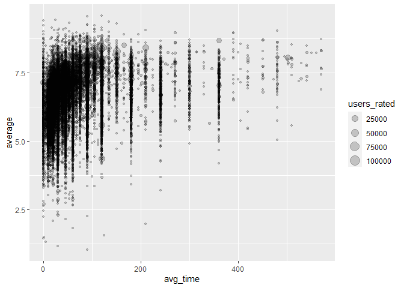
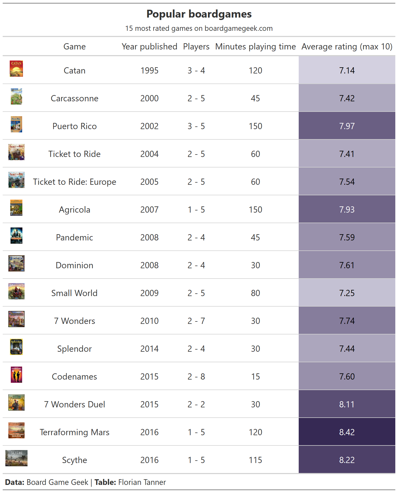

2022-01-25 Board games
================

    ## Warning: package 'gt' was built under R version 4.1.2

## Read data

``` r
ratings <- readr::read_csv('https://raw.githubusercontent.com/rfordatascience/tidytuesday/master/data/2022/2022-01-25/ratings.csv')
```

    ## Rows: 21831 Columns: 10

    ## -- Column specification --------------------------------------------------------
    ## Delimiter: ","
    ## chr (3): name, url, thumbnail
    ## dbl (7): num, id, year, rank, average, bayes_average, users_rated

    ## 
    ## i Use `spec()` to retrieve the full column specification for this data.
    ## i Specify the column types or set `show_col_types = FALSE` to quiet this message.

``` r
details <- readr::read_csv('https://raw.githubusercontent.com/rfordatascience/tidytuesday/master/data/2022/2022-01-25/details.csv')
```

    ## Rows: 21631 Columns: 23

    ## -- Column specification --------------------------------------------------------
    ## Delimiter: ","
    ## chr (10): primary, description, boardgamecategory, boardgamemechanic, boardg...
    ## dbl (13): num, id, yearpublished, minplayers, maxplayers, playingtime, minpl...

    ## 
    ## i Use `spec()` to retrieve the full column specification for this data.
    ## i Specify the column types or set `show_col_types = FALSE` to quiet this message.

## Questions

-   Is rating influenced by play lengths
-   How long do different categories of games take?
-   Best designers, best artists?

## Notes

-   Character columns are Python lists
-   Link to thumbnail is included! Could be used for highlighting
-   Maxplaytime and playtime are equal
-   reviews users posted on boardgamegeek

## EDA

``` r
joined <- details |> 
  left_join(ratings, by = "id") 

joined |> 
  skimr::skim()
```

|                                                  |        |
|:-------------------------------------------------|:-------|
| Name                                             | joined |
| Number of rows                                   | 21631  |
| Number of columns                                | 32     |
| \_\_\_\_\_\_\_\_\_\_\_\_\_\_\_\_\_\_\_\_\_\_\_   |        |
| Column type frequency:                           |        |
| character                                        | 13     |
| numeric                                          | 19     |
| \_\_\_\_\_\_\_\_\_\_\_\_\_\_\_\_\_\_\_\_\_\_\_\_ |        |
| Group variables                                  | None   |

Data summary

**Variable type: character**

| skim_variable           | n_missing | complete_rate | min |   max | empty | n_unique | whitespace |
|:------------------------|----------:|--------------:|----:|------:|------:|---------:|-----------:|
| primary                 |         0 |          1.00 |   1 |   107 |     0 |    21236 |          0 |
| description             |         1 |          1.00 |  49 | 16144 |     0 |    21615 |          0 |
| boardgamecategory       |       283 |          0.99 |   8 |   216 |     0 |     6730 |          0 |
| boardgamemechanic       |      1590 |          0.93 |   8 |   478 |     0 |     8291 |          0 |
| boardgamefamily         |      3761 |          0.83 |  13 |  2768 |     0 |    11285 |          0 |
| boardgameexpansion      |     16125 |          0.25 |   7 | 18150 |     0 |     5264 |          0 |
| boardgameimplementation |     16769 |          0.22 |   6 |   890 |     0 |     4247 |          0 |
| boardgamedesigner       |       596 |          0.97 |   7 |   332 |     0 |     9136 |          0 |
| boardgameartist         |      5907 |          0.73 |   6 |  8408 |     0 |     9080 |          0 |
| boardgamepublisher      |         1 |          1.00 |   6 |  3744 |     0 |    11265 |          0 |
| name                    |         0 |          1.00 |   1 |   107 |     0 |    21236 |          0 |
| url                     |         0 |          1.00 |  16 |    68 |     0 |    21631 |          0 |
| thumbnail               |         6 |          1.00 | 135 |   139 |     0 |    21616 |          0 |

**Variable type: numeric**

| skim_variable | n_missing | complete_rate |      mean |        sd |       p0 |      p25 |       p50 |       p75 |      p100 | hist  |
|:--------------|----------:|--------------:|----------:|----------:|---------:|---------:|----------:|----------:|----------:|:------|
| num.x         |         0 |             1 |  10815.00 |   6244.48 |     0.00 |  5407.50 |  10815.00 |  16222.50 |  21630.00 | ▇▇▇▇▇ |
| id            |         0 |             1 | 118133.09 | 105310.42 |     1.00 | 12280.50 | 105187.00 | 207013.00 | 350992.00 | ▇▂▃▃▂ |
| yearpublished |         0 |             1 |   1986.09 |    210.04 | -3500.00 |  2001.00 |   2011.00 |   2017.00 |   2023.00 | ▁▁▁▁▇ |
| minplayers    |         0 |             1 |      2.01 |      0.69 |     0.00 |     2.00 |      2.00 |      2.00 |     10.00 | ▇▁▁▁▁ |
| maxplayers    |         0 |             1 |      5.71 |     15.10 |     0.00 |     4.00 |      4.00 |      6.00 |    999.00 | ▇▁▁▁▁ |
| playingtime   |         0 |             1 |     90.51 |    534.83 |     0.00 |    25.00 |     45.00 |     90.00 |  60000.00 | ▇▁▁▁▁ |
| minplaytime   |         0 |             1 |     63.65 |    447.21 |     0.00 |    20.00 |     30.00 |     60.00 |  60000.00 | ▇▁▁▁▁ |
| maxplaytime   |         0 |             1 |     90.51 |    534.83 |     0.00 |    25.00 |     45.00 |     90.00 |  60000.00 | ▇▁▁▁▁ |
| minage        |         0 |             1 |      9.61 |      3.64 |     0.00 |     8.00 |     10.00 |     12.00 |     25.00 | ▂▇▆▁▁ |
| owned         |         0 |             1 |   1487.92 |   5395.08 |     0.00 |   150.00 |    322.00 |    903.50 | 168364.00 | ▇▁▁▁▁ |
| trading       |         0 |             1 |     43.59 |    102.41 |     0.00 |     5.00 |     13.00 |     38.00 |   2508.00 | ▇▁▁▁▁ |
| wanting       |         0 |             1 |     42.03 |    117.94 |     0.00 |     3.00 |      9.00 |     29.00 |   2011.00 | ▇▁▁▁▁ |
| wishing       |         0 |             1 |    233.66 |    800.66 |     0.00 |    14.00 |     39.00 |    131.00 |  19325.00 | ▇▁▁▁▁ |
| num.y         |         0 |             1 |  10878.52 |   6311.92 |     0.00 |  5407.50 |  10838.00 |  16355.50 |  21830.00 | ▇▇▇▇▇ |
| year          |         0 |             1 |   1988.10 |    190.12 |     0.00 |  2001.00 |   2011.00 |   2017.00 |   3500.00 | ▁▁▇▁▁ |
| rank          |         0 |             1 |  10879.52 |   6311.92 |     1.00 |  5408.50 |  10839.00 |  16356.50 |  21831.00 | ▇▇▇▇▇ |
| average       |         0 |             1 |      6.42 |      0.93 |     1.04 |     5.83 |      6.45 |      7.04 |      9.57 | ▁▁▅▇▁ |
| bayes_average |         0 |             1 |      5.68 |      0.37 |     0.00 |     5.51 |      5.55 |      5.68 |      8.51 | ▁▁▁▇▁ |
| users_rated   |         0 |             1 |    874.55 |   3695.95 |    30.00 |    57.00 |    124.00 |    397.00 | 108975.00 | ▇▁▁▁▁ |

``` r
mean(joined$playingtime == joined$maxplaytime)
```

    ## [1] 1

``` r
joined |> 
  mutate(avg_time = (playingtime + minplaytime)/2) |> 
  filter(avg_time < 600) |> 
  ggplot(aes(x = avg_time, y = average, size = users_rated)) +
  geom_point(alpha = 0.2)
```

<!-- -->

``` r
long_games <- joined |> 
  mutate(avg_time = (playingtime + minplaytime)/2) |> 
  filter(avg_time > 600)
```

``` r
joined |> 
  filter(playingtime < 10)
```

    ## # A tibble: 970 x 32
    ##    num.x     id primary             description yearpublished minplayers maxplayers
    ##    <dbl>  <dbl> <chr>               <chr>               <dbl>      <dbl>      <dbl>
    ##  1    67    171 Chess               Chess is a~          1475          2          2
    ##  2   820 194626 Happy Salmon        Descriptio~          2016          3          6
    ##  3  1029  11901 Tic-Tac-Toe         A very old~         -1300          2          2
    ##  4  1036   1540 BattleTech          BattleTech~          1985          2          0
    ##  5  1091  19841 Pentago             Pentago is~          2005          2          2
    ##  6  1290  65611 Cthulhu Dice        Serving Ct~          2010          2          6
    ##  7  1565 253618 5-Minute Marvel     The Marvel~          2018          2          5
    ##  8  1941  33468 Zombie in My Pocket There are ~          2007          1          1
    ##  9  2021 184491 Spaceteam           Spaceteam ~          2015          3          6
    ## 10  2141  10799 Old Maid            Old Maid i~          1874          2          6
    ## # ... with 960 more rows, and 25 more variables: playingtime <dbl>,
    ## #   minplaytime <dbl>, maxplaytime <dbl>, minage <dbl>,
    ## #   boardgamecategory <chr>, boardgamemechanic <chr>, boardgamefamily <chr>,
    ## #   boardgameexpansion <chr>, boardgameimplementation <chr>,
    ## #   boardgamedesigner <chr>, boardgameartist <chr>, boardgamepublisher <chr>,
    ## #   owned <dbl>, trading <dbl>, wanting <dbl>, wishing <dbl>, num.y <dbl>,
    ## #   name <chr>, year <dbl>, rank <dbl>, average <dbl>, bayes_average <dbl>, ...

## Table of highly rated games

``` r
tab <- joined |> 
  slice_max(users_rated, n = 15) |> 
  mutate(players = str_c(minplayers, " - ", maxplayers)) |> 
  select(thumbnail, name, yearpublished, players, 
         playingtime, average) |> 
  arrange(yearpublished) |> 
  gt() |> 
  data_color(columns = average,
             colors = scales::col_numeric(
               palette = 
                 c(paletteer::paletteer_c("scico::acton", 2, direction = -1)),
               domain = c(7, 8.5))) |> 
  text_transform(
    locations = cells_body(thumbnail),
    fn = function(x) {
      web_image(
        url = x
      )}) |> 
  cols_align(
    align = c("center"),
    columns = c(everything())
  ) |> 
  tab_header(
    title = md("**Popular boardgames**"),
    subtitle = md("15 most rated games on boardgamegeek.com")) |> 
  tab_source_note(md("**Data:** Board Game Geek | **Table:** Florian Tanner")) |> 
  cols_label(
    name = "Game",
    yearpublished = "Year\npublished",
    players = "Players",
    playingtime = "Minutes\nplaying\ntime",
    average = "Average\nrating\n(max 10)",
    thumbnail = "") 
```

``` r
tab
```

<div id="javtvrqurj" style="overflow-x:auto;overflow-y:auto;width:auto;height:auto;">
<style>html {
  font-family: -apple-system, BlinkMacSystemFont, 'Segoe UI', Roboto, Oxygen, Ubuntu, Cantarell, 'Helvetica Neue', 'Fira Sans', 'Droid Sans', Arial, sans-serif;
}

#javtvrqurj .gt_table {
  display: table;
  border-collapse: collapse;
  margin-left: auto;
  margin-right: auto;
  color: #333333;
  font-size: 16px;
  font-weight: normal;
  font-style: normal;
  background-color: #FFFFFF;
  width: auto;
  border-top-style: solid;
  border-top-width: 2px;
  border-top-color: #A8A8A8;
  border-right-style: none;
  border-right-width: 2px;
  border-right-color: #D3D3D3;
  border-bottom-style: solid;
  border-bottom-width: 2px;
  border-bottom-color: #A8A8A8;
  border-left-style: none;
  border-left-width: 2px;
  border-left-color: #D3D3D3;
}

#javtvrqurj .gt_heading {
  background-color: #FFFFFF;
  text-align: center;
  border-bottom-color: #FFFFFF;
  border-left-style: none;
  border-left-width: 1px;
  border-left-color: #D3D3D3;
  border-right-style: none;
  border-right-width: 1px;
  border-right-color: #D3D3D3;
}

#javtvrqurj .gt_title {
  color: #333333;
  font-size: 125%;
  font-weight: initial;
  padding-top: 4px;
  padding-bottom: 4px;
  border-bottom-color: #FFFFFF;
  border-bottom-width: 0;
}

#javtvrqurj .gt_subtitle {
  color: #333333;
  font-size: 85%;
  font-weight: initial;
  padding-top: 0;
  padding-bottom: 6px;
  border-top-color: #FFFFFF;
  border-top-width: 0;
}

#javtvrqurj .gt_bottom_border {
  border-bottom-style: solid;
  border-bottom-width: 2px;
  border-bottom-color: #D3D3D3;
}

#javtvrqurj .gt_col_headings {
  border-top-style: solid;
  border-top-width: 2px;
  border-top-color: #D3D3D3;
  border-bottom-style: solid;
  border-bottom-width: 2px;
  border-bottom-color: #D3D3D3;
  border-left-style: none;
  border-left-width: 1px;
  border-left-color: #D3D3D3;
  border-right-style: none;
  border-right-width: 1px;
  border-right-color: #D3D3D3;
}

#javtvrqurj .gt_col_heading {
  color: #333333;
  background-color: #FFFFFF;
  font-size: 100%;
  font-weight: normal;
  text-transform: inherit;
  border-left-style: none;
  border-left-width: 1px;
  border-left-color: #D3D3D3;
  border-right-style: none;
  border-right-width: 1px;
  border-right-color: #D3D3D3;
  vertical-align: bottom;
  padding-top: 5px;
  padding-bottom: 6px;
  padding-left: 5px;
  padding-right: 5px;
  overflow-x: hidden;
}

#javtvrqurj .gt_column_spanner_outer {
  color: #333333;
  background-color: #FFFFFF;
  font-size: 100%;
  font-weight: normal;
  text-transform: inherit;
  padding-top: 0;
  padding-bottom: 0;
  padding-left: 4px;
  padding-right: 4px;
}

#javtvrqurj .gt_column_spanner_outer:first-child {
  padding-left: 0;
}

#javtvrqurj .gt_column_spanner_outer:last-child {
  padding-right: 0;
}

#javtvrqurj .gt_column_spanner {
  border-bottom-style: solid;
  border-bottom-width: 2px;
  border-bottom-color: #D3D3D3;
  vertical-align: bottom;
  padding-top: 5px;
  padding-bottom: 5px;
  overflow-x: hidden;
  display: inline-block;
  width: 100%;
}

#javtvrqurj .gt_group_heading {
  padding: 8px;
  color: #333333;
  background-color: #FFFFFF;
  font-size: 100%;
  font-weight: initial;
  text-transform: inherit;
  border-top-style: solid;
  border-top-width: 2px;
  border-top-color: #D3D3D3;
  border-bottom-style: solid;
  border-bottom-width: 2px;
  border-bottom-color: #D3D3D3;
  border-left-style: none;
  border-left-width: 1px;
  border-left-color: #D3D3D3;
  border-right-style: none;
  border-right-width: 1px;
  border-right-color: #D3D3D3;
  vertical-align: middle;
}

#javtvrqurj .gt_empty_group_heading {
  padding: 0.5px;
  color: #333333;
  background-color: #FFFFFF;
  font-size: 100%;
  font-weight: initial;
  border-top-style: solid;
  border-top-width: 2px;
  border-top-color: #D3D3D3;
  border-bottom-style: solid;
  border-bottom-width: 2px;
  border-bottom-color: #D3D3D3;
  vertical-align: middle;
}

#javtvrqurj .gt_from_md > :first-child {
  margin-top: 0;
}

#javtvrqurj .gt_from_md > :last-child {
  margin-bottom: 0;
}

#javtvrqurj .gt_row {
  padding-top: 8px;
  padding-bottom: 8px;
  padding-left: 5px;
  padding-right: 5px;
  margin: 10px;
  border-top-style: solid;
  border-top-width: 1px;
  border-top-color: #D3D3D3;
  border-left-style: none;
  border-left-width: 1px;
  border-left-color: #D3D3D3;
  border-right-style: none;
  border-right-width: 1px;
  border-right-color: #D3D3D3;
  vertical-align: middle;
  overflow-x: hidden;
}

#javtvrqurj .gt_stub {
  color: #333333;
  background-color: #FFFFFF;
  font-size: 100%;
  font-weight: initial;
  text-transform: inherit;
  border-right-style: solid;
  border-right-width: 2px;
  border-right-color: #D3D3D3;
  padding-left: 12px;
}

#javtvrqurj .gt_summary_row {
  color: #333333;
  background-color: #FFFFFF;
  text-transform: inherit;
  padding-top: 8px;
  padding-bottom: 8px;
  padding-left: 5px;
  padding-right: 5px;
}

#javtvrqurj .gt_first_summary_row {
  padding-top: 8px;
  padding-bottom: 8px;
  padding-left: 5px;
  padding-right: 5px;
  border-top-style: solid;
  border-top-width: 2px;
  border-top-color: #D3D3D3;
}

#javtvrqurj .gt_grand_summary_row {
  color: #333333;
  background-color: #FFFFFF;
  text-transform: inherit;
  padding-top: 8px;
  padding-bottom: 8px;
  padding-left: 5px;
  padding-right: 5px;
}

#javtvrqurj .gt_first_grand_summary_row {
  padding-top: 8px;
  padding-bottom: 8px;
  padding-left: 5px;
  padding-right: 5px;
  border-top-style: double;
  border-top-width: 6px;
  border-top-color: #D3D3D3;
}

#javtvrqurj .gt_striped {
  background-color: rgba(128, 128, 128, 0.05);
}

#javtvrqurj .gt_table_body {
  border-top-style: solid;
  border-top-width: 2px;
  border-top-color: #D3D3D3;
  border-bottom-style: solid;
  border-bottom-width: 2px;
  border-bottom-color: #D3D3D3;
}

#javtvrqurj .gt_footnotes {
  color: #333333;
  background-color: #FFFFFF;
  border-bottom-style: none;
  border-bottom-width: 2px;
  border-bottom-color: #D3D3D3;
  border-left-style: none;
  border-left-width: 2px;
  border-left-color: #D3D3D3;
  border-right-style: none;
  border-right-width: 2px;
  border-right-color: #D3D3D3;
}

#javtvrqurj .gt_footnote {
  margin: 0px;
  font-size: 90%;
  padding: 4px;
}

#javtvrqurj .gt_sourcenotes {
  color: #333333;
  background-color: #FFFFFF;
  border-bottom-style: none;
  border-bottom-width: 2px;
  border-bottom-color: #D3D3D3;
  border-left-style: none;
  border-left-width: 2px;
  border-left-color: #D3D3D3;
  border-right-style: none;
  border-right-width: 2px;
  border-right-color: #D3D3D3;
}

#javtvrqurj .gt_sourcenote {
  font-size: 90%;
  padding: 4px;
}

#javtvrqurj .gt_left {
  text-align: left;
}

#javtvrqurj .gt_center {
  text-align: center;
}

#javtvrqurj .gt_right {
  text-align: right;
  font-variant-numeric: tabular-nums;
}

#javtvrqurj .gt_font_normal {
  font-weight: normal;
}

#javtvrqurj .gt_font_bold {
  font-weight: bold;
}

#javtvrqurj .gt_font_italic {
  font-style: italic;
}

#javtvrqurj .gt_super {
  font-size: 65%;
}

#javtvrqurj .gt_footnote_marks {
  font-style: italic;
  font-weight: normal;
  font-size: 65%;
}
</style>
<table class="gt_table">
  <thead class="gt_header">
    <tr>
      <th colspan="6" class="gt_heading gt_title gt_font_normal" style><strong>Popular boardgames</strong></th>
    </tr>
    <tr>
      <th colspan="6" class="gt_heading gt_subtitle gt_font_normal gt_bottom_border" style>15 most rated games on boardgamegeek.com</th>
    </tr>
  </thead>
  <thead class="gt_col_headings">
    <tr>
      <th class="gt_col_heading gt_columns_bottom_border gt_center" rowspan="1" colspan="1"></th>
      <th class="gt_col_heading gt_columns_bottom_border gt_center" rowspan="1" colspan="1">Game</th>
      <th class="gt_col_heading gt_columns_bottom_border gt_center" rowspan="1" colspan="1">Year
published</th>
      <th class="gt_col_heading gt_columns_bottom_border gt_center" rowspan="1" colspan="1">Players</th>
      <th class="gt_col_heading gt_columns_bottom_border gt_center" rowspan="1" colspan="1">Minutes
playing
time</th>
      <th class="gt_col_heading gt_columns_bottom_border gt_center" rowspan="1" colspan="1">Average
rating
(max 10)</th>
    </tr>
  </thead>
  <tbody class="gt_table_body">
    <tr><td class="gt_row gt_center"></td>
<td class="gt_row gt_center">Catan</td>
<td class="gt_row gt_center">1995</td>
<td class="gt_row gt_center">3 - 4</td>
<td class="gt_row gt_center">120</td>
<td class="gt_row gt_center" style="background-color: #D3D0E0; color: #000000;">7.14</td></tr>
    <tr><td class="gt_row gt_center"></td>
<td class="gt_row gt_center">Carcassonne</td>
<td class="gt_row gt_center">2000</td>
<td class="gt_row gt_center">2 - 5</td>
<td class="gt_row gt_center">45</td>
<td class="gt_row gt_center" style="background-color: #AEA9BF; color: #000000;">7.42</td></tr>
    <tr><td class="gt_row gt_center"></td>
<td class="gt_row gt_center">Puerto Rico</td>
<td class="gt_row gt_center">2002</td>
<td class="gt_row gt_center">3 - 5</td>
<td class="gt_row gt_center">150</td>
<td class="gt_row gt_center" style="background-color: #6A5F83; color: #FFFFFF;">7.97</td></tr>
    <tr><td class="gt_row gt_center"></td>
<td class="gt_row gt_center">Ticket to Ride</td>
<td class="gt_row gt_center">2004</td>
<td class="gt_row gt_center">2 - 5</td>
<td class="gt_row gt_center">60</td>
<td class="gt_row gt_center" style="background-color: #B0AAC0; color: #000000;">7.41</td></tr>
    <tr><td class="gt_row gt_center"></td>
<td class="gt_row gt_center">Ticket to Ride: Europe</td>
<td class="gt_row gt_center">2005</td>
<td class="gt_row gt_center">2 - 5</td>
<td class="gt_row gt_center">60</td>
<td class="gt_row gt_center" style="background-color: #9F98B2; color: #000000;">7.54</td></tr>
    <tr><td class="gt_row gt_center"></td>
<td class="gt_row gt_center">Agricola</td>
<td class="gt_row gt_center">2007</td>
<td class="gt_row gt_center">1 - 5</td>
<td class="gt_row gt_center">150</td>
<td class="gt_row gt_center" style="background-color: #6F6487; color: #FFFFFF;">7.93</td></tr>
    <tr><td class="gt_row gt_center"></td>
<td class="gt_row gt_center">Pandemic</td>
<td class="gt_row gt_center">2008</td>
<td class="gt_row gt_center">2 - 4</td>
<td class="gt_row gt_center">45</td>
<td class="gt_row gt_center" style="background-color: #9991AC; color: #000000;">7.59</td></tr>
    <tr><td class="gt_row gt_center"></td>
<td class="gt_row gt_center">Dominion</td>
<td class="gt_row gt_center">2008</td>
<td class="gt_row gt_center">2 - 4</td>
<td class="gt_row gt_center">30</td>
<td class="gt_row gt_center" style="background-color: #968EAA; color: #000000;">7.61</td></tr>
    <tr><td class="gt_row gt_center"></td>
<td class="gt_row gt_center">Small World</td>
<td class="gt_row gt_center">2009</td>
<td class="gt_row gt_center">2 - 5</td>
<td class="gt_row gt_center">80</td>
<td class="gt_row gt_center" style="background-color: #C4C1D3; color: #000000;">7.25</td></tr>
    <tr><td class="gt_row gt_center"></td>
<td class="gt_row gt_center">7 Wonders</td>
<td class="gt_row gt_center">2010</td>
<td class="gt_row gt_center">2 - 7</td>
<td class="gt_row gt_center">30</td>
<td class="gt_row gt_center" style="background-color: #867D9C; color: #000000;">7.74</td></tr>
    <tr><td class="gt_row gt_center"></td>
<td class="gt_row gt_center">Splendor</td>
<td class="gt_row gt_center">2014</td>
<td class="gt_row gt_center">2 - 4</td>
<td class="gt_row gt_center">30</td>
<td class="gt_row gt_center" style="background-color: #ACA6BD; color: #000000;">7.44</td></tr>
    <tr><td class="gt_row gt_center"></td>
<td class="gt_row gt_center">Codenames</td>
<td class="gt_row gt_center">2015</td>
<td class="gt_row gt_center">2 - 8</td>
<td class="gt_row gt_center">15</td>
<td class="gt_row gt_center" style="background-color: #9890AB; color: #000000;">7.60</td></tr>
    <tr><td class="gt_row gt_center"></td>
<td class="gt_row gt_center">7 Wonders Duel</td>
<td class="gt_row gt_center">2015</td>
<td class="gt_row gt_center">2 - 2</td>
<td class="gt_row gt_center">30</td>
<td class="gt_row gt_center" style="background-color: #5A4E74; color: #FFFFFF;">8.11</td></tr>
    <tr><td class="gt_row gt_center"></td>
<td class="gt_row gt_center">Terraforming Mars</td>
<td class="gt_row gt_center">2016</td>
<td class="gt_row gt_center">1 - 5</td>
<td class="gt_row gt_center">120</td>
<td class="gt_row gt_center" style="background-color: #362954; color: #FFFFFF;">8.42</td></tr>
    <tr><td class="gt_row gt_center"></td>
<td class="gt_row gt_center">Scythe</td>
<td class="gt_row gt_center">2016</td>
<td class="gt_row gt_center">1 - 5</td>
<td class="gt_row gt_center">115</td>
<td class="gt_row gt_center" style="background-color: #4D4068; color: #FFFFFF;">8.22</td></tr>
  </tbody>
  <tfoot class="gt_sourcenotes">
    <tr>
      <td class="gt_sourcenote" colspan="6"><strong>Data:</strong> Board Game Geek | <strong>Table:</strong> Florian Tanner</td>
    </tr>
  </tfoot>
  
</table>
</div>

``` r
gtsave(tab, "boardgames.png")
```

<!-- -->

``` r
sessionInfo()
```

    ## R version 4.1.1 (2021-08-10)
    ## Platform: x86_64-w64-mingw32/x64 (64-bit)
    ## Running under: Windows 10 x64 (build 19042)
    ## 
    ## Matrix products: default
    ## 
    ## locale:
    ## [1] LC_COLLATE=English_United States.1252 
    ## [2] LC_CTYPE=English_United States.1252   
    ## [3] LC_MONETARY=English_United States.1252
    ## [4] LC_NUMERIC=C                          
    ## [5] LC_TIME=English_United States.1252    
    ## 
    ## attached base packages:
    ## [1] stats     graphics  grDevices utils     datasets  methods   base     
    ## 
    ## other attached packages:
    ##  [1] gt_0.3.1        forcats_0.5.1   stringr_1.4.0   dplyr_1.0.7    
    ##  [5] purrr_0.3.4     readr_2.0.2     tidyr_1.1.4     tibble_3.1.5   
    ##  [9] ggplot2_3.3.5   tidyverse_1.3.1
    ## 
    ## loaded via a namespace (and not attached):
    ##  [1] httr_1.4.2       sass_0.4.0       bit64_4.0.5      vroom_1.5.5     
    ##  [5] jsonlite_1.7.2   modelr_0.1.8     paletteer_1.4.0  assertthat_0.2.1
    ##  [9] highr_0.9        cellranger_1.1.0 yaml_2.2.1       pillar_1.6.3    
    ## [13] backports_1.2.1  glue_1.4.2       digest_0.6.28    checkmate_2.0.0 
    ## [17] rvest_1.0.1      colorspace_2.0-2 htmltools_0.5.2  pkgconfig_2.0.3 
    ## [21] broom_0.7.9      haven_2.4.3      scales_1.1.1     webshot_0.5.2   
    ## [25] processx_3.5.2   tzdb_0.1.2       generics_0.1.0   farver_2.1.0    
    ## [29] ellipsis_0.3.2   withr_2.4.2      repr_1.1.3       skimr_2.1.3     
    ## [33] cli_3.0.1        magrittr_2.0.1   crayon_1.4.1     readxl_1.3.1    
    ## [37] ps_1.6.0         evaluate_0.14    fs_1.5.0         fansi_0.5.0     
    ## [41] xml2_1.3.2       tools_4.1.1      hms_1.1.1        lifecycle_1.0.1 
    ## [45] munsell_0.5.0    reprex_2.0.1     callr_3.7.0      compiler_4.1.1  
    ## [49] rlang_0.4.11     grid_4.1.1       rstudioapi_0.13  base64enc_0.1-3 
    ## [53] labeling_0.4.2   rmarkdown_2.11   gtable_0.3.0     DBI_1.1.1       
    ## [57] curl_4.3.2       rematch2_2.1.2   R6_2.5.1         lubridate_1.7.10
    ## [61] knitr_1.36       fastmap_1.1.0    bit_4.0.4        utf8_1.2.2      
    ## [65] prismatic_1.0.0  commonmark_1.7   scico_1.3.0      stringi_1.7.5   
    ## [69] parallel_4.1.1   Rcpp_1.0.7       vctrs_0.3.8      dbplyr_2.1.1    
    ## [73] tidyselect_1.1.1 xfun_0.26
