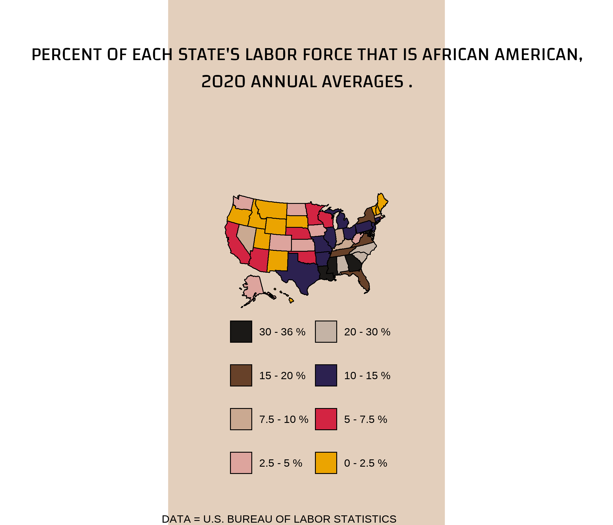

2022-02-15 #DuBoisChallenge2022
================

``` r
rm(list = ls())

library(tidyverse)
```

    ## -- Attaching packages --------------------------------------- tidyverse 1.3.1 --

    ## v ggplot2 3.3.5     v purrr   0.3.4
    ## v tibble  3.1.5     v dplyr   1.0.7
    ## v tidyr   1.1.4     v stringr 1.4.0
    ## v readr   2.0.2     v forcats 0.5.1

    ## -- Conflicts ------------------------------------------ tidyverse_conflicts() --
    ## x dplyr::filter() masks stats::filter()
    ## x dplyr::lag()    masks stats::lag()

``` r
library(cdlTools)
```

    ## Warning: package 'cdlTools' was built under R version 4.1.2

``` r
library(usmap)
```

    ## 
    ## Attaching package: 'usmap'

    ## The following object is masked from 'package:cdlTools':
    ## 
    ##     fips

``` r
library(showtext)
```

    ## Loading required package: sysfonts

    ## Loading required package: showtextdb

``` r
sysfonts::font_add_google("Changa")
showtext_opts(dpi = 300)
showtext_auto(enable = TRUE)


font <- "Changa"
```

# challenge_03 Map

``` r
dat2020 <- read_csv("data2020.csv") |>  janitor::clean_names()
```

    ## Rows: 51 Columns: 2

    ## -- Column specification --------------------------------------------------------
    ## Delimiter: ","
    ## chr (1): State
    ## dbl (1): Percent of labor force

    ## 
    ## i Use `spec()` to retrieve the full column specification for this data.
    ## i Specify the column types or set `show_col_types = FALSE` to quiet this message.

## Make bins

-   This split gives a somewhat even distribution of states into bins

``` r
dat_binned <- dat2020 |> 
  mutate(bin = case_when(percent_of_labor_force <=36 & percent_of_labor_force > 30 ~ "30 - 36 %",
                         percent_of_labor_force <=30 & percent_of_labor_force > 20 ~ "20 - 30 %",
                         percent_of_labor_force <=20 & percent_of_labor_force > 15 ~ "15 - 20 %",
                         percent_of_labor_force <=15 & percent_of_labor_force > 10 ~ "10 - 15 %",
                         percent_of_labor_force <=10 & percent_of_labor_force > 7.5 ~ "7.5 - 10 %",
                         percent_of_labor_force <=7.5 & percent_of_labor_force > 5 ~ "5 - 7.5 %",
                         percent_of_labor_force <=5 & percent_of_labor_force > 2.5 ~ "2.5 - 5 %",
                         percent_of_labor_force <=2.5& percent_of_labor_force > 0 ~ "0 - 2.5 %"),
         bin = fct_relevel(bin, levels = c("30 - 36 %","20 - 30 %",  
                                      "15 - 20 %", "10 - 15 %",
                                      "7.5 - 10 %", "5 - 7.5 %",
                                      "2.5 - 5 %", "0 - 2.5 %")),
         fips = fips(state))
```

    ## Warning: Outer names are only allowed for unnamed scalar atomic inputs

## Building theme

### Color palette

``` r
# Fills for map
black_fill <- "#1b1917"
yellow_fill <- "#eba400"
dark_brown_fill <- "#674129"
pink_fill <- "#dda49d"
bright_red_fill <- "#d32442"
light_brown_fill <- "#caa991"
dark_blue_fill <- "#2c2150"
grey_fill <- "#c4b3a5" # In lieu of the textured fills

# Other
map_background <- "#cdbbaa"
panel_background <- "#e3cfbc"
text_color <- "#241c18"
```

### Theme

``` r
theme_panel_03 <- theme_void()+
  theme(legend.background = element_rect(color = panel_background,fill = panel_background), 
        legend.title = element_blank(),
        legend.position = "bottom",
        legend.key.size = unit(1.3, "lines"),
        legend.spacing.y = unit(1.2, "lines"),
        legend.margin = margin(0,1,1,1, unit = "cm"),
        axis.title.y=element_blank(),
        axis.text.y=element_blank(),
        axis.ticks.y=element_blank(),
        axis.ticks.x=element_blank(),
        axis.title.x = element_blank(),
        plot.title = element_text(hjust = 0.5, family = font, 
                                  size = 15.5, margin = margin(0, 0, 80, 0),
                                  lineheight = 1.2),
        plot.margin = margin(40,40,0, 40),
        panel.border = element_blank(),
        panel.grid.major = element_blank(),
        panel.grid.minor = element_blank(),
        panel.grid = element_line(), 
        panel.background = element_rect(fill = panel_background, color = panel_background),
        plot.background = element_rect(fill = panel_background, color = panel_background),
        axis.text.x=element_blank()) 
```

## Set titles

``` r
title_03 = "PERCENT OF EACH STATE'S LABOR FORCE THAT IS AFRICAN AMERICAN,\n2020 ANNUAL AVERAGES ."
caption_03 = "DATA = U.S. BUREAU OF LABOR STATISTICS"
```

## Basic map

``` r
basic_map_gg <- plot_usmap(data = dat_binned, regions = "states", values = "bin")
```

## Add theme

``` r
p <- basic_map_gg +
  labs(title = title_03, caption= caption_03) +
  scale_fill_manual(values = c(black_fill, grey_fill, dark_brown_fill, dark_blue_fill, 
                               light_brown_fill, bright_red_fill, pink_fill, yellow_fill)) +
  theme_panel_03 +
  guides(fill = guide_legend(ncol = 2, byrow = TRUE))

p
```

<!-- -->

``` r
ggsave(p, filename = "challenge_03.png", units = "cm", width = 12, height = 16, limitsize = F, scale = 1.4)
```

``` r
sessionInfo()
```

    ## R version 4.1.1 (2021-08-10)
    ## Platform: x86_64-w64-mingw32/x64 (64-bit)
    ## Running under: Windows 10 x64 (build 19044)
    ## 
    ## Matrix products: default
    ## 
    ## locale:
    ## [1] LC_COLLATE=English_United States.1252 
    ## [2] LC_CTYPE=English_United States.1252   
    ## [3] LC_MONETARY=English_United States.1252
    ## [4] LC_NUMERIC=C                          
    ## [5] LC_TIME=English_United States.1252    
    ## 
    ## attached base packages:
    ## [1] stats     graphics  grDevices utils     datasets  methods   base     
    ## 
    ## other attached packages:
    ##  [1] showtext_0.9-4  showtextdb_3.0  sysfonts_0.8.5  usmap_0.5.2    
    ##  [5] cdlTools_0.15   forcats_0.5.1   stringr_1.4.0   dplyr_1.0.7    
    ##  [9] purrr_0.3.4     readr_2.0.2     tidyr_1.1.4     tibble_3.1.5   
    ## [13] ggplot2_3.3.5   tidyverse_1.3.1
    ## 
    ## loaded via a namespace (and not attached):
    ##  [1] httr_1.4.2       bit64_4.0.5      vroom_1.5.5      jsonlite_1.7.2  
    ##  [5] modelr_0.1.8     assertthat_0.2.1 highr_0.9        sp_1.4-5        
    ##  [9] cellranger_1.1.0 yaml_2.2.1       pillar_1.6.3     backports_1.2.1 
    ## [13] lattice_0.20-44  glue_1.4.2       digest_0.6.28    rvest_1.0.1     
    ## [17] snakecase_0.11.0 colorspace_2.0-2 htmltools_0.5.2  pkgconfig_2.0.3 
    ## [21] broom_0.7.9      raster_3.5-15    haven_2.4.3      scales_1.1.1    
    ## [25] terra_1.5-17     tzdb_0.1.2       generics_0.1.0   farver_2.1.0    
    ## [29] ellipsis_0.3.2   withr_2.4.2      janitor_2.1.0    cli_3.0.1       
    ## [33] magrittr_2.0.1   crayon_1.4.1     readxl_1.3.1     evaluate_0.14   
    ## [37] fs_1.5.0         fansi_0.5.0      xml2_1.3.2       tools_4.1.1     
    ## [41] hms_1.1.1        lifecycle_1.0.1  munsell_0.5.0    reprex_2.0.1    
    ## [45] compiler_4.1.1   rlang_0.4.11     grid_4.1.1       rstudioapi_0.13 
    ## [49] labeling_0.4.2   rmarkdown_2.11   gtable_0.3.0     codetools_0.2-18
    ## [53] DBI_1.1.1        curl_4.3.2       R6_2.5.1         lubridate_1.7.10
    ## [57] knitr_1.36       fastmap_1.1.0    bit_4.0.4        utf8_1.2.2      
    ## [61] stringi_1.7.5    parallel_4.1.1   Rcpp_1.0.7       vctrs_0.3.8     
    ## [65] dbplyr_2.1.1     tidyselect_1.1.1 xfun_0.26
