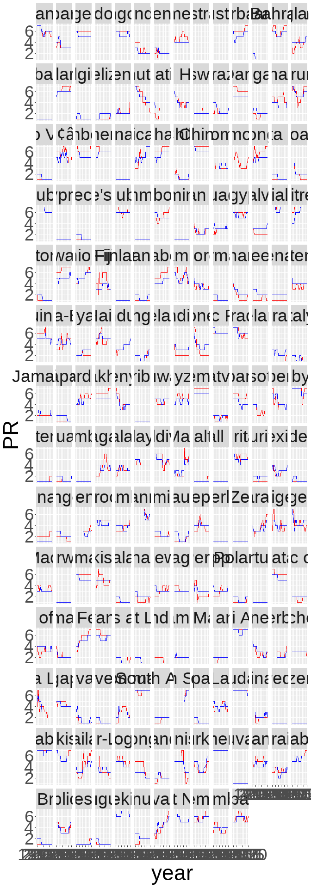

2022-02-22 World Freedom index
================
Florian Tanner
2022-02-22 22:32:01

``` r
rm(list = ls())

library(tidyverse)
```

    ## -- Attaching packages --------------------------------------- tidyverse 1.3.1 --

    ## v ggplot2 3.3.5     v purrr   0.3.4
    ## v tibble  3.1.5     v dplyr   1.0.7
    ## v tidyr   1.1.4     v stringr 1.4.0
    ## v readr   2.0.2     v forcats 0.5.1

    ## -- Conflicts ------------------------------------------ tidyverse_conflicts() --
    ## x dplyr::filter() masks stats::filter()
    ## x dplyr::lag()    masks stats::lag()

``` r
library(showtext)
```

    ## Loading required package: sysfonts

    ## Loading required package: showtextdb

``` r
library(ggflags)
library(countrycode)

sysfonts::font_add_google("Poppins")
showtext_opts(dpi = 300)
showtext_auto(enable = TRUE)

font <- "Poppins"
```

``` r
freedom <- readr::read_csv('https://raw.githubusercontent.com/rfordatascience/tidytuesday/master/data/2022/2022-02-22/freedom.csv')
```

    ## Rows: 4979 Columns: 8

    ## -- Column specification --------------------------------------------------------
    ## Delimiter: ","
    ## chr (3): country, Status, Region_Name
    ## dbl (5): year, CL, PR, Region_Code, is_ldc

    ## 
    ## i Use `spec()` to retrieve the full column specification for this data.
    ## i Specify the column types or set `show_col_types = FALSE` to quiet this message.

# EDA

``` r
freedom |> skimr::skim()
```

|                                                  |         |
|:-------------------------------------------------|:--------|
| Name                                             | freedom |
| Number of rows                                   | 4979    |
| Number of columns                                | 8       |
| \_\_\_\_\_\_\_\_\_\_\_\_\_\_\_\_\_\_\_\_\_\_\_   |         |
| Column type frequency:                           |         |
| character                                        | 3       |
| numeric                                          | 5       |
| \_\_\_\_\_\_\_\_\_\_\_\_\_\_\_\_\_\_\_\_\_\_\_\_ |         |
| Group variables                                  | None    |

Data summary

**Variable type: character**

| skim_variable | n_missing | complete_rate | min | max | empty | n_unique | whitespace |
|:--------------|----------:|--------------:|----:|----:|------:|---------:|-----------:|
| country       |         0 |             1 |   4 |  52 |     0 |      193 |          0 |
| Status        |         0 |             1 |   1 |   2 |     0 |        3 |          0 |
| Region_Name   |         0 |             1 |   4 |   8 |     0 |        5 |          0 |

**Variable type: numeric**

| skim_variable | n_missing | complete_rate |    mean |    sd |   p0 |  p25 |  p50 |  p75 | p100 | hist  |
|:--------------|----------:|--------------:|--------:|------:|-----:|-----:|-----:|-----:|-----:|:------|
| year          |         0 |             1 | 2007.56 |  7.49 | 1995 | 2001 | 2008 | 2014 | 2020 | ▇▇▇▇▇ |
| CL            |         0 |             1 |    3.37 |  1.87 |    1 |    2 |    3 |    5 |    7 | ▇▃▃▃▃ |
| PR            |         0 |             1 |    3.41 |  2.18 |    1 |    1 |    3 |    6 |    7 | ▇▂▂▂▅ |
| Region_Code   |         0 |             1 |   72.53 | 68.64 |    2 |    2 |   19 |  142 |  150 | ▇▁▁▁▇ |
| is_ldc        |         0 |             1 |    0.24 |  0.42 |    0 |    0 |    0 |    0 |    1 | ▇▁▁▁▂ |

``` r
table(freedom$year)
```

    ## 
    ## 1995 1996 1997 1998 1999 2000 2001 2002 2003 2004 2005 2006 2007 2008 2009 2010 
    ##  189  189  189  189  190  190  190  190  191  191  191  192  192  192  192  192 
    ## 2011 2012 2013 2014 2015 2016 2017 2018 2019 2020 
    ##  193  193  193  193  193  193  193  193  193  193

``` r
freedom |> 
  ggplot() +
  geom_line(aes(x = year, y = PR, group = country), color = "red") +
  geom_line(aes(x = year, y = CL, group = country), color = "blue") +
  facet_wrap(~country)
```

<!-- -->

``` r
change <- freedom |> 
  filter(year %in% c(2010, 2020)) |> 
  pivot_wider(id_cols = c(country, Region_Name), values_from = c(CL, PR), names_from = year) |> 
  mutate(change_cl = CL_2020 - CL_2010,
         change_pr = PR_2020- PR_2010,
         change_cl_factor = case_when(change_cl > 0 ~ "positive",
                                   change_cl <0 ~ "negative",
                                   change_cl == 0 ~ "neutral"),
         country_code = tolower(countrycode(sourcevar = country, origin = "country.name", destination = "iso2c")))
```

# Select countries to plot

Need to be the standard G8 countries + big winners and losers

``` r
selected_countries <- c("France", "Germany", "Italy", "Japan", "United Kingdom of Great Britain and Northern Ireland", "United States of America", "Canada", "Russian Federation", "China", "Saudi Arabia")

set.seed(123)

n_sample = 5

cl_diff <- change |> 
  slice_max(order_by = change_cl, n =n_sample) |>
  bind_rows(change |> 
              slice_min(order_by = change_cl, n = n_sample) |> 
              slice_sample(n = n_sample)) |> 
  pull(country)
```

## Theme

``` r
background <- "#E6E6EA"
color_up <- "#C9ADA7"
color_down <- "#4A4E69"
neutral <- "black"
text_dot_col <- "grey30"

theme_freedom <- theme_minimal()  + 
  theme(legend.position = "none",
        text = element_text(family = font),
        panel.background = element_rect(fill = background, color= background),
        plot.background = element_rect(fill = background, color= background),
        plot.title = element_text(hjust= 1, color = text_dot_col, size = rel(2.5)),
        plot.subtitle = element_text(hjust= 1, color = text_dot_col),
        plot.caption =  element_text(size = rel(0.6), color = text_dot_col)) 
```

## CL graph

``` r
p_cl <- change |> 
  filter(country %in% c(selected_countries, cl_diff)) |> 
  mutate(country = case_when(country == "United Kingdom of Great Britain and Northern Ireland" ~ "United Kingdom",
                             country !=  "United Kingdom of Great Britain and Northern Ireland" ~ country),
         country = fct_reorder(country, CL_2020),
         ) |> 
  ggplot() +
  geom_segment(aes(y = country, yend = country, x = CL_2010, xend = CL_2020, color = change_cl_factor), size = 2) +
  geom_point(aes(x = CL_2010, y = country), size = 3, color = text_dot_col) +
  geom_flag(aes(x = CL_2020, y = country, country = country_code)) +
  geom_point(aes(x = CL_2020, y = country), shape = 1, size = 6, color = text_dot_col) +
  geom_segment(aes(x = 5.5, y = 4, xend = 4, yend = 4),
                  arrow = arrow(length = unit(0.2, "cm")), size = 1.5, color = color_up) + 
  geom_segment(aes(x = 4.5, y = 5, xend = 6, yend = 5),
                  arrow = arrow(length = unit(0.2, "cm")), size = 1.5, color = color_down) + 
  geom_point(aes(x =5.5, y = 4), size = 3, color = text_dot_col) +
  geom_point(aes(x =4.5, y = 5), size = 3, color = text_dot_col) +
  annotate(geom = "text", x = 4.5, y = 3, label = "More liberty", family = font, color = text_dot_col) +
  annotate(geom = "text", x = 4.49, y = 3.02, label = "More liberty", family = font, color = color_up) +
  annotate(geom = "text", x = 5.5, y = 6, label = "Less liberty", family = font, color = text_dot_col) +
  annotate(geom = "text", x = 5.49, y = 6.02, label = "Less liberty", family = font, color = color_down) +
  scale_x_continuous(breaks = seq(1,7,1), limits = c(1,7)) +
  scale_color_manual(values = c(color_up, neutral,  color_down)) +
  labs(x = "", y = "", title = "Civil Liberties", 
       subtitle = "Change from 2010 to 2020 - higher scores mean less liberty",
       caption = "Rating based on Freedom of Expression and Belief, Associational and Organizational Rights, Rule of Law,\nPersonal Autonomy and Individual Rights\n\nData: UN and Freedom House | Graphic: @TannerFlorian") +
  theme_freedom

p_cl
```

<!-- -->

## Save

``` r
ggsave(filename = "civil_liberties.png", plot = p_cl, device = "png", units = "cm", height = 15, width = 13, limitsize = F, dpi = 300)
```

``` r
sessionInfo()
```

    ## R version 4.1.1 (2021-08-10)
    ## Platform: x86_64-w64-mingw32/x64 (64-bit)
    ## Running under: Windows 10 x64 (build 19044)
    ## 
    ## Matrix products: default
    ## 
    ## locale:
    ## [1] LC_COLLATE=English_United States.1252 
    ## [2] LC_CTYPE=English_United States.1252   
    ## [3] LC_MONETARY=English_United States.1252
    ## [4] LC_NUMERIC=C                          
    ## [5] LC_TIME=English_United States.1252    
    ## 
    ## attached base packages:
    ## [1] stats     graphics  grDevices utils     datasets  methods   base     
    ## 
    ## other attached packages:
    ##  [1] countrycode_1.3.0 ggflags_0.0.2     showtext_0.9-4    showtextdb_3.0   
    ##  [5] sysfonts_0.8.5    forcats_0.5.1     stringr_1.4.0     dplyr_1.0.7      
    ##  [9] purrr_0.3.4       readr_2.0.2       tidyr_1.1.4       tibble_3.1.5     
    ## [13] ggplot2_3.3.5     tidyverse_1.3.1  
    ## 
    ## loaded via a namespace (and not attached):
    ##  [1] httr_1.4.2       bit64_4.0.5      vroom_1.5.5      jsonlite_1.7.2  
    ##  [5] modelr_0.1.8     assertthat_0.2.1 highr_0.9        cellranger_1.1.0
    ##  [9] yaml_2.2.1       pillar_1.6.3     backports_1.2.1  glue_1.4.2      
    ## [13] digest_0.6.28    rvest_1.0.1      colorspace_2.0-2 htmltools_0.5.2 
    ## [17] XML_3.99-0.8     pkgconfig_2.0.3  grImport2_0.2-0  broom_0.7.9     
    ## [21] haven_2.4.3      scales_1.1.1     jpeg_0.1-9       tzdb_0.1.2      
    ## [25] farver_2.1.0     generics_0.1.0   ellipsis_0.3.2   withr_2.4.2     
    ## [29] repr_1.1.3       skimr_2.1.3      cli_3.0.1        magrittr_2.0.1  
    ## [33] crayon_1.4.1     readxl_1.3.1     evaluate_0.14    fs_1.5.0        
    ## [37] fansi_0.5.0      xml2_1.3.2       tools_4.1.1      hms_1.1.1       
    ## [41] lifecycle_1.0.1  munsell_0.5.0    reprex_2.0.1     compiler_4.1.1  
    ## [45] rlang_0.4.11     grid_4.1.1       rstudioapi_0.13  labeling_0.4.2  
    ## [49] base64enc_0.1-3  rmarkdown_2.11   gtable_0.3.0     DBI_1.1.1       
    ## [53] curl_4.3.2       R6_2.5.1         lubridate_1.7.10 knitr_1.36      
    ## [57] fastmap_1.1.0    bit_4.0.4        utf8_1.2.2       stringi_1.7.5   
    ## [61] parallel_4.1.1   Rcpp_1.0.7       vctrs_0.3.8      png_0.1-7       
    ## [65] dbplyr_2.1.1     tidyselect_1.1.1 xfun_0.26
