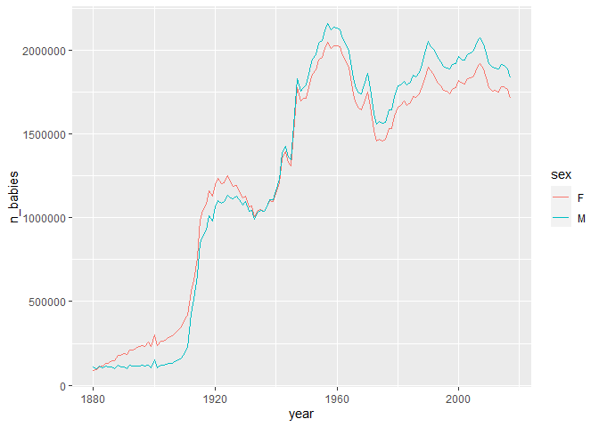

2022-03-22 Baby names
================
Florian Tanner
2022-03-22 13:10:14

``` r
rm(list = ls())

library(tidyverse)
```

    ## -- Attaching packages --------------------------------------- tidyverse 1.3.1 --

    ## v ggplot2 3.3.5     v purrr   0.3.4
    ## v tibble  3.1.6     v dplyr   1.0.8
    ## v tidyr   1.2.0     v stringr 1.4.0
    ## v readr   2.1.2     v forcats 0.5.1

    ## -- Conflicts ------------------------------------------ tidyverse_conflicts() --
    ## x dplyr::filter() masks stats::filter()
    ## x dplyr::lag()    masks stats::lag()

``` r
library(gt)
library(gtExtras)
```

``` r
babynames <- readr::read_csv('https://raw.githubusercontent.com/rfordatascience/tidytuesday/master/data/2022/2022-03-22/babynames.csv')
```

    ## Rows: 1924665 Columns: 5
    ## -- Column specification --------------------------------------------------------
    ## Delimiter: ","
    ## chr (2): sex, name
    ## dbl (3): year, n, prop
    ## 
    ## i Use `spec()` to retrieve the full column specification for this data.
    ## i Specify the column types or set `show_col_types = FALSE` to quiet this message.

# EDA

## Summaries

``` r
babynames |> 
  group_by(year, sex) |> 
  summarise(n_babies = sum(n)) |> 
  ggplot(aes(x= year, y = n_babies, color = sex, group= sex)) +
  geom_line()
```

    ## `summarise()` has grouped output by 'year'. You can override using the
    ## `.groups` argument.

<!-- -->

## Top male and female

``` r
top_m_generation <- babynames |> 
  filter(year >= 2013,
         year <= 2017,
         sex == "M") |> 
  group_by(name) |> 
  summarise(prop_generation = mean(prop)) |> 
  slice_max(order_by = prop_generation, n = 12) |> 
  pull(name)

top_f_generation <- babynames |> 
  filter(year >= 2013,
         year <= 2017,
         sex == "F") |> 
  group_by(name) |> 
  summarise(prop_generation = mean(prop)) |> 
  slice_max(order_by = prop_generation, n = 12) |> 
  pull(name)
```

## Top neutral

``` r
top_n_generation <- babynames |> 
  pivot_wider(id_cols = c(year, name), values_from = n, names_from = sex, names_prefix = "sex_") |> 
  mutate(total = sex_M + sex_F,
         ratio_M_F= sex_M / sex_F) |> 
  filter(year >= 2013,
         year <= 2017) |> 
  group_by(name) |> 
  summarise(mean_generation = mean(total),
            mean_ratio = mean(ratio_M_F)) |>
  filter(!is.na(mean_generation),
         mean_ratio > 0.25 & mean_ratio < 0.75) |> 
  slice_max(order_by = mean_generation, n = 12) |> 
  pull(name)
```

## Prepare dfs for gt

``` r
m_summary <- babynames |> 
  filter(year >= 2013,
         year <= 2017,
         name %in% top_m_generation,
         sex == "M") |> 
  group_by(name) |> 
  summarise(mean_n = round(mean(n), 0),
            n_dat = list(n)) |> 
  ungroup()

f_summary <- babynames |> 
  filter(year >= 2013,
         year <= 2017,
         name %in% top_f_generation,
         sex == "F") |> 
  group_by(name) |> 
  summarise(mean_n = round(mean(n), 0),
            n_dat = list(n)) |> 
  ungroup()

n_summary <- babynames |> 
  filter(year >= 2013,
         year <= 2017, 
         name %in% top_n_generation) |> 
  pivot_wider(id_cols = c(year, name), values_from = n, names_from = sex, names_prefix = "sex_", values_fill = 0) |> 
  mutate(total = sex_M + sex_F) |> 
  group_by(name) |> 
  summarise(mean_n = round(mean(total), 0),
            n_dat = list(total)) |> 
  ungroup()
```

## Create tables

``` r
table_m <- m_summary |> 
  arrange(desc(mean_n)) |> 
  select(-mean_n) |> 
  gt() |> 
  gt_sparkline(n_dat, same_limit = FALSE, range_colors = c("#FFBA08", "#D00000")) |> 
  cols_label(name = "Name",n_dat = "2013-2017") |> 
  gt_theme_espn()|>
  as_raw_html()

table_f <- f_summary |> 
  arrange(desc(mean_n)) |>
  select(-mean_n) |> 
  gt() |> 
  gt_sparkline(n_dat, same_limit = FALSE, range_colors = c("#FFBA08", "#D00000")) |> 
  cols_label(name = "Name",n_dat = "2013-2017") |> 
  gt_theme_espn()|>
  as_raw_html()

table_n <- n_summary |> 
  arrange(desc(mean_n)) |> 
  select(-mean_n) |> 
  gt() |> 
  gt_sparkline(n_dat, same_limit = FALSE, range_colors = c("#FFBA08", "#D00000")) |> 
  cols_label(name = "Name",n_dat = "2013-2017") |> 
  gt_theme_espn()|>
  as_raw_html()
```

## Combine tables

``` r
data_tables <- data.frame(female_table = table_f, neutral_table = table_n, male_table = table_m)
```

``` r
tab <- data_tables %>% 
  gt() %>% 
  fmt_markdown(columns = everything()) |> 
  cols_label(            female_table = "Girls", 
                         neutral_table = "Neutral names",
                         male_table = "Boys") |> 
  tab_header(title = md("**Generation Alpha:** Most popular baby names in the US"),
             subtitle = "Trend in popularity from 2013 - 2017 and number of births in 2017") |> 
  tab_source_note(source_note = md("**Data:** {babynames} R package, #tidytuesday 2022-03-22 | **Table:** Florian Tanner")) |> 
  gt_theme_espn()
```

``` r
gtsave(data = tab, "gen_alpha_names.png")
```

<!-- -->

``` r
sessionInfo()
```

    ## R version 4.1.3 (2022-03-10)
    ## Platform: x86_64-w64-mingw32/x64 (64-bit)
    ## Running under: Windows 10 x64 (build 19044)
    ## 
    ## Matrix products: default
    ## 
    ## locale:
    ## [1] LC_COLLATE=English_Australia.1252  LC_CTYPE=English_Australia.1252   
    ## [3] LC_MONETARY=English_Australia.1252 LC_NUMERIC=C                      
    ## [5] LC_TIME=English_Australia.1252    
    ## 
    ## attached base packages:
    ## [1] stats     graphics  grDevices utils     datasets  methods   base     
    ## 
    ## other attached packages:
    ##  [1] gtExtras_0.2.4  gt_0.4.0        forcats_0.5.1   stringr_1.4.0  
    ##  [5] dplyr_1.0.8     purrr_0.3.4     readr_2.1.2     tidyr_1.2.0    
    ##  [9] tibble_3.1.6    ggplot2_3.3.5   tidyverse_1.3.1
    ## 
    ## loaded via a namespace (and not attached):
    ##  [1] httr_1.4.2        sass_0.4.0        bit64_4.0.5       vroom_1.5.7      
    ##  [5] jsonlite_1.8.0    modelr_0.1.8      paletteer_1.4.0   assertthat_0.2.1 
    ##  [9] highr_0.9         cellranger_1.1.0  yaml_2.3.5        pillar_1.7.0     
    ## [13] backports_1.4.1   glue_1.6.2        digest_0.6.29     checkmate_2.0.0  
    ## [17] rvest_1.0.2       colorspace_2.0-3  htmltools_0.5.2   pkgconfig_2.0.3  
    ## [21] broom_0.7.12      haven_2.4.3       scales_1.1.1      webshot_0.5.2    
    ## [25] processx_3.5.2    fontawesome_0.2.2 svglite_2.1.0     tzdb_0.2.0       
    ## [29] generics_0.1.2    farver_2.1.0      ellipsis_0.3.2    withr_2.5.0      
    ## [33] cli_3.2.0         magrittr_2.0.2    crayon_1.5.0      readxl_1.3.1     
    ## [37] ps_1.6.0          evaluate_0.15     fs_1.5.2          fansi_1.0.2      
    ## [41] xml2_1.3.3        tools_4.1.3       hms_1.1.1         lifecycle_1.0.1  
    ## [45] munsell_0.5.0     reprex_2.0.1      callr_3.7.0       compiler_4.1.3   
    ## [49] systemfonts_1.0.4 rlang_1.0.2       grid_4.1.3        rstudioapi_0.13  
    ## [53] labeling_0.4.2    rmarkdown_2.12    gtable_0.3.0      DBI_1.1.2        
    ## [57] curl_4.3.2        rematch2_2.1.2    R6_2.5.1          lubridate_1.8.0  
    ## [61] knitr_1.37        fastmap_1.1.0     bit_4.0.4         utf8_1.2.2       
    ## [65] commonmark_1.8.0  stringi_1.7.6     parallel_4.1.3    Rcpp_1.0.8       
    ## [69] vctrs_0.3.8       dbplyr_2.1.1      tidyselect_1.1.2  xfun_0.30
