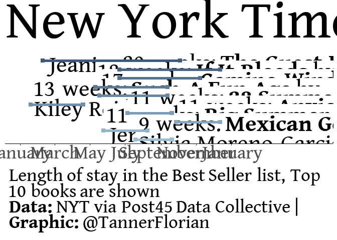

2022-05-10 NYTimes best sellers
================
Florian Tanner
2022-05-10 23:02:14

``` r
rm(list = ls())

library(tidyverse)
```

    ## -- Attaching packages --------------------------------------- tidyverse 1.3.1 --

    ## v ggplot2 3.3.5     v purrr   0.3.4
    ## v tibble  3.1.6     v dplyr   1.0.8
    ## v tidyr   1.2.0     v stringr 1.4.0
    ## v readr   2.1.2     v forcats 0.5.1

    ## -- Conflicts ------------------------------------------ tidyverse_conflicts() --
    ## x dplyr::filter() masks stats::filter()
    ## x dplyr::lag()    masks stats::lag()

``` r
library(ggtext)
sysfonts::font_add_google("Gentium Book Basic")
showtext::showtext_auto()
showtext::showtext_opts(dpi = 300)
```

``` r
nyt_titles <- readr::read_tsv('https://raw.githubusercontent.com/rfordatascience/tidytuesday/master/data/2022/2022-05-10/nyt_titles.tsv')
```

    ## Rows: 7431 Columns: 8
    ## -- Column specification --------------------------------------------------------
    ## Delimiter: "\t"
    ## chr  (2): title, author
    ## dbl  (5): id, year, total_weeks, debut_rank, best_rank
    ## date (1): first_week
    ## 
    ## i Use `spec()` to retrieve the full column specification for this data.
    ## i Specify the column types or set `show_col_types = FALSE` to quiet this message.

``` r
nyt_full <- readr::read_tsv('https://raw.githubusercontent.com/rfordatascience/tidytuesday/master/data/2022/2022-05-10/nyt_full.tsv')
```

    ## Rows: 60386 Columns: 6
    ## -- Column specification --------------------------------------------------------
    ## Delimiter: "\t"
    ## chr  (2): title, author
    ## dbl  (3): year, rank, title_id
    ## date (1): week
    ## 
    ## i Use `spec()` to retrieve the full column specification for this data.
    ## i Specify the column types or set `show_col_types = FALSE` to quiet this message.

``` r
theme_bestsellers <-
  theme_minimal() +
  theme(axis.line.x = element_line(), 
        axis.ticks.x = element_line(colour = "grey20"),
        axis.title.y = element_blank(),
        axis.text.y = element_blank(),
        panel.grid = element_blank(),
        axis.title.x = element_blank(),
        legend.position = "none",
        plot.caption =element_textbox_simple( padding = margin(5.5, 5.5, 5.5, 5.5),
                                              margin = margin(5, 0, 0, 0)),
        text = element_text(family = "Gentium Book Basic"),
        plot.title = element_text(size = 26))
```

# EDA

``` r
n_titles <- 10

date_breaks_monthly <- as.Date(c("2020-01-01", "2020-03-01", "2020-05-01", "2020-07-01", "2020-09-01", "2020-11-01", "2021-01-01"))

p <- nyt_titles |> 
  filter(year == 2020) |> 
  slice_max(order_by = total_weeks, n = n_titles, with_ties = FALSE) |> 
  mutate(title_titlecase = str_to_title(title),
         last_week = first_week + total_weeks*7,
         rank_that_year = n_titles + 1 - row_number(),
         best_label = paste(total_weeks, " weeks: **", title_titlecase, "** by ", author, sep = "")) |> 
  ggplot(aes(x = first_week, y = rank_that_year, color = rank_that_year)) +
  geom_textbox(aes(x = first_week, y = rank_that_year + 0.35, label = best_label), 
                       hjust = 0,
                       color = "black",
                       width =1, 
                       box.colour = NA,
                       box.size = NA,
               family = "Gentium Book Basic") +
  geom_segment(aes(x = first_week, xend = last_week, y = rank_that_year, yend = rank_that_year),
               size =2) +
  geom_point(size =2.5, shape = 15) +
  geom_point(aes(x = last_week, y = rank_that_year), size =2.5, shape = 15) +
  scale_x_date(limits = c(as.Date("2020-01-01"), as.Date("2021-06-01")),
               date_labels = "%B",
               breaks = date_breaks_monthly)  +
  scale_color_gradient(low = "#98C1D9", high = "#3D5A80") +
  labs(title = "New York Times Best Sellers in 2020", 
       caption = "**Data:** NYT via Post45 Data Collective | **Graphic:** @TannerFlorian") +
  theme_bestsellers
  
p
```

<!-- -->

``` r
ggsave(plot = p, filename = "nyt.jpg", units = "cm", device = "jpg", width = 12, height = 8, dpi = 300, scale = 1.45)
```

``` r
sessionInfo()
```

    ## R version 4.1.3 (2022-03-10)
    ## Platform: x86_64-w64-mingw32/x64 (64-bit)
    ## Running under: Windows 10 x64 (build 19044)
    ## 
    ## Matrix products: default
    ## 
    ## locale:
    ## [1] LC_COLLATE=English_United States.1252 
    ## [2] LC_CTYPE=English_United States.1252   
    ## [3] LC_MONETARY=English_United States.1252
    ## [4] LC_NUMERIC=C                          
    ## [5] LC_TIME=English_United States.1252    
    ## 
    ## attached base packages:
    ## [1] stats     graphics  grDevices utils     datasets  methods   base     
    ## 
    ## other attached packages:
    ##  [1] ggtext_0.1.1    forcats_0.5.1   stringr_1.4.0   dplyr_1.0.8    
    ##  [5] purrr_0.3.4     readr_2.1.2     tidyr_1.2.0     tibble_3.1.6   
    ##  [9] ggplot2_3.3.5   tidyverse_1.3.1
    ## 
    ## loaded via a namespace (and not attached):
    ##  [1] Rcpp_1.0.8.3     lubridate_1.8.0  sysfonts_0.8.8   assertthat_0.2.1
    ##  [5] digest_0.6.29    utf8_1.2.2       R6_2.5.1         cellranger_1.1.0
    ##  [9] backports_1.4.1  reprex_2.0.1     evaluate_0.15    highr_0.9       
    ## [13] httr_1.4.2       pillar_1.7.0     rlang_1.0.2      curl_4.3.2      
    ## [17] readxl_1.3.1     rstudioapi_0.13  rmarkdown_2.13   labeling_0.4.2  
    ## [21] bit_4.0.4        munsell_0.5.0    gridtext_0.1.4   broom_0.7.12    
    ## [25] compiler_4.1.3   modelr_0.1.8     xfun_0.30        pkgconfig_2.0.3 
    ## [29] htmltools_0.5.2  tidyselect_1.1.2 fansi_1.0.2      crayon_1.5.0    
    ## [33] showtextdb_3.0   tzdb_0.2.0       dbplyr_2.1.1     withr_2.5.0     
    ## [37] grid_4.1.3       jsonlite_1.8.0   gtable_0.3.0     lifecycle_1.0.1 
    ## [41] DBI_1.1.2        magrittr_2.0.2   scales_1.1.1     cli_3.2.0       
    ## [45] stringi_1.7.6    vroom_1.5.7      farver_2.1.0     fs_1.5.2        
    ## [49] xml2_1.3.3       ellipsis_0.3.2   generics_0.1.2   vctrs_0.3.8     
    ## [53] tools_4.1.3      showtext_0.9-5   bit64_4.0.5      glue_1.6.2      
    ## [57] markdown_1.1     hms_1.1.1        parallel_4.1.3   fastmap_1.1.0   
    ## [61] yaml_2.3.5       colorspace_2.0-3 rvest_1.0.2      knitr_1.37      
    ## [65] haven_2.4.3
